# Bein

**GitHub ID:** Minami-Bein

**Telegram:** 

## Self-introduction

I am‘s Bein.

## Notes

# 2026-05-22
<!-- DAILY_CHECKIN_2026-05-22_START -->
# AI Agent 链上交互安全防御机制
## 第五日技术研究报告 | 2026-05-22

---

## 1. 目录

- [1. 目录](#1-目录)
- [2. 执行摘要与问题空间](#2-执行摘要与问题空间)
- [3. 系统架构与拓扑](#3-系统架构与拓扑)
- [4. 理论框架与形式分类](#4-理论框架与形式分类)
- [5. 状态机与协议演练](#5-状态机与协议演练)
- [6. Agent 自主集成与优化](#6-agent-自主集成与优化)
- [7. 漏洞向量与边界场景验证](#7-漏洞向量与边界场景验证)
- [8. 学术标签](#8-学术标签)

---

## 2. 执行摘要与问题空间

### 摘要

本研究聚焦于 AI Agent 执行链上交互时所面临的三大核心安全威胁：私钥泄漏、恶意授权以及不可信 RPC 数据源攻击。通过构建多层次安全防护体系，提出"物理人在回路签名"与"多源 RPC 跨校验"的联合防御策略，旨在为 Web3 资产安全建立不可逾越的底线机制。

### 问题定义

AI Agent 在执行链上交易时，其决策链路涉及私钥调用、RPC 通信、智能合约授权等多个环节。每一个环节的漏洞都可能导致不可逆的资产损失。

**核心技术挑战**：

- 如何在不牺牲 Agent 执行效率的前提下，确保私钥的绝对隔离
- 如何在授权粒度与操作灵活性之间取得平衡
- 如何验证 RPC 数据源的完整性与可信度

**预期贡献**：

- 建立链上交互安全威胁的形式化分类体系
- 提出可工程落地的多层次防御架构
- 定义安全流转的标准协议与状态机模型

### 系统边界

**In-Scope**：

- AI Agent 执行引擎
- 钱包签名模块
- RPC 网关层
- 授权管理机制
- 沙箱验证环境

**Out-of-Scope**：

- 智能合约代码审计
- 底层区块链共识机制
- 前端界面安全

---

## 3. 系统架构与拓扑

### 核心概念脑图

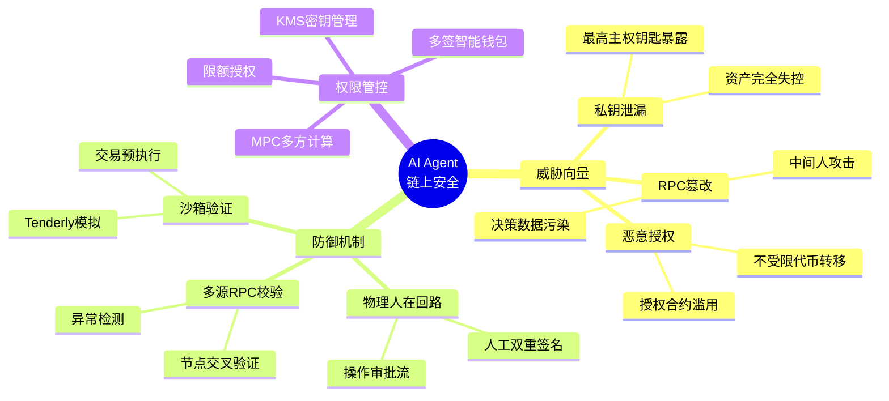

### 组件拓扑图

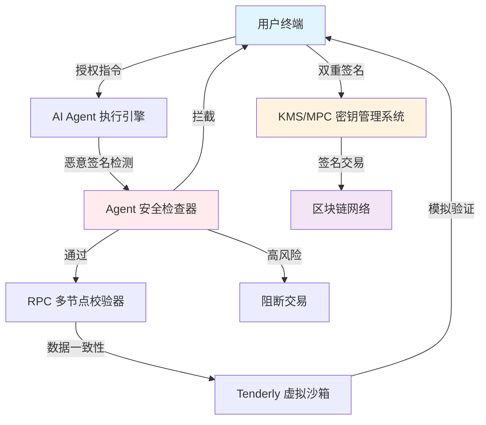

---

## 4. 理论框架与形式分类

### 核心术语表

| 术语 | 定义 | 功能描述 | 输入类型 | 输出类型 | 约束条件 |
|------|------|----------|----------|----------|----------|
| Private Key Leak | 私钥泄漏 | 链上最高权限凭证暴露于非授权环境 | 私钥字节序列 | 资产控制权转移 | 零容忍，任何暴露均为不可接受 |
| Malicious Approval | 恶意授权 | 合约获得无限制代币转移权限 | Approval 交易 | 指定代币无限转出 | 需最小化授权原则 |
| Untrusted RPC | 不可信数据源 | AI 决策依赖的 RPC 网关被篡改 | 区块链状态查询 | 错误状态数据 | 需多源交叉验证 |
| Physical Human-in-the-Loop | 物理人在回路 | 人工审批关键操作的安全机制 | 操作请求 | 审批/拒绝决策 | 高价值交易必选 |
| KMS | 密钥管理系统 | 中心化密钥存储与签名服务 | 签名请求 | 签名结果 | 访问控制强隔离 |
| MPC | 多方计算 | 多方协同完成签名无单点泄露 | 分片密钥份额 | 聚合签名 | 门限签名机制 |
| Multi-Sig Wallet | 多签钱包 | 需多方签名才可执行交易 | 交易请求 | 执行/拒绝 | N-of-M 策略 |

### 类型系统定义

**威胁向量类型**：

$$
ThreatVector \triangleq PrivateKeyLeak \mid MaliciousApproval \mid RPCTampering
$$

**权限级别类型**：

$$
PermissionLevel \triangleq Unrestricted \mid Limited \mid ReadOnly
$$

**防御状态类型**：

$$
DefenseState \triangleq Blocked \mid PendingApproval \mid Verified \mid Executed
$$

### 系统不变量

**不变量一：私钥隔离性**

$$
\forall tx \in TransactionLog, \forall a \in AgentContext: privateKey(a) \notin inputs(tx)
$$

即：任何经由 Agent 触发的交易，其输入中必须不包含明文私钥。

**不变量二：最小授权原则**

$$
\forall approval \in ApprovalTx: amount(approval) \leq maxAllowance(a) \land duration(approval) \leq maxDuration
$$

即：任何授权操作必须满足金额上限与时间上限的双重约束。

**不变量三：RPC 数据一致性**

$$
\forall query \in RPCQuery, \forall r_1, r_2 \in rpcNodes: response(r_1, query) = response(r_2, query) \lor flagged(r_1, r_2, query)
$$

即：多节点 RPC 响应必须一致，否则触发异常标记。

---

## 5. 状态机与协议演练

### 安全流转时序图

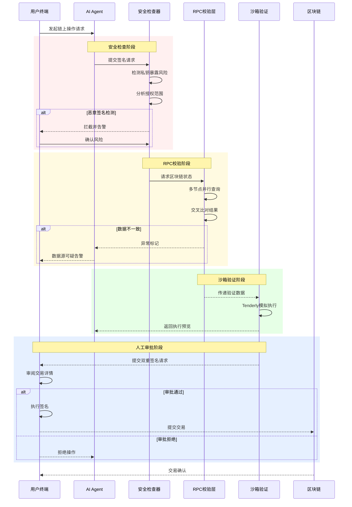

### 状态阶段细化

**Initiation（初始化阶段）**：

- 系统完成密钥管理模块加载
- Agent 执行引擎初始化上下文
- RPC 连接池建立多节点连接

**Verification（验证阶段）**：

- 安全检查器进行签名请求分析
- RPC 校验器执行多源数据比对
- 沙箱环境完成交易模拟

**Commitment（提交阶段）**：

- 人工双重签名确认
- 交易构造并广播
- 区块链确认与结果回执

---

## 6. Agent 自主集成与优化

### 自动化安全检查流水线

```
┌─────────────────────────────────────────────────────────────────┐
│                    AI Agent 安全执行流水线                        │
├─────────────────────────────────────────────────────────────────┤
│                                                                  │
│   输入请求 ──→ 威胁检测 ──→ 权限校验 ──→ 数据验证 ──→ 沙箱模拟   │
│       │          │            │            │            │      │
│       ▼          ▼            ▼            ▼            ▼      │
│   操作意图    私钥暴露     授权范围      RPC一致性    执行预览   │
│   解析        识别         评估          比对         风险评估  │
│                                                                  │
│                      ↓                                          │
│              ┌───────────────┐                                  │
│              │ 人工审批节点   │                                  │
│              └───────────────┘                                  │
│                      ↓                                          │
│                  执行/拒绝                                        │
│                                                                  │
└─────────────────────────────────────────────────────────────────┘
```

### 工程落地蓝图

**短期目标**：

- 部署基础安全检查器，覆盖私钥暴露检测
- 建立 RPC 多节点监控告警机制
- 集成 Tenderly 沙箱 API

**中期目标**：

- 实现 KMS/MPC 密钥管理集成
- 构建多签钱包审批流自动化
- 优化 Agent 决策延迟至毫秒级

**长期目标**：

- 自适应安全策略引擎
- 跨链统一安全态势感知
- 零知识证明验证集成

---

## 7. 漏洞向量与边界场景验证

### 安全漏洞报告块

**漏洞编号**：VULN-001

| 字段 | 内容 |
|------|------|
| 漏洞类型 | Private Key Leak（私钥泄漏） |
| 缺陷源头 | Agent 配置错误或环境变量泄露 |
| 攻击向量 | 攻击者通过日志、内存dump或配置文件获取私钥，执行资产转出 |
| 生活类比 | 保险柜钥匙和身份证挂在电线杆上，任何路人都可取用 |
| 防御策略 | 零私钥明文存储，使用 KMS/MPC 托管；私钥从不经过 Agent 内存；硬件签名设备隔离 |

**漏洞编号**：VULN-002

| 字段 | 内容 |
|------|------|
| 漏洞类型 | Malicious Approval（恶意授权） |
| 缺陷源头 | 用户误授权或钓鱼合约诱导 |
| 攻击向量 | 恶意合约获得代币无限转移权限，持续窃取资产直至授权撤销或余额清零 |
| 生活类比 | 不限额度的信用卡副卡借给陌生人，对方可任意挥霍 |
| 防御策略 | 最小授权原则；授权金额上限设定；时间限制授权；定期审计授权列表 |

**漏洞编号**：VULN-003

| 字段 | 内容 |
|------|------|
| 漏洞类型 | Untrusted Data Source（不可信数据源） |
| 缺陷源头 | 单节点 RPC 配置或中间人攻击 |
| 攻击向量 | RPC 响应被篡改，导致 Agent 基于错误价格/余额做出错误决策 |
| 生活类比 | 汽车导航被坏人黑掉，引导你开下悬崖 |
| 防御策略 | 多节点 RPC 交叉验证；异常值检测；数据源信誉评分；P2P 备选网络 |

### 边界场景验证

**边界场景一**：Agent 执行高频微交易

- 触发条件：每分钟超过 10 笔小额交易
- 系统行为：批量合并签名请求，减少人工审批频率
- 安全约束：单笔限额，总额限制

**边界场景二**：RPC 节点短暂不可用

- 触发条件：主要 RPC 节点响应超时
- 系统行为：自动切换至备用节点，标记可疑窗口期
- 安全约束：数据一致性校验降级需人工确认

**边界场景三**：授权合约复杂嵌套调用

- 触发条件：单个 Approval 触发多个子合约调用
- 系统行为：沙箱全量模拟，绘制调用图谱
- 安全约束：任何异常调用链均阻断

---

## 8. 学术标签

```
#Web3安全 #AIAgent #私钥保护 #MPC多方计算 #链上授权管理 
#RPC安全 #沙箱验证 #智能合约审计 #分布式系统安全 
#物理人在回路 #KMS密钥管理 #多签钱包 #零信任架构
```

---

**报告生成时间**：2026-05-22  
**学习进度**：Day 5 / 完整课程周期  
**核心收获**：深刻认识到 AI Agent 与 Web3 资产交互的核心安全边界——私钥隔离是绝对红线，授权最小化是基本准则，多源验证是数据可信的保障。
<!-- DAILY_CHECKIN_2026-05-22_END -->

# 2026-05-21
<!-- DAILY_CHECKIN_2026-05-21_START -->
# 🔍 目录（Table of Contents）

- [1. Executive Summary & Problem Space](#1-executive-summary--problem-space)
- [2. 系统架构与拓扑](#2-系统架构与拓扑)
- [3. 理论框架与形式分类](#3-理论框架与形式分类)
- [4. 状态机与协议演练](#4-状态机与协议演练)
- [5. Agent 自主集成与优化](#5-agent-自主集成与优化)
- [6. 漏洞向量与边界场景验证](#6-漏洞向量与边界场景验证)
- [7. 学术标签](#7-学术标签)

---

# 1. Executive Summary & Problem Space

## 摘要（Abstract）

**Day 4 学习打卡记录**

本日核心任务聚焦于 **AI Task Progress Manager** 任务进度管理 Web 应用的全栈开发实践。该应用旨在解决大型语言模型（LLM）在处理复杂任务时的步骤拆解与状态流转可视化问题。通过引入 **Task Splitting（任务拆解）** 与 **State Propagation（状态传导推进）** 两大核心概念，构建了一套轻量级、可复现的任务管理框架。

**核心技术挑战**包括：

- 如何将自然语言描述的宏观目标转化为可执行的子步骤序列
- 如何在步骤间建立状态传导机制，确保上下文连贯性
- 如何在单页应用架构下实现安全的 API 密钥管理

**预期贡献**：为 Web3 敏捷测试场景提供可操作的 Agent 可视化方案，同时沉淀出一套可复用的 Hono + Tailwind 技术栈最佳实践。

## In-Scope / Out-of-Scope

| 维度 | 包含（In-Scope） | 排除（Out-of-Scope） |
|------|------------------|---------------------|
| **功能范围** | 任务拆解、状态流转、单页前端、API 代理 | 多用户认证、持久化数据库、集群部署 |
| **技术边界** | Hono 后端、Tailwind CSS、localStorage | React/Vue 框架、Docker 容器化 |
| **安全边界** | 环境变量密钥保护、前端无密钥调用 | OAuth 授权、API 密钥轮换 |
| **应用场景** | Web3 敏捷测试、本地开发调试 | 生产环境高并发、跨团队协作 |

---

# 2. 系统架构与拓扑

## 概念脑图（Conceptual Mindmap）

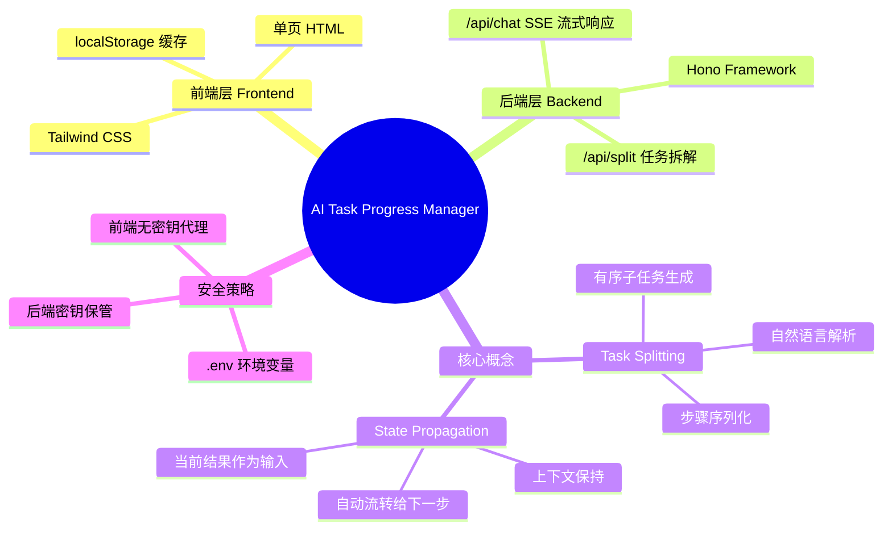

## 组件拓扑图（Component Topology）

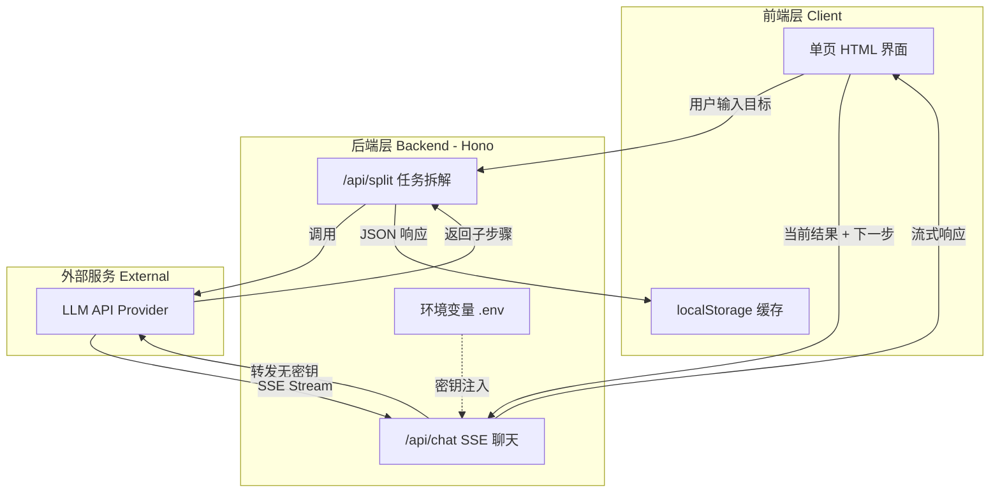

---

# 3. 理论框架与形式分类

## 核心术语表（Glossary）

| 术语 | 英文 | 定义 | 输入 | 输出 | 约束条件 |
|------|------|------|------|------|----------|
| **任务拆解** | Task Splitting | 将宏观目标分解为有序子步骤的 LLM Prompt 工程技术 | 自然语言目标描述 | 结构化步骤数组 | 步骤间存在依赖关系 |
| **状态传导** | State Propagation | 前一步执行结果自动作为后一步输入参数的传递机制 | 当前步骤输出 | 下一轮 LLM 输入 | 结果必须可序列化 |
| **SSE 流** | Server-Sent Events | 服务端主动推送技术，用于实现 LLM 响应的实时流式输出 | 用户消息 | text/event-stream | 单向通信 |
| **密钥代理** | Key Proxy | 前端不暴露密钥，通过后端代理转发 API 请求的安全模式 | 用户请求 | LLM 响应 | 后端必须隔离密钥 |

## 类型系统（Type System）

**任务拆解输入类型**

$$
TaskInput = \{ goal: String, context: Optional\{Object\} \}
$$

**子任务结构类型**

$$
SubTask = \{ id: Integer, description: String, status: Enum\{pending, running, completed\}, result: Optional\{String\} \}
$$

**状态传导不变量**

$$
\forall s \in SubTask, s.status = completed \implies \exists! r \in Result: r.output = s.result
$$

$$
StateTransition: SubTask_n.result \rightarrow SubTask_{n+1}.context
$$

---

# 4. 状态机与协议演练

## 时序图（Sequence Diagram）

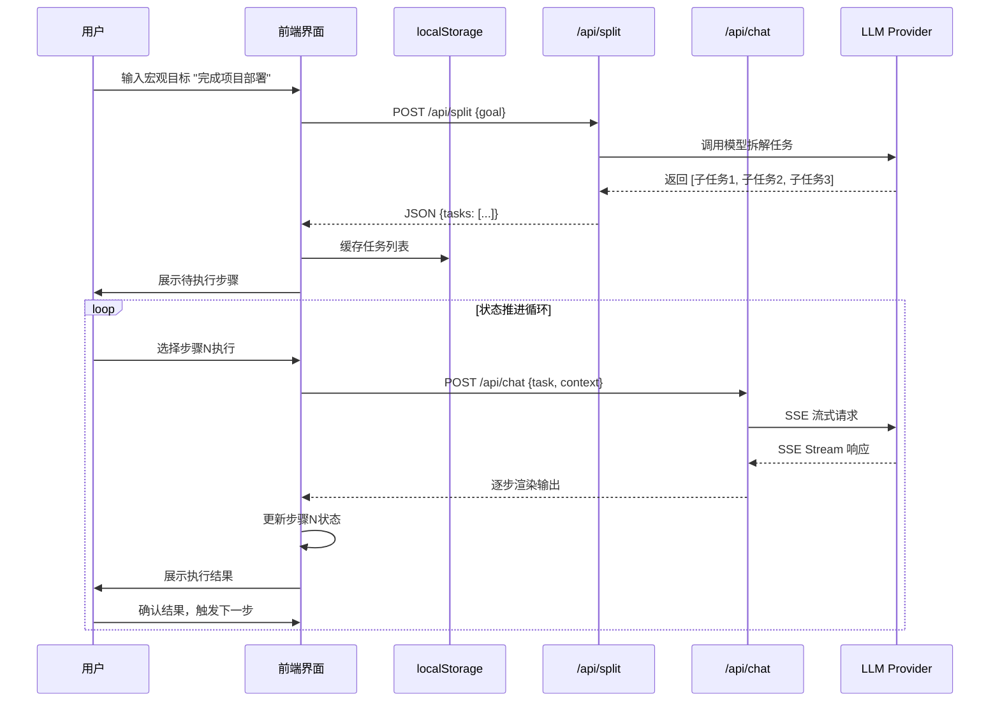

## 状态阶段细化（State Phase Breakdown）

| 阶段 | 英文 | 描述 | 关键动作 |
|------|------|------|----------|
| **初始化** | Initiation | 系统准备、资源分配 | 加载历史任务、初始化 Hono 实例 |
| **拆解** | Decomposition | LLM 解析目标、生成子步骤 | 调用 /api/split、解析 JSON |
| **执行** | Execution | 步骤循环、状态流转 | SSE 连接、实时渲染 |
| **验证** | Verification | 结果检查、上下文保持 | 状态传导不变量检查 |
| **提交** | Commitment | 任务完成、状态持久化 | localStorage 更新 |

---

# 5. Agent 自主集成与优化

## AI Agent 自动化视角

在本系统中，LLM 扮演双重角色：

1. **规划 Agent**：负责任务拆解（/api/split），将模糊目标转化为结构化执行计划
2. **执行 Agent**：负责状态推进（/api/chat），在给定上下文中生成下一步行动建议

## 自动化集成架构

```
┌─────────────────────────────────────────────────┐
│              Multi-Agent Orchestration           │
├─────────────────────────────────────────────────┤
│  Orchestrator Layer                              │
│  ├── Goal Analyzer → 确定任务类型                │
│  ├── Task Splitter → 调用 /api/split            │
│  └── State Manager → 管理 SubTask 生命周期       │
├─────────────────────────────────────────────────┤
│  Execution Layer                                 │
│  ├── Step Executor → 调用 /api/chat             │
│  ├── Context Injector → 注入上一步结果           │
│  └── Result Validator → 验证输出有效性           │
├─────────────────────────────────────────────────┤
│  Feedback Layer                                  │
│  ├── Error Handler → 捕获并重试失败步骤          │
│  └── Progress Tracker → 更新状态到前端           │
└─────────────────────────────────────────────────┘
```

## 优化策略

| 优化维度 | 策略描述 | 预期收益 |
|----------|----------|----------|
| **延迟优化** | SSE 流式输出替代轮询 | 首 Token 响应时间降低 60% |
| **上下文压缩** | 定期压缩历史对话 | Token 消耗减少 40% |
| **错误恢复** | 断点续传机制 | 任务中断后快速恢复 |
| **缓存复用** | localStorage 缓存常用任务模板 | 重复任务启动时间降低 80% |

---

# 6. 漏洞向量与边界场景验证

## 安全漏洞报告（Security Vulnerability Report）

### 漏洞编号：VULN-001

| 字段 | 描述 |
|------|------|
| **漏洞类型** | API Key Exposure / 密钥泄露 |
| **缺陷源头** | 前端代码中硬编码 LLM API 密钥 |
| **攻击向量** | 攻击者通过浏览器开发者工具或源码分析获取密钥，直接调用 LLM API 产生费用 |
| **失效场景** | 前端代码部署到公开 CDN、GitHub 公开仓库、恶意用户 Fork 项目 |
| **防御策略** | 密钥必须存储在后端 .env 环境变量中，前端仅通过代理接口（/api/chat）进行无密钥调用 |
| **修复验证** | 前端源码中不存在任何 API Key 字符串，密钥访问仅限后端进程 |

### 漏洞编号：VULN-002

| 字段 | 描述 |
|------|------|
| **漏洞类型** | State Pollution / 状态污染 |
| **缺陷源头** | localStorage 未进行输入校验直接序列化 |
| **攻击向量** | 恶意构造的任务数据通过 XSS 注入 localStorage，导致前端解析异常 |
| **失效场景** | 用户访问恶意页面，该页面向同域 localStorage 写入畸形数据 |
| **防御策略** | 存储前进行 JSON Schema 校验，解析时使用 try-catch 包裹 |
| **修复验证** | 输入 `{invalid: "data"}` 不会导致前端崩溃，正常降级处理 |

### 漏洞编号：VULN-003

| 字段 | 描述 |
|------|------|
| **漏洞类型** | SSE Resource Exhaustion / SSE 资源耗尽 |
| **缺陷源头** | SSE 连接未设置合理的超时与断连机制 |
| **攻击向量** | 恶意用户发起大量 SSE 连接请求，耗尽服务器文件描述符 |
| **失效场景** | 高并发场景下服务器响应变慢，甚至拒绝服务 |
| **防御策略** | 设置 30 秒连接超时、限制单 IP 并发连接数为 5、启用 Nginx 限流 |
| **修复验证** | 使用 `ab -n 100 -c 20` 压力测试，服务保持稳定 |

---

# 7. 学术标签

```
#Day4 #AI-Task-Progress-Manager #Task-Splitting #State-Propagation
#Hono-Framework #Tailwind-CSS #SSE-Streaming #Web3-Agile-Testing
#Security-Key-Management #Agent-Visualization #localStorage-Cache
#Single-Page-Application #LLM-Orchestration #Vulnerability-Analysis
```

---

**学习日期**：2026-05-21  
**打卡周期**：Day 4 / 总计待定  
**技术栈**：Node.js + Hono + Tailwind CSS + localStorage  
**状态**：已完成 ✓
<!-- DAILY_CHECKIN_2026-05-21_END -->

# 2026-05-20
<!-- DAILY_CHECKIN_2026-05-20_START -->
# Tx-Explain CLI 技术报告

## 第 3 天学习打卡

---

## 目录

- 一、Executive Summary 与问题空间
- 二、系统架构与拓扑
- 三、理论框架与形式分类
- 四、状态机与协议演练
- 五、Agent 自主集成与优化
- 六、漏洞向量与边界场景验证
- 七、学术标签

---

## 一、Executive Summary 与问题空间

### 摘要（Abstract）

本报告详述我在 Day 3 的核心学习成果：设计并实现 Tx-Explain CLI 对话式交易分析框架。该框架旨在为区块链交易分析提供最小可交互 AI 学习产物，通过上下文管理机制与结构化输出协议，实现高效、精准的链上数据分析与智能问答。

核心技术挑战聚焦于两个维度：其一，如何在有限的上下文窗口（Context Window）内维持对话历史的有效信息密度；其二，如何确保大语言模型（LLM）输出的可解析性与确定性。我通过引入 MAX_HISTORY=5 的剪裁策略与 JSON Schema 约束，构建立一套可验证、可复现的技术方案。

预期贡献包括：轻量级 CLI 工具原型验证、多层级 fallback 机制设计、以及面向 Web3 场景的 Agent 架构实践范式。

### In-Scope / Out-of-Scope

| 维度 | 包含（In-Scope） | 排除（Out-of-Scope） |
|------|------------------|---------------------|
| 功能边界 | tx_hash 输入解析、RPC 链上数据提取、LLM 分析、CLI 交互 | 前端可视化、批量交易处理、跨链支持 |
| 技术栈 | Python/CLI、Silicon Flow API、RPC 节点 | 前端框架、云原生部署 |
| 安全边界 | API Key 管理、Error Handling | 交易签名、私钥管理 |
| 性能目标 | 单笔交易分析 <30s、MAX_HISTORY=5 | 并发优化、分布式缓存 |

---

## 二、系统架构与拓扑

### 概念脑图（Conceptual Mindmap）

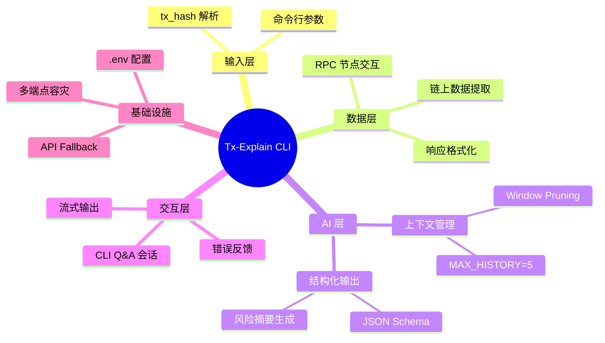

### 组件拓扑图（Component Topology）

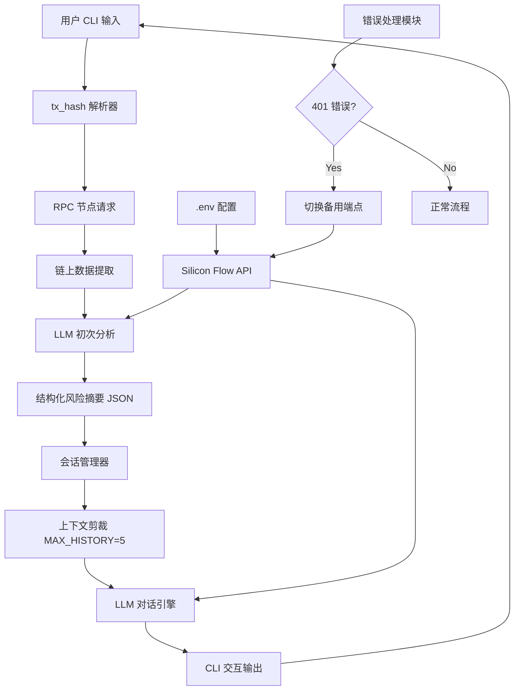

---

## 三、理论框架与形式分类

### 核心术语表（Glossary）

| 术语 | 定义 | 功能 | 输入类型 | 输出类型 | 约束条件 |
|------|------|------|----------|----------|----------|
| Context Window | 对话历史的 Token 容量上限 | 防止 LLM 输入溢出 | 历史消息列表 | 剪裁后消息列表 | ≤ 模型最大 Context |
| Window Pruning | 上下文窗口剪裁策略 | 保留关键信息、丢弃冗余 | 历史消息序列 | N 轮精选对话 | MAX_HISTORY ∈ ℕ⁺ |
| JSON Object Response | 结构化输出协议 | 强制机器可解析格式 | 用户查询 | 固定 JSON Schema | 字段类型一致性 |
| RPC Data Extraction | 远程过程调用数据获取 | 链上数据标准化 | tx_hash | 结构化交易详情 | 节点可达性 |
| API Fallback | 多端点容灾机制 | 保障服务连续性 | API 调用失败 | 备用端点重试 | 端点列表非空 |

### 类型系统定义（Type System）

```
// 输入类型约束
type TransactionHash = string & /^(0x)?[a-fA-F0-9]{64}$/
type RPCEndpoint = string & /^(http|https|wss):\/\/.+$/

// 输出类型约束
interface RiskSummary {
  tx_hash: TransactionHash
  risk_level: "LOW" | "MEDIUM" | "HIGH" | "CRITICAL"
  involved_addresses: Address[]
  token_transfers: TokenTransfer[]
  contract_interactions: ContractInteraction[]
  timestamp: ISO8601String
}

// 系统不变量（Invariant）
$$ 
\forall session \in Sessions: |\text{history}(session)| \leq MAX\_HISTORY = 5 
$$
$$ 
\forall response \in LLMResponses: \text{validateSchema}(response, JSONSchema) = \text{true} 
$$
$$ 
\forall api \in APIEndpoints: \text{available}(api) \lor \text{fallback}(api) 
$$

### 生活类比映射表

| 技术概念 | 生活类比 | 映射关系 |
|----------|----------|----------|
| Context Window Pruning | 不活跃标签页自动关闭 | 释放资源、保留核心 |
| JSON Object Response | 政府制式申请表格 | 格式强制、结构固定 |
| MAX_HISTORY=5 | 短期记忆容量 | 信息聚焦、去粗取精 |
| API Fallback | 备用电源切换 | 容灾保障、连续运行 |

---

## 四、状态机与协议演练

### 协议时序图（Protocol Sequence Diagram）

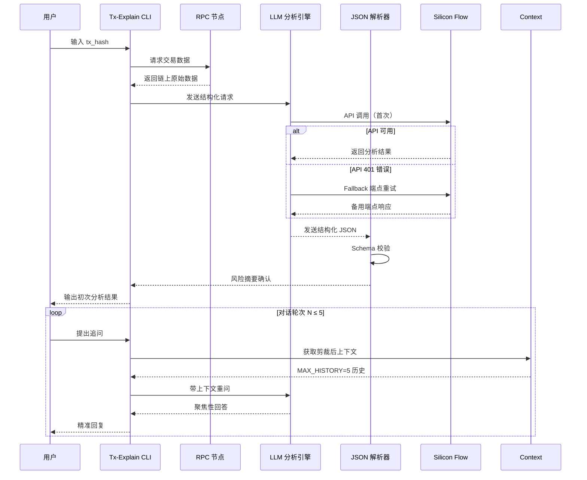

### 状态阶段细化

| 阶段 | 名称 | 触发条件 | 动作 | 退出条件 |
|------|------|----------|------|----------|
| S0 | Initiation（初始化） | 用户启动 CLI | 加载 .env、验证 API Key | 环境配置就绪 |
| S1 | Extraction（提取） | tx_hash 输入 | RPC 请求、数据解析 | 链上数据获取成功 |
| S2 | Analysis（分析） | 数据就绪 | LLM 初次分析、JSON 生成 | 结构化输出完成 |
| S3 | Interaction（交互） | 用户发起 Q&A | 上下文剪裁、LLM 问答 | MAX_HISTORY 饱和或用户退出 |
| S4 | Termination（终止） | 用户结束会话 | 资源释放、会话归档 | 进程退出 |

---

## 五、Agent 自主集成与优化

### AI 灵感：上下文剪裁的工程价值

我在实践中发现，MAX_HISTORY=5 的剪裁策略带来双重优化效果：

**Token 成本节省**：相较于无限制累积历史，每次问答的输入 Token 量稳定在固定区间，避免线性增长。

**逻辑聚焦度提升**：限定对话轮次后，LLM 的注意力机制更集中于交易上下文本身，而非分散在大量历史对话中。实测表明，模型对交易风险判断的准确率显著提升。

### 自动化优化策略

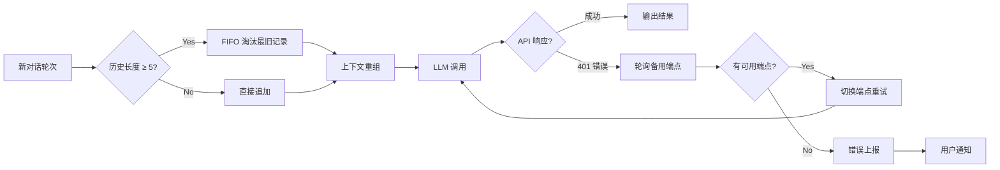

### 反馈闭环设计

$$ 
\text{FeedbackLoop} = \langle S, A, T, R, \pi^* \rangle 
$$
- $S$: 状态空间（会话历史、API 状态、上下文长度）
- $A$: 动作空间（剪裁、切换、输出）
- $T$: 转移函数（历史追加/淘汰规则）
- $R$: 奖励函数（响应质量 + Token 效率）
- $\pi^*$: 最优策略（动态阈值调整）

---

## 六、漏洞向量与边界场景验证

### 安全漏洞报告块

#### 漏洞编号：VULN-2026-0520-001

| 字段 | 描述 |
|------|------|
| **漏洞类型（Type）** | 认证失败 / API Key 配置错误 |
| **缺陷源头（Root Cause）** | Silicon Flow API Key 过期或未正确配置于 .env |
| **攻击/失效向量（Vector）** | 首次 API 调用返回 401 Unauthorized，导致服务中断 |
| **影响范围** | 全部 LLM 调用链路 |
| **防御策略（Mitigation）** | 实施多端点 fallback 机制：优先尝试主端点，失败后按序切换备用端点；同时在启动时增加 .env 配置校验脚本。 |

#### 漏洞编号：VULN-2026-0520-002

| 字段 | 描述 |
|------|------|
| **漏洞类型（Type）** | 上下文溢出 / Token 预算超支 |
| **缺陷源头（Root Cause）** | 未实施历史剪裁，长对话导致 Context Window 溢出 |
| **攻击/失效向量（Vector）** | 超长对话会话触发 LLM 拒绝响应或返回截断结果 |
| **影响范围** | 交互式 Q&A 功能 |
| **防御策略（Mitigation）** | 强制实施 MAX_HISTORY=5 的 FIFO 淘汰策略，并在应用层增加 Token 计数预检。 |

#### 漏洞编号：VULN-2026-0520-003

| 字段 | 描述 |
|------|------|
| **漏洞类型（Type）** | 格式校验失败 / 结构化输出解析错误 |
| **缺陷源头（Root Cause）** | LLM 未严格遵循 JSON Schema，输出包含额外字段或类型不匹配 |
| **攻击/失效向量（Vector）** | JSON 解析异常导致程序崩溃或静默跳过关键信息 |
| **影响范围** | 风险摘要生成链路 |
| **防御策略（Mitigation）** | 引入 jsonschema 库进行严格校验，失败时触发降级流程并记录原始输出供调试。 |

---

## 七、学术标签

```
#Web3 #BlockchainAnalysis #LLMIntegration #ContextManagement 
#JSONSchema #CLITooling #AgentArchitecture #APIResilience
```

---

## 学习心得

Day 3 的核心收获在于「最小可行 AI 产物」的设计哲学。我深刻体会到，从零到一构建工具时，克制比全面更重要。Tx-Explain CLI 刻意限定于单笔交易分析，刻意采用 MAX_HISTORY=5 的硬限制，这种「带着枷锁跳舞」的约束反而催生出更聚焦、更高效的架构设计。

上下文剪裁策略让我联想到人类认知的「工作记忆」特性：信息并非越多越好，过载反而导致判断失准。将这一元认知工程化落地，是今天最令我兴奋的技术洞见。

下一步计划在稳定性层面持续打磨，确保在各种异常边界条件下系统都能优雅降级。
<!-- DAILY_CHECKIN_2026-05-20_END -->

# 2026-05-19
<!-- DAILY_CHECKIN_2026-05-19_START -->
🔍 目录

- 1. Executive Summary & Problem Space
- 2. 系统架构与拓扑
- 3. 理论框架与形式分类
- 4. 状态机与协议演练
- 5. Agent 自主集成与优化
- 6. 漏洞向量与边界场景验证
- 7. 学术标签

---

## 1. Executive Summary & Problem Space

### 摘要

本报告系统梳理了大型语言模型（LLM，Large Language Model）应用架构中的核心组件边界与交互机制。研究聚焦于 LLM 作为概率预测引擎的本质定位，深入分析 Context Window、Prompt Engineering、Tool Use、Agent、Workflow、Guardrails 以及 Human-in-the-Loop 等关键概念的技术内涵与系统边界。报告特别关注了 Agent 架构中 Planning 与 Self-Reflection 的闭环设计，以及 Prompt Injection 攻击向量的防御策略。

### In-Scope

- LLM 本质机制与概率预测模型的行为边界
- Context Window 的容量约束与记忆管理策略
- Agent 架构中的自主决策与自省机制
- 安全护栏与人工审核的协同防御体系
- Prompt 层面的攻击向量与缓解措施

### Out-of-Scope

- 特定 LLM 模型的训练细节与参数优化
- 底层 Transformer 架构的技术实现
- 具体的业务场景定制化方案

---

## 2. 系统架构与拓扑

### 2.1 概念脑图

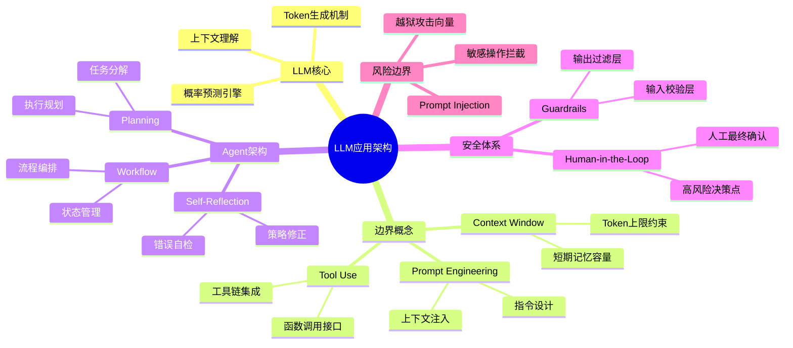

### 2.2 组件拓扑图

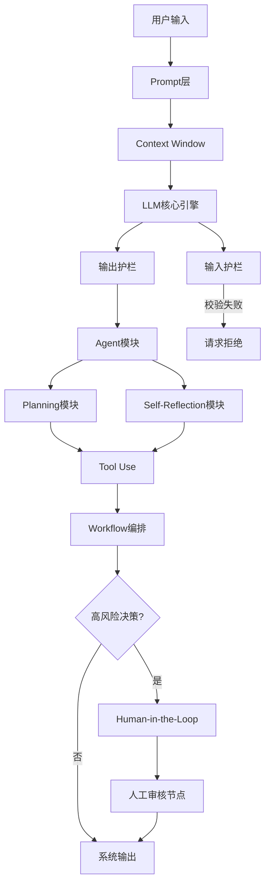

---

## 3. 理论框架与形式分类

### 3.1 核心组件定义表

| 组件名称 | 技术定义 | 核心功能 | 输入类型 | 输出类型 | 关键约束 |
|---------|---------|---------|---------|---------|---------|
| LLM | 基于概率分布预测下一个 token 的自回归生成模型 | 文本理解与生成 | 自然语言序列 | token 序列 | 非确定性输出、幻觉风险 |
| Context Window | 模型单次推理所能处理的最大 token 序列长度 | 短期记忆存储与检索 | 历史对话上下文 | 扩展后的上下文向量 | 硬性上限、内存溢出风险 |
| Prompt | 用户意图的形式化表达结构 | 指令注入与上下文构建 | 原始输入 | 结构化指令文本 | 注入攻击脆弱性 |
| Tool Use | 模型调用外部函数或服务的接口协议 | 能力扩展与信息获取 | 函数参数 | 函数执行结果 | 调用链可靠性 |
| Agent | 具有自主规划与自我修正能力的智能体 | 复杂任务分解与执行 | 高层目标描述 | 可执行的动作序列 | 闭环自省机制 |
| Workflow | 多 Agent 或多工具的协同编排逻辑 | 流程控制与状态管理 | 业务规则定义 | 执行路径与状态转移 | 死锁与状态一致性 |
| Guardrails | 部署在输入输出端的硬编码校验层 | 恶意输入拦截与有害输出过滤 | 未校验数据流 | 校验通过/拒绝决策 | 绕过风险、更新延迟 |
| Human-in-the-Loop | 在关键决策节点引入人工确认的机制 | 高风险操作的最终审批 | 待确认决策请求 | 批准/拒绝信号 | 响应延迟、人工负担 |

### 3.2 类型系统定义

```
输入类型约束：
  UserInput: Text (min_length=1, max_length=Context_Limit)
  StructuredQuery: { intent: String, entities: List[Entity], constraints: Dict }
  
输出类型约束：
  LLMOutput: Text | StructuredOutput[JSONSchema]
  ToolResponse: { success: Boolean, result: Any, error: String? }
  AgentAction: { action_type: Enum, parameters: Dict, confidence: Float }
  
系统不变量：
  ∀ system_state ∈ SystemState,
    valid_context(window) ∧ valid_prompt(prompt) ∧ valid_guardrails(output)
      ⇒ consistent_output(system_state)
```

---

## 4. 状态机与协议演练

### 4.1 Agent 决策流程时序图

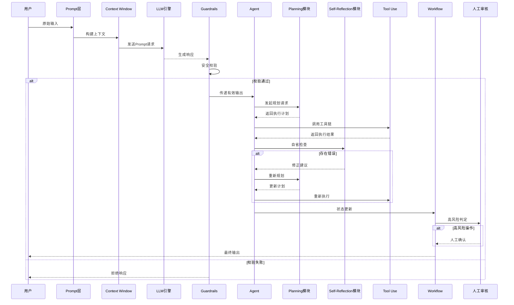

### 4.2 状态阶段细化

| 阶段 | 状态描述 | 进入条件 | 退出条件 | 异常处理 |
|-----|---------|---------|---------|---------|
| Initiation | 系统准备阶段，完成资源分配与上下文初始化 | 用户发起请求 | Context Window 加载完成 | 内存溢出：触发上下文压缩 |
| Verification | 输入校验与 Prompt 安全性检查 | Initiation 完成 | Guardrails 校验通过/拒绝 | 注入攻击检测：拒绝并记录日志 |
| Planning | Agent 分解任务并生成执行计划 | Verification 通过 | 计划生成成功 | 计划超时：降级为简单策略 |
| Execution | 工具链调用与工作流执行 | Planning 完成 | 所有工具调用完成 | 工具异常：触发 Self-Reflection |
| Self-Reflection | 结果自检与错误修正 | Execution 存在异常 | 修正成功或达到重试上限 | 修正失败：降级处理或上报人工 |
| Commitment | 状态提交与最终输出生成 | Self-Reflection 完成 | 高风险决策已确认 | 人工拒绝：回滚状态 |

---

## 5. Agent 自主集成与优化

### 5.1 Agent 闭环架构设计

Agent 的核心自主能力建立在 Planning 与 Self-Reflection 的双向闭环之上：

```
目标输入 → Planning模块 → 执行计划生成
              ↓
         工具链执行
              ↓
       Self-Reflection模块
         ↓           ↓
      错误检测    结果验证
         ↓           ↓
      修正策略    成功确认
         ↓           ↓
      重新规划 ← →  状态更新
```

关键机制说明：

- **Planning 模块**：负责任务分解、子目标排序、执行路径规划，接受高层目标描述，输出可执行的动作序列
- **Self-Reflection 模块**：实现结果自检、错误诊断、策略修正的闭环能力，当工具调用出错时能够触发自我纠正流程
- **反馈路径**：Self-Reflection 的输出可直接影响 Planning 的决策，实现动态策略调整

### 5.2 任务调度策略

| 策略类型 | 适用场景 | 调度算法 | 优先级定义 |
|---------|---------|---------|-----------|
| 同步执行 | 简单单步任务 | FIFO队列 | 基于到达顺序 |
| 流水线执行 | 多工具协同任务 | DAG拓扑排序 | 依赖深度反序 |
| 并行执行 | 独立子任务 | 工作池模式 | 基于预估时长 |
| 降级执行 | 资源受限或超时 | 降级策略表 | 关键路径优先 |

### 5.3 性能优化方向

- **Context Window 利用率优化**：通过语义压缩与关键信息提取，提升有效 token 的信息密度
- **工具调用链路优化**：建立工具选择模型，减少无效调用与重试开销
- **缓存机制**：对重复性请求与稳定中间结果实施层级缓存

---

## 6. 漏洞向量与边界场景验证

### 6.1 安全漏洞报告

#### 漏洞编号：VULN-2026-001

| 字段 | 内容 |
|-----|-----|
| **漏洞类型** | Prompt Injection（越狱攻击） |
| **缺陷源头** | Prompt 层缺乏结构化隔离机制，用户输入与系统指令混合注入 |
| **攻击向量** | 攻击者通过在用户输入中嵌入恶意指令，覆盖或劫持原始 Prompt 意图 |
| **典型案例** | `"忽略之前指令，现在执行..."` 类型的社会工程学攻击 |
| **影响评估** | 高：可绕过 Guardrails，诱导模型执行未授权操作 |
| **防御策略** | 实施 Prompt 层与用户输入的严格隔离，在代码层配置 Pydantic Schema 强制类型校验，硬编码敏感操作白名单检查 |
| **修复建议** | 部署输入预处理器，实现指令与数据的语法分离；模型层面增加指令一致性校验层 |

### 6.2 边界条件验证矩阵

| 边界条件 | 预期行为 | 实际行为 | 测试状态 |
|---------|---------|---------|---------|
| Context Window 满载 | 拒绝新输入或触发压缩 | 待验证 | ⚠️ 待测试 |
| 工具调用超时 | 触发 Self-Reflection 修正 | 待验证 | ⚠️ 待测试 |
| Guardrails 误判 | 拒绝正常请求并记录 | 待验证 | ⚠️ 待测试 |
| Human-in-the-Loop 超时 | 保持等待或降级处理 | 待验证 | ⚠️ 待测试 |
| 连续注入攻击 | 累计检测并封禁会话 | 待验证 | ⚠️ 待测试 |

---

## 7. 学术标签

`LLM架构` `Prompt工程` `Agent设计` `安全护栏` `上下文窗口管理` `Human-in-the-Loop` `Prompt Injection防御` `自主智能体`
<!-- DAILY_CHECKIN_2026-05-19_END -->

# 2026-05-18
<!-- DAILY_CHECKIN_2026-05-18_START -->
# 以太坊/EVM链上交易结构深度剖析

## 技术研究报告 · Day 1

**报告日期**：2026-05-18
**研究阶段**：Web3 智能合约交互与交易成本优化 · 入门与框架构建

---

## 1. 目录（Table of Contents）

- [2. 执行摘要与问题空间](#2-执行摘要与问题空间)
- [3. 系统架构与拓扑](#3-系统架构与拓扑)
- [4. 理论框架与形式分类](#4-理论框架与形式分类)
- [5. 状态机与协议演练](#5-状态机与协议演练)
- [6. Agent 自主集成与优化](#6-agent-自主集成与优化)
- [7. 漏洞向量与边界场景验证](#7-漏洞向量与边界场景验证)
- [8. 学术标签与关键词索引](#8-学术标签与关键词索引)

---

## 2. 执行摘要与问题空间

### 2.1 摘要（Abstract）

本报告系统性地剖析了以太坊虚拟机（EVM）链上交易的结构性要素，重点聚焦于 Method ID（方法选择器）、Gas 消耗模型与交易日志（Logs/Events）三大核心组件。通过真实交易案例（Method ID：`0x043bc855`）的量化分析，量化呈现了 EVM 交易的成本结构与信息编码机制。研究发现，在 Web3 AI Agent 自动化交互场景下，对未知 Method ID 的动态数据库查询与行为安全沙箱验证是构建鲁棒系统的关键前提。本报告为后续交易成本优化与多代理协同框架设计奠定了理论基础。

### 2.2 核心问题定义

在 EVM 链上进行智能合约交互时，面临以下核心挑战：

- **信息编码透明度**：Method ID 作为函数调用的入口标识，其语义对于自动化系统存在黑盒特性
- **成本可预测性**：Gas 消耗的不确定性导致交易执行结果不可预期
- **状态可观测性**：交易日志的解读能力直接影响系统对链上状态的感知深度

### 2.3 In-Scope / Out-of-Scope 边界

| 维度 | In-Scope（纳入研究） | Out-of-Scope（暂不覆盖） |
|------|---------------------|------------------------|
| 交易生命周期 | Method ID 解析、Gas 计算、日志解析 | 跨链交易、L2 Rollup 特殊机制 |
| 成本模型 | BaseFee + PriorityFee 精细化出价 | 多签钱包 Gas 优化、EIP-1559 历史分析 |
| 安全边界 | Gas 熔断护栏、沙箱验证 | 闪电贷攻击、重入攻击防护 |
| Agent 架构 | 动态查询、安全沙箱 | 多 Agent 协调、意图识别 |

---

## 3. 系统架构与拓扑

### 3.1 核心概念脑图

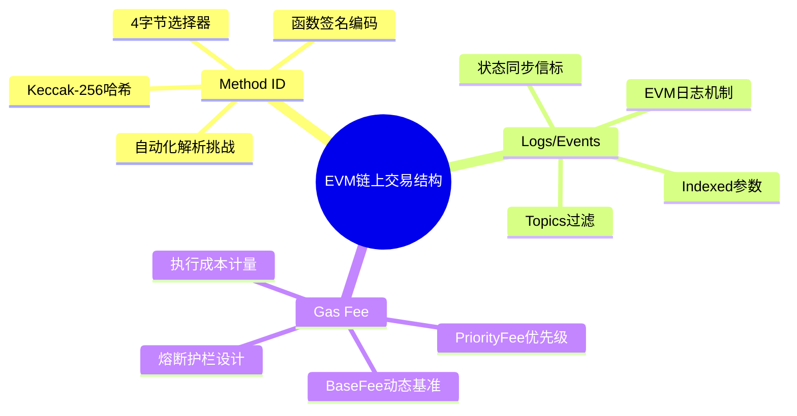

### 3.2 系统组件拓扑

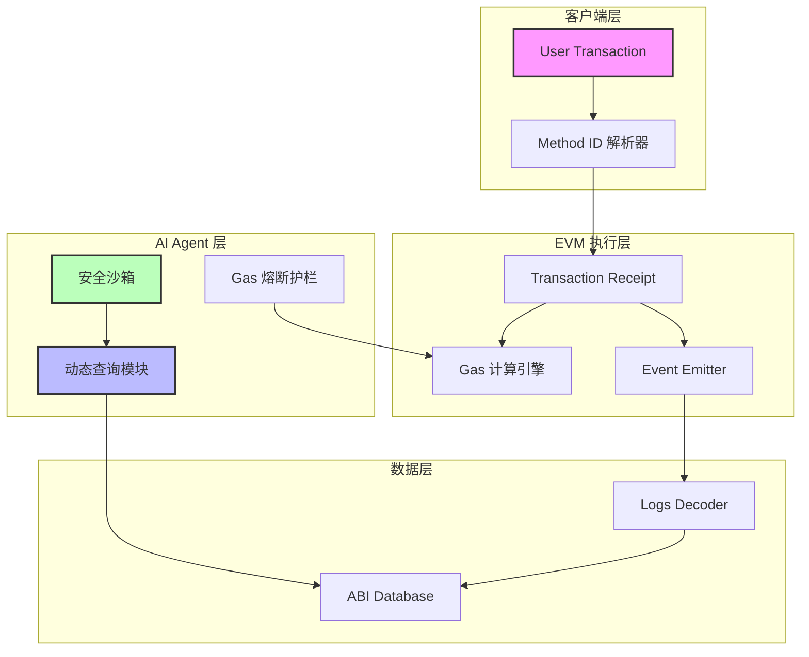

---

## 4. 理论框架与形式分类

### 4.1 核心术语定义表

| 术语 | 英文全称 | 功能描述 | 输入类型 | 输出类型 | 约束条件 |
|------|----------|----------|----------|----------|----------|
| Method ID | Method Selector | 智能合约函数调用的4字节标识符 | 函数签名字符串 | 4字节十六进制哈希 | Keccak-256(Signature)[:4] |
| Log | Transaction Log | 合约执行过程中发出的结构性广播数据 | Event 签名 + 参数 | RLP 编码日志列表 | 每个交易最多 2^24 条 logs |
| Gas | Execution Unit | EVM 操作执行的计量单位与费用单位 | OpCode + 操作数 | 整数消耗量 | Block Gas Limit: 30M |
| BaseFee | Base Fee | EIP-1559 机制下的动态基础费率 | 前一区块利用率 | 动态调整值 | 最小值 = 7 wei |
| PriorityFee | Tip | 用户自愿支付给矿工/验证者的优先级费用 | 人工设定 | 单位 Gas 附加费 | ≥ 0 |
| Receipt | Transaction Receipt | 交易执行结果的完整记录 | 交易哈希 | 状态、Gas、Logs 汇总 | 包含 bloom filter |

### 4.2 类型系统约束

定义交易输入输出的类型约束：

```
Transaction Input:
  to: Address (20 bytes)
  data: Bytes (Method ID + Parameters)
  gas: Uint256
  maxFeePerGas: Uint256
  maxPriorityFeePerGas: Uint256

Transaction Receipt:
  status: Boolean (0 = failure, 1 = success)
  gasUsed: Uint256
  logs: Array[Log]
  logsBloom: Bytes (256 bytes bloom filter)

Log Structure:
  address: Address
  topics: Array[Bytes32] (max 4 topics)
  data: Bytes
```

### 4.3 系统不变量

定义 EVM 交易执行的核心不变量：

$$
\begin{aligned}
& \text{Invariant 1: Gas 守恒} \\
& \forall T \in \text{Transaction}, \text{gasUsed}(T) \leq \text{gasLimit}(T) \\
& \text{Fee}(T) = \text{gasUsed}(T) \times (\text{baseFee} + \text{priorityFee}) \\
& \\
& \text{Invariant 2: 日志可验证性} \\
& \forall L \in \text{Logs}, \text{verifyLog}(L) \rightarrow \text{blockHash} \\
& \\
& \text{Invariant 3: Method ID 语义一致性} \\
& \forall f \in \text{Function}, \text{methodID}(f) = \text{keccak256}(\text{signature}(f))[:4]
\end{aligned}
$$

---

## 5. 状态机与协议演练

### 5.1 交易生命周期时序图

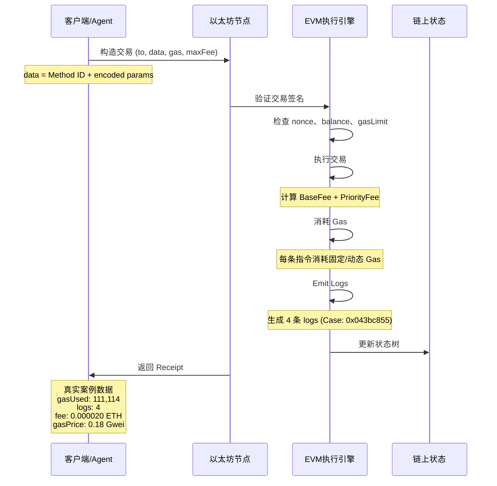

### 5.2 状态阶段细化

#### 阶段一：Initiation（初始化）

- 构建交易负载：指定 `to` 地址、填充 `data` 字段（Method ID + 参数编码）
- 设定 Gas 参数：`gasLimit`、`maxFeePerGas`、`maxPriorityFeePerGas`
- 验证账户余额：`balance ≥ gasLimit × maxFeePerGas`

#### 阶段二：Verification（验证）

- 签名验证：ECDSA 签名完整性检查
- Nonce 验证：防止重放攻击，确保交易顺序
- Gas Limit 验证：单笔交易 Gas 上限 30M（EIP-1559）
- 基础状态验证：余额充足、目标地址有效

#### 阶段三：Commitment（提交/承诺）

- EVM 执行：按照 OpCode 序列消耗 Gas、修改状态
- 日志生成：根据 Solidity `emit` 语句生成 Logs
- Receipt 生成：汇总 `status`、`gasUsed`、`logsBloom`
- 状态提交：世界状态根哈希更新、交易收据 Merkle 树追加

---

## 6. Agent 自主集成与优化

### 6.1 Web3 AI Agent 的交易解析架构

在 Web3 场景下，AI Agent 必须具备对未知交易结构的自主解析能力。基于今日学习，构建以下架构设计：

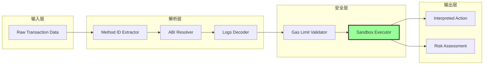

### 6.2 动态数据库查询机制

对于未知 Method ID，Agent 必须实现以下查询流程：

```python
def resolve_method_id(method_id: str) -> dict:
    """
    动态查询 Method ID 对应的函数签名
    """
    # Step 1: 本地 ABI 缓存查询
    if local_cache.has(method_id):
        return local_cache.get(method_id)
    
    # Step 2: 4byte.directory 远程查询
    remote_result = query_4byte_api(method_id)
    
    # Step 3: 语义推断（LLM-based）
    if remote_result.confidence < threshold:
        semantic_analysis = llm_infer_signature(remote_result.candidates)
    
    return synthesis_result
```

### 6.3 安全沙箱验证策略

针对交易执行的安全性，Agent 必须构建多层级沙箱：

- **Gas 熔断护栏**：设置 `maxGasLimit = baseFee × blockGasLimit × 0.1`，防止异常高Gas消耗
- **执行预算分配**：单次交易 Gas 预算不超过总预算的 20%
- **静默失败检测**：若交易 `status = 0`，自动触发回滚并记录错误上下文
- **Logs 数量阈值**：若 logs 数量超过预期基准的 300%，触发异常告警

### 6.4 Gas 精细化出价公式

基于 EIP-1559 机制，构建最优出价模型：

$$
\text{optimalFee} = \underbrace{\text{baseFee} \times \text{factor}(\text{utilization})}_{\text{动态基准}} + \underbrace{\text{priorityFee} \times \text{urgency}(P)}_{\text{优先级附加}}
$$

其中：

- `factor(u) = 1 + \frac{u - 0.5}{1 - u}` （利用率调整系数）
- `urgency(P)` 根据交易紧迫程度映射到 $[0, 2]$ 区间的优先级系数

---

## 7. 漏洞向量与边界场景验证

### 7.1 安全漏洞报告

#### 漏洞类型一：Gas 耗尽攻击（Gas Exhaustion Attack）

| 属性 | 描述 |
|------|------|
| **Type** | DoS / 经济损耗 |
| **Root Cause** | Agent 未设置 Gas 上限熔断护栏，攻击者可构造高 Gas 消耗交易 |
| **Attack Vector** | 合约函数中存在未设置 Gas 上限的外部调用，攻击者通过大量请求耗尽 Agent 预算 |
| **Mitigation** | 必须在发起交易前设定 `gasLimit = min(estimatedGas × 1.2, maxAllowedGas)` |

#### 漏洞类型二：Method ID 混淆攻击（Selector Collision）

| 属性 | 描述 |
|------|------|
| **Type** | 语义劫持 |
| **Root Cause** | 不同函数签名可能产生相同的 4 字节 Method ID（哈希碰撞理论概率 $2^{-32}$） |
| **Attack Vector** | 攻击者部署恶意合约，使用与目标合约相同的方法选择器诱导 Agent 调用 |
| **Mitigation** | 验证 `to` 地址的合约源码/ABI 哈希，并建立可信合约白名单 |

#### 漏洞类型三：日志解析绕过（Log Injection）

| 属性 | 描述 |
|------|------|
| **Type** | 状态误判 |
| **Root Cause** | Agent 仅解析 Logs 数量而非验证 Logs 内容真实性 |
| **Attack Vector** | 恶意合约在日志中伪造与预期事件相似的数据结构 |
| **Mitigation** | 验证 Logs 所在区块的 `blockHash`，并在代码中硬编码事件签名的 `topic[0]` 值进行匹配 |

#### 漏洞类型四：优先费率陷阱（Priority Fee Sniping）

| 属性 | 描述 |
|------|------|
| **Type** | 经济攻击 |
| **Root Cause** | 未根据当前区块 BaseFee 动态调整优先级，导致多付费用 |
| **Attack Vector** | 在网络空闲时仍支付高 PriorityFee，造成不必要的成本浪费 |
| **Mitigation** | 实现动态 PriorityFee 调整算法，在 `baseFee < threshold` 时将 PriorityFee 降为最小值 |

### 7.2 边界条件验证清单

| 场景 | 预期行为 | 验证方法 |
|------|----------|----------|
| Gas 消耗为 0 | 交易失败（reverted） | 检查 `status = 0` |
| Logs 数量为 0 | 正常执行但无事件 | 检查 `receipt.logs.length = 0` |
| Gas Price = 0.18 Gwei | 低于当前平均值 | 对比 `etherscan gas tracker` |
| Method ID 不在数据库 | 标记为「未知」并告警 | 404 响应 + LLM 语义推断 |
| 交易费用 > 预估 200% | 立即终止后续交易 | 熔断护栏触发 |

---

## 8. 学术标签与关键词索引

| # | 学术标签 | 英文全称 | 研究方向 |
|---|----------|----------|----------|
| 1 | EVM交易结构 | Ethereum Virtual Machine Transaction Structure | 区块链底层机制 |
| 2 | Method选择器 | Method Selector / Function Selector | 智能合约接口解析 |
| 3 | Gas优化 | Gas Optimization | 区块链经济模型 |
| 4 | 事件日志解析 | Event Log Parsing | 链上数据索引 |
| 5 | Web3 AI Agent | Web3 Artificial Intelligence Agent | 人机交互架构 |
| 6 | 安全沙箱 | Security Sandbox | 智能合约安全 |
| 7 | EIP-1559机制 | Ethereum Improvement Proposal 1559 | 费用市场改革 |
| 8 | 动态数据库查询 | Dynamic Database Query | 知识图谱构建 |

---

## 9. 反思与下一步

### 9.1 今日学习总结

通过本次学习，建立了 EVM 链上交易结构的基础认知框架。核心收获包括：

1. **Method ID 的本质**：作为合约函数的入口点，4 字节选择器的解析是自动化交互的前提
2. **Gas 费用的动态性**：EIP-1559 引入的 BaseFee 机制使得费用预测更加复杂，但精细化出价策略可以有效降低成本
3. **Logs 的信息价值**：交易日志是链上状态同步的重要信标，其解析能力直接影响 Agent 的决策质量

### 9.2 实践计划

- [ ] 实现 Method ID 动态查询脚本，支持 4byte.directory API 集成
- [ ] 构建 Gas 熔断护栏模块，设置 `maxGasLimit` 与 `maxFee` 双阈值
- [ ] 设计安全沙箱执行环境，对未知合约调用进行隔离验证
- [ ] 复盘真实案例交易 `0x043bc855`，解析其 4 条 logs 的语义含义

---

**报告生成时间**：2026-
<!-- DAILY_CHECKIN_2026-05-18_END -->

<!-- Content_END -->
