# 0xLoong

**GitHub ID:** Silence-dream

**Telegram:** @Ox_Loong

## Self-introduction

AI x Web3 School

## Notes

<!-- Content_START -->
# 2026-05-28
<!-- DAILY_CHECKIN_2026-05-28_START -->
**2026-05-28 学习笔记**  
  
**Hackathon项目开发 - AI Agent DeFi策略师**  
  
**学习目标**  
1\. 搭建AI Agent DeFi策略师项目骨架  
2\. 确定技术栈并完成基础配置  
3\. 实现最小可行原型（MVP）基础框架  
4\. 记录技术选型与实现过程  
  
\---  
  
**一、今日核心任务**  
  
**1\. 项目骨架搭建**  
\- **目录结构设计**：  
  

```
  ai-agent-defi-strategist/
  ├── frontend/          # React前端
  ├── backend/           # Node.js/Python后端
  ├── ai-agent/          # ElizaOS Agent核心
  ├── data-fetcher/      # 链上数据获取模块
  ├── smart-contracts/   # 智能合约（如有需要）
  └── docs/              # 项目文档
  
```

\- **初始化步骤**：  
  1. 创建GitHub仓库（如`ai-agent-defi-strategist`）  
  2. 使用ElizaOS模板初始化Agent框架  
  3. 配置基础开发环境（Node.js 18+, Python 3.10+）  
  
**2\. 技术栈确认**  
**\*\*前端**\*\*  
  
• 组件: **前端**  
  
• 技术选型: React + Chart.js  
  
• 理由: 成熟生态，图表展示友好  
  
**\*\*后端**\*\*  
  
• 组件: **后端**  
  
• 技术选型: Node.js (Express)  
  
• 理由: 与ElizaOS集成方便  
  
**\*\*AI框架**\*\*  
  
• 组件: **AI框架**  
  
• 技术选型: ElizaOS  
  
• 理由: 开源、支持链上交互、社区活跃  
  
**\*\*AI推理**\*\*  
  
• 组件: **AI推理**  
  
• 技术选型: Ora Protocol SDK  
  
• 理由: 链上可验证推理，适合DeFi场景  
  
**\*\*数据源**\*\*  
  
• 组件: **数据源**  
  
• 技术选型: The Graph + Etherscan API  
  
• 理由: 去中心化查询 + 实时数据  
  
**\*\*区块链交互**\*\*  
  
• 组件: **区块链交互**  
  
• 技术选型: ethers.js v6  
  
• 理由: 现代、轻量、TypeScript支持好  
  
**3\. MVP功能范围**  
**核心流程**：  

```
用户输入 → Agent解析意图 → 获取链上数据 → AI推理分析 → 输出策略建议
```

  
**具体功能**：  
1\. **自然语言接口**：接收用户指令（如"分析ETH/USDC流动性池风险"）  
2\. **数据获取**：从The Graph获取DeFi协议数据（TVL、APR、交易量）  
3\. **AI分析**：通过Ora Protocol进行基础风险评估  
4\. **结果展示**：以文本+简单图表形式展示分析结果  
  
\---  
  
**二、技术要点笔记**  
  
**1\. ElizaOS快速入门**  

Bash

```
# 安装ElizaOS CLI
npm install -g @elizaos/cli

# 创建新项目
elizaos create ai-agent-defi-strategist
cd ai-agent-defi-strategist

# 启动开发服务器
elizaos start --dev
```

  
**关键概念**：  
\- **Character**：Agent的人格设定和知识库  
\- **Actions**：Agent可执行的操作（如查询链上数据）  
\- **Providers**：数据提供者（如区块链数据、API数据）  
  
**2\. Ora Protocol集成要点**  

JavaScript

```
// 安装Ora SDK
npm install @ora-protocol/sdk

// 基础调用示例
import { Ora } from '@ora-protocol/sdk';

const ora = new Ora({
  network: 'ethereum', // 或 'polygon', 'arbitrum'
});

// 请求AI推理
const result = await ora.requestInference({
  model: 'defi-risk-assessment',
  input: {
    protocol: 'uniswap-v3',
    pool: 'ETH/USDC',
    timeframe: '7d'
  }
});
```

  
**3\. The Graph查询示例**  

graphql

```
# 查询Uniswap V3池子数据
{
  pool(id: "0x8ad599c3a0ff1de082011efddc58f1908eb6e6d8") {
    token0 { symbol }
    token1 { symbol }
    liquidity
    volumeUSD
    totalValueLockedUSD
  }
}
```

  
\---  
  
**三、实践步骤**  
  
**步骤1：环境准备（30分钟）**  
1\. 确保Node.js 18+和Python 3.10+已安装  
2\. 安装ElizaOS CLI和必要依赖  
3\. 配置以太坊测试网RPC（如Sepolia）  
4\. 获取必要的API密钥（The Graph、Etherscan）  
  
**步骤2：项目初始化（45分钟）**  
1\. 创建项目目录结构  
2\. 初始化Git仓库  
3\. 使用ElizaOS创建Agent骨架  
4\. 配置基础依赖和脚本  
  
**步骤3：核心模块实现（90分钟）**  
1\. **数据获取模块**：  
   - 实现The Graph查询客户端  
   - 实现Etherscan API调用  
   - 数据格式化工具函数  
  
2\. **AI推理模块**：  
   - 集成Ora Protocol SDK  
   - 定义DeFi风险评估模型调用  
   - 结果解析和格式化  
  
3\. **Agent核心逻辑**：  
   - 定义Character（DeFi策略师人格）  
   - 实现基础Action：`analyze_defi_risk`  
   - 连接数据获取和AI推理模块  
  
**步骤4：测试与调试（45分钟）**  
1\. 单元测试各模块功能  
2\. 集成测试完整流程  
3\. 调试常见错误（网络连接、API限制等）  
  
\---  
  
**四、思考题**  
  
1\. **可信度问题**：如何确保AI推理结果在DeFi决策中的可信度？考虑Ora Protocol的验证机制。  
  
2\. **实时性挑战**：区块链数据更新有延迟，如何处理DeFi策略的时效性要求？  
  
3\. **自主边界**：AI Agent应该有多大的自主权？  
   - 自动执行交易 vs 仅提供建议  
   - 资金管理权限控制  
   - 风险控制机制设计  
  
4\. **成本优化**：每次AI推理和链上查询都有成本，如何优化调用频率？  
  
\---  
  
**五、参考资源**  
  
**文档**  
\- [ElizaOS官方文档](https://github.com/elizaOS/eliza)  
\- [Ora Protocol开发者文档](https://docs.ora.io/)  
\- [The Graph文档](https://thegraph.com/docs/)  
\- [ethers.js v6文档](https://docs.ethers.org/)  
  
**示例项目**  
\- [ElizaOS DeFi Agent示例](https://github.com/elizaOS/eliza/tree/main/examples)  
\- [Ora Protocol集成案例](https://github.com/ora-io/awesome-ora)  
  
**社区**  
\- ElizaOS Discord：实时技术支持  
\- Ora Protocol Telegram：开发者交流
<!-- DAILY_CHECKIN_2026-05-28_END -->

# 2026-05-27
<!-- DAILY_CHECKIN_2026-05-27_START -->

**交易完整生命周期**  
  
**流程图（文字版）**  
  

```
用户发起交易（用私钥签名）
    ↓
交易广播到 P2P 网络
    ↓
节点验证签名和余额
    ↓
矿工/验证者收集交易
    ↓
打包进新区块
    ↓
共识机制确认（PoW/PoS）
    ↓
区块上链（不可逆）
    ↓
交易最终确认
```

  
  
\---  
  
**📝 各阶段详解**  
  
**1️⃣ 用户发起交易**  
\- 用户使用私钥对交易进行签名  
\- 签名确保交易的真实性和不可篡改性  
  
**2️⃣ 交易广播到 P2P 网络**  
\- 签名后的交易被广播到去中心化网络  
\- 网络中的节点接收并转发交易  
  
**3️⃣ 节点验证签名和余额**  
\- 网络节点验证交易签名的有效性  
\- 检查发送方是否有足够余额  
\- 验证交易格式和语法  
  
**4️⃣ 矿工/验证者收集交易**  
\- 矿工（PoW）或验证者（PoS）收集待处理交易  
\- 将交易放入内存池（mempool）  
  
**5️⃣ 打包进新区块**  
\- 矿工/验证者将交易打包成新的区块  
\- 区块包含多笔交易和区块头信息  
  
**6️⃣ 共识机制确认**  
\- **PoW（工作量证明）**：矿工通过计算哈希值竞争记账权  
\- **PoS（权益证明）**：验证者根据质押的代币数量被选中  
\- 确保网络对新区块达成一致  
  
**7️⃣ 区块上链（不可逆）**  
\- 新区块被添加到区块链末尾  
\- 一旦上链，交易几乎不可逆转  
\- 后续区块会进一步确认交易的最终性  
  
**8️⃣ 交易最终确认**  
\- 交易被网络完全确认  
\- 接收方可以信任交易已完成  
\- 通常需要多个区块确认（如6个区块）
<!-- DAILY_CHECKIN_2026-05-27_END -->

# 2026-05-25
<!-- DAILY_CHECKIN_2026-05-25_START -->


````
# 2026-05-25 学习日志

## 去中心化 AI 推理网络 + Hackathon 项目启动

### 学习路径：推荐路径（从理论到实践，先理解再动手）

---

## 一、去中心化 AI 推理网络 全景图

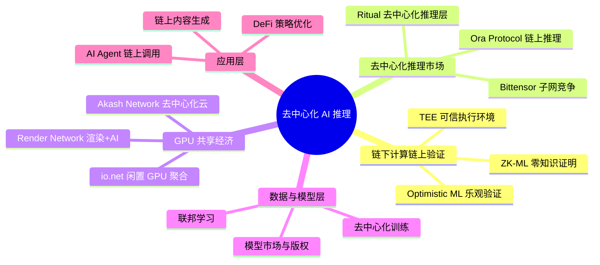

---

## 二、核心模式 / 五大要点

### 模式 1：ZK-ML（零知识机器学习）

**核心思想**：在链下运行 AI 模型推理，生成零知识证明，链上只验证证明的正确性——既保证了计算效率，又实现了可验证性。

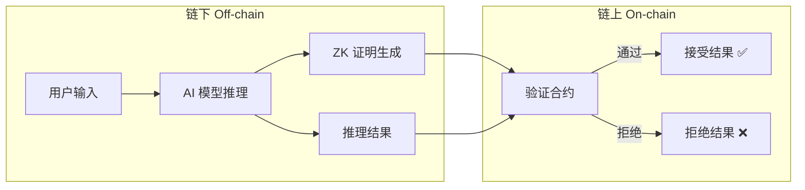

**代表性项目**：
- **EZKL**：将 ML 模型转换为 ZK 电路，支持链上验证推理结果。已被多个 DeFi 项目集成
- **Modulus Labs**：专注于 ZK 证明的 AI 推理，目标是让链上 AI 决策可验证
- **Giza**：在 StarkNet 上实现链上 ML 推理，主打 DeFi 策略优化

**技术关键点**：
- ZK 证明生成是瓶颈——生成一个 MNIST 推理证明可能需要几分钟
- 电路大小与模型复杂度成正比，目前只适合小型模型
- 未来方向：递归证明、硬件加速（GPU/FPGA）、专用 ZK 芯片

---

### 模式 2：去中心化推理市场

**核心思想**：将 AI 推理能力商品化，任何人可以提供 GPU 算力，任何人可以购买推理服务，通过代币经济激励供需平衡。

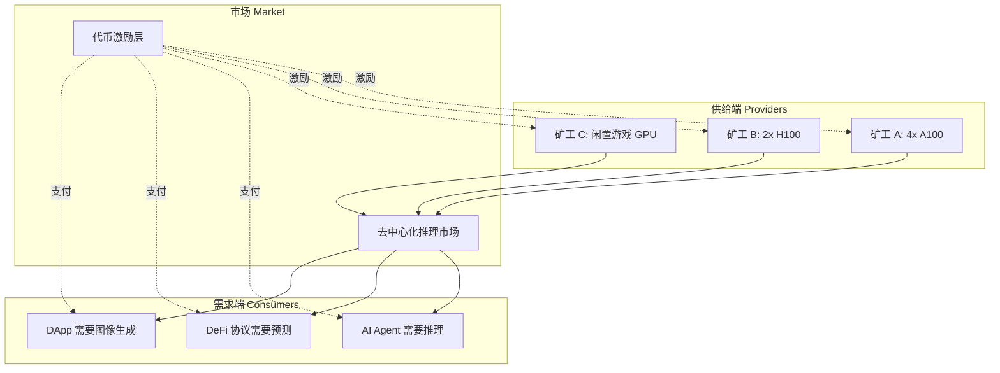

**代表性项目**：
- **Bittensor (TAO)**：去中心化 AI 网络，通过子网竞争机制让不同 AI 服务（文本、图像、推理）相互竞争，优胜劣汰。当前市值最大的去中心化 AI 项目之一
- **Ora Protocol**：提供链上 AI 推理预言机，智能合约可以直接调用 AI 模型。创新点是将 AI 推理作为区块链原语
- **Ritual**：去中心化推理层，为 DeFi、DAO 等场景提供可验证的 AI 推理服务

**技术关键点**：
- 验证问题是核心难题——如何确保矿工返回的是真实推理结果而非随机数？
- 常见方案：多矿工冗余计算 + 挑战机制、ZK 证明、TEE 硬件证明
- 代币经济设计：质押-惩罚机制确保服务质量

---

### 模式 3：GPU 共享经济（DePIN + AI）

**核心思想**：聚合全球闲置 GPU 资源（数据中心、矿工、个人电脑），形成分布式计算网络，成本比传统云服务低 50-90%。

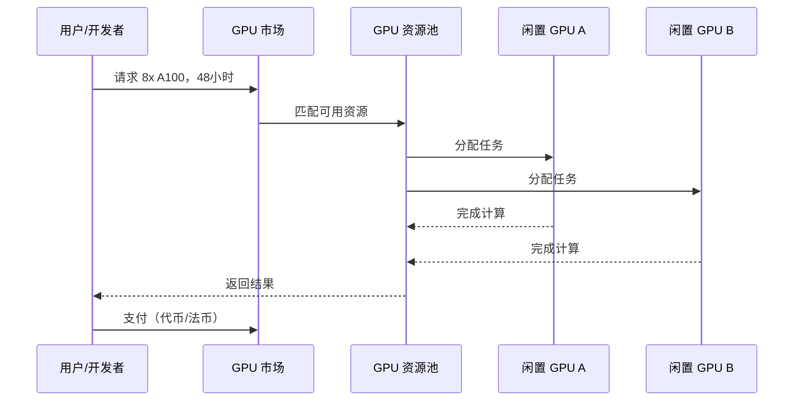

**代表性项目**：
- **io.net**：聚合来自数据中心、矿工、闲置设备的 GPU，构建分布式 AI 计算网络。支持 PyTorch/TensorFlow 直接部署。成本比 AWS 低 50-90%
- **Render Network (RENDER)**：最初聚焦 3D 渲染，现扩展到 AI 训练和推理。与 Apple、HBO 等有合作关系
- **Akash Network (AKT)**：去中心化云市场，支持 GPU 租赁和 AI 工作负载。采用反向拍卖定价

**技术关键点**：
- 网络延迟和带宽是实际瓶颈——分布式训练需要高速互联
- 数据隐私：敏感数据在他人 GPU 上运行，需要加密或 TEE
- 容错机制：节点随时可能离线，需要任务重分配和检查点

---

### 模式 4：TEE 可信执行环境

**核心思想**：利用硬件级安全飞地（如 Intel SGX、AMD SEV），在不可信的远程 GPU 上安全运行 AI 模型，保证数据和模型的机密性。

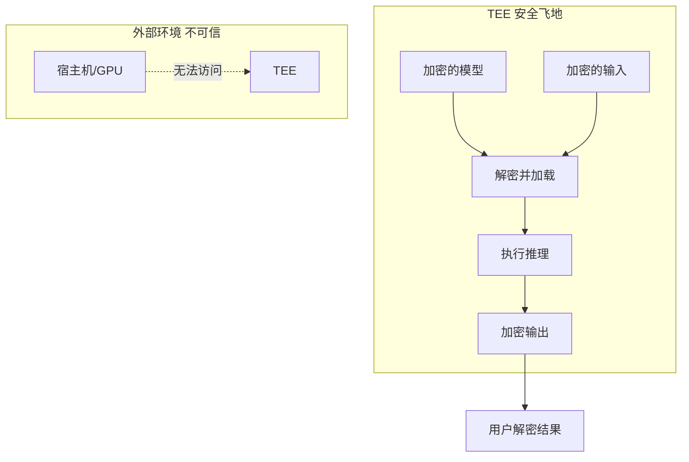

**代表性项目**：
- **Flashbots SUAVE**：使用 TEE 保护 MEV 策略的隐私性
- **Marlin Protocol**：TEE + 去中心化计算网络，支持机密 AI 推理
- **Secret Network**：基于 TEE 的隐私智能合约平台，可运行隐私保护的 AI 模型

**技术关键点**：
- TEE 并非万能——侧信道攻击（如 Spectre/Meltdown）仍可能泄露信息
- 性能开销：TEE 内的计算比普通环境慢 10-30%
- 硬件依赖：需要特定 CPU/GPU 支持，限制了去中心化程度

---

### 模式 5：链上 AI Agent 闭环

**核心思想**：AI Agent 不仅调用链上合约，还能自主进行推理、决策、执行的完整闭环——从"工具"进化为"自主参与者"。

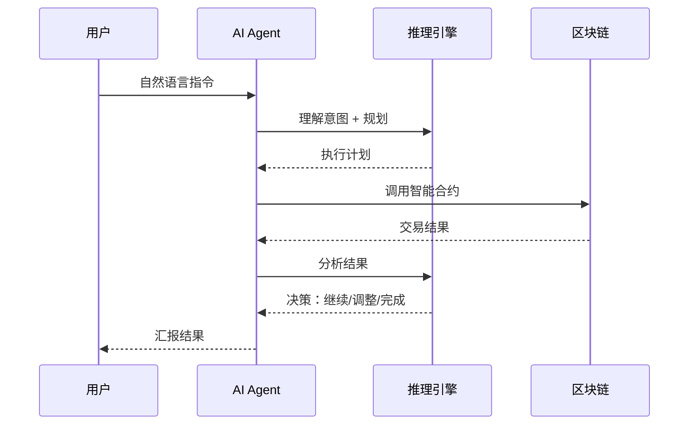

**代表性项目**：
- **AI16Z / ElizaOS**：开源 AI Agent 框架，支持 Agent 自主管理加密资产、社交互动
- **Virtuals Protocol**：AI Agent 代币化平台，Agent 可以拥有自己的代币和资产
- **MyShell**：AI Agent 创建平台，支持 Agent 与区块链交互

**技术关键点**：
- Function Calling 是核心——LLM 如何准确选择和调用链上工具
- 安全性：Agent 有资金操作权限时，需要多签、限额等保护机制
- 成本控制：每次推理都有成本，需要优化调用频率和模型选择

---

## 三、重点项目深度解析

### 🔥 1. Bittensor — 去中心化 AI 竞争网络

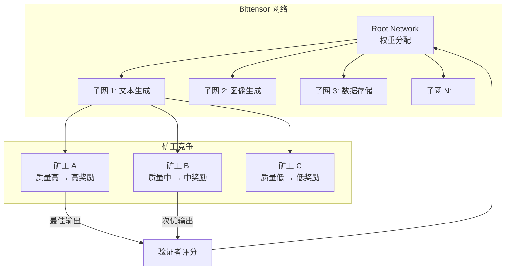

**核心机制**：
- 每个子网专注一种 AI 服务（文本、图像、推理、搜索等）
- 矿工在子网中竞争，提供最佳 AI 输出
- 验证者评估矿工质量，分配 TAO 代币奖励
- Root Network 动态调整各子网的奖励权重

**为什么重要**：
- 这是目前最大的去中心化 AI 网络，市值一度超过 100 亿美元
- 子网机制创造了 AI 服务的自由市场
- 任何开发者都可以创建新子网，定义新的 AI 服务类型

**Hackathon 可借鉴点**：
- 可以在 Bittensor 子网上构建应用，直接调用去中心化 AI 服务
- 子网创建机制可以启发自己的项目设计

---

### 🔥 2. Ora Protocol — 链上 AI 预言机

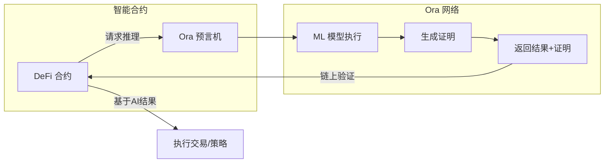

**核心机制**：
- 将 AI 推理作为区块链原语——智能合约可以直接 `requestAIInference()`
- 使用乐观验证 + 挑战期机制降低成本
- 支持多种 ML 模型（分类、回归、NLP 等）

**为什么重要**：
- 解决了"智能合约不够智能"的问题——DeFi 协议终于可以用 AI 做决策
- 降低了 AI × Web3 的集成门槛
- 已在多个 DeFi 协议中实际应用

---

## 四、技术方案对比与选择指南

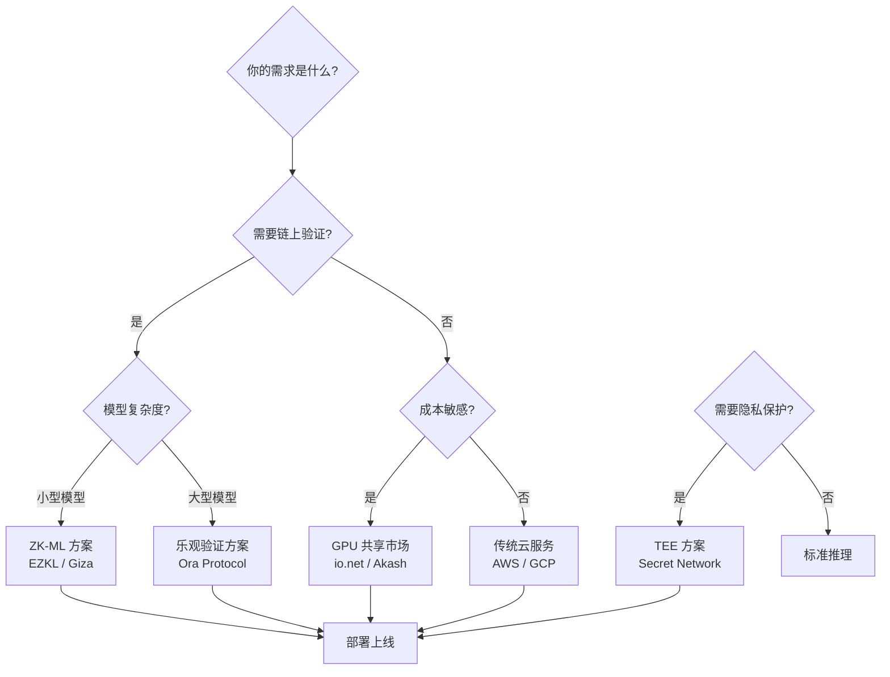

**选择建议**：
- **DeFi 策略优化** → Ora Protocol（链上推理 + 乐观验证）
- **AI Agent + 资产管理** → ElizaOS 框架 + Bittensor 推理
- **数据隐私优先** → TEE 方案（Secret Network / Marlin）
- **低成本大规模推理** → io.net / Akash（GPU 共享）

---

## 五、Hackathon 项目灵感 💡

基于今天学习的去中心化 AI 推理，以下是一些可行的 Hackathon 方向：

**方向 1：AI Agent DeFi 策略师** ⭐⭐⭐ 难度 / ⭐⭐⭐⭐ 创新性
- AI Agent 自动分析 DeFi 协议数据，生成投资策略
- 使用 Ora Protocol 做链上推理，ElizaOS 做 Agent 框架
- 技术栈：Solidity + ElizaOS + Ora SDK + React

**方向 2：去中心化 AI 模型市场** ⭐⭐⭐⭐ 难度 / ⭐⭐⭐⭐⭐ 创新性
- 模型提供者上传模型，用户付费调用
- 使用 ZK 证明验证模型质量
- 技术栈：Solidity + EZKL + IPFS + Next.js

**方向 3：链上 AI 内容审核 DAO** ⭐⭐ 难度 / ⭐⭐⭐ 创新性
- DAO 提交内容，AI Agent 自动审核并投票
- 使用 Bittensor 子网做内容分析
- 技术栈：Solidity + Bittensor SDK + Snapshot + React

**推荐入门方向**：方向 1（AI Agent DeFi 策略师）
- 难度适中，工具链成熟
- 可以先做一个 MVP：Agent 读取链上数据 → 推理 → 给出建议
- 后续可以扩展为自动执行

---

## 六、关键术语速查

- **ZK-ML**：Zero-Knowledge Machine Learning，用零知识证明验证 ML 推理结果的正确性
- **DePIN**：Decentralized Physical Infrastructure Networks，去中心化物理基础设施网络
- **TEE**：Trusted Execution Environment，可信执行环境，硬件级安全飞地
- **Optimistic ML**：乐观机器学习，默认接受结果，设有挑战期供质疑
- **子网 (Subnet)**：Bittensor 网络中专注于特定 AI 服务的独立竞争市场
- **推理 (Inference)**：使用训练好的模型对新输入进行预测/生成的过程
- **Function Calling**：LLM 根据用户意图选择并调用预定义工具/API 的能力

---

## 七、今日学习总结

### 📌 核心收获

1. **去中心化 AI 推理有三条主要技术路线**：ZK-ML（可验证但慢）、乐观验证（快但有挑战期）、TEE（安全但依赖硬件）。没有银弹，需要根据场景选择
2. **Bittensor 和 Ora 是当前最值得关注的两个项目**：前者构建了 AI 服务的自由市场，后者让智能合约真正"智能"
3. **GPU 共享经济正在改变 AI 计算的成本结构**：io.net 等项目将闲置 GPU 聚合，成本比 AWS 低 50-90%，这对 Hackathon 项目非常友好

### 🤔 思考题

- 如果你要做一个 AI Agent DeFi 项目，你会选择哪种推理验证方案？为什么？
- 去中心化推理市场如何防止矿工"作弊"（返回假结果）？
- ZK-ML 的性能瓶颈什么时候能被突破？这对 AI × Web3 意味着什么？

### 📚 进一步阅读

- [EZKL 文档](https://docs.ezkl.xyz/)：ZK-ML 的实际操作指南
- [Bittensor 子网文档](https://docs.bittensor.com/)：了解子网机制和开发
- [Ora Protocol 文档](https://docs.ora.io/)：链上 AI 推理的集成方法
- [io.net 文档](https://docs.io.net/)：GPU 共享网络的使用方式

---

## 八、下一步行动

### 今日剩余时间建议

1. ✅ 选择一个 Hackathon 方向（推荐：AI Agent DeFi 策略师）
2. ✅ 画出项目架构图（用 Mermaid）
3. ✅ 确定技术栈并搭建项目骨架
4. ✅ 提交今日学习日志到 GitHub

### 本周目标

- 完成 Hackathon 项目的最小可行原型（MVP）
- 核心功能：Agent 读取链上数据 → AI 推理 → 给出策略建议
- 技术栈确定 + 基础代码框架搭建完成

---

> 💡 *今天学的内容比较硬核，但这些是 AI × Web3 的核心基础设施。理解了这些，你就知道自己的 Hackathon 项目该站在哪个"肩膀"上了。加油！*
````
<!-- DAILY_CHECKIN_2026-05-25_END -->

# 2026-05-23
<!-- DAILY_CHECKIN_2026-05-23_START -->


## **一、账户：你的链上身份**

在区块链世界里，账户就是你的链上身份。

它通常表现为一个地址，例如：

0xA1b2C3...89F

这个地址可以接收资产、发送资产、持有 Token、持有 NFT，也可以和智能合约交互。

你可以把账户理解成：

> 你在区块链上的身份证号，或者银行账户号。

但和传统互联网不同的是，区块链账户没有用户名、密码、手机号验证码。

真正控制账户的是你的私钥。

谁掌握了私钥，谁就拥有这个账户的控制权。

想进一步理解账户、钱包、地址和私钥的关系，可以阅读

[Ethereum 官方钱包介绍](https://ethereum.org/wallets/)

。Ethereum 官方文档也提到，钱包可以作为你连接应用的入口，并帮助你管理账户、余额和交易记录。(

[ethereum.org](http://ethereum.org)

)

实操例子：创建一个链上账户

你可以选择一个钱包工具，例如：

-   [MetaMask](https://metamask.io/)
    
-   [Rabby Wallet](https://rabby.io/)
    
-   [OKX Wallet](https://web3.okx.com/)
    
-   [Phantom](https://phantom.com/)
    

这些都是常见的钱包入口，其中 MetaMask、Rabby 和 OKX Wallet 都支持以太坊及 EVM 生态，Phantom 常用于 Solana，也支持多链场景。(

[MetaMask](https://metamask.io/?utm_source=chatgpt.com)

)

创建钱包后，你会得到一个地址，例如：

0x7a9F...12B8

这个地址就是你的链上账户。

别人可以往这个地址转 ETH、Token 或 NFT。

但一定要记住：

> 地址可以公开，私钥和助记词绝对不能公开。

## **二、钱包：管理账户和私钥的工具**

很多新手会误以为，钱包是“存币的地方”。

其实不是。

链上资产并不是存在钱包里，而是记录在区块链上。

钱包只是帮你管理账户和私钥的工具。

钱包主要负责：

-   创建账户
    
-   保存私钥或助记词
    
-   展示链上资产
    
-   连接 DApp
    
-   发起签名
    
-   发起交易
    

所以更准确地说：

> 钱包不是保险柜，而是钥匙管理器。

资产在链上，钱包负责帮你拿着“钥匙”。

实操例子：用同一个助记词恢复账户

假设你在

[MetaMask](https://metamask.io/)

里创建了一个钱包。

之后你把同一组助记词导入

[Rabby Wallet](https://rabby.io/)

。

你会发现，Rabby 里也能看到同一个地址。

这说明：

账户不是属于某个钱包 App 的。 账户属于这组私钥或助记词。

MetaMask、Rabby、OKX Wallet 只是不同的钱包工具。

安全提醒

不要把助记词发给任何人。

不要在陌生网站输入助记词。

不要把助记词截图保存在手机或网盘。

如果一个网站让你输入助记词，基本可以直接判断为高风险。

## **三、签名：证明这次操作是你授权的**

区块链没有传统意义上的登录系统。

你不能通过手机号验证码证明“我是我”。

你证明身份的方式是：

> 用私钥对消息或交易进行签名。

签名的作用是：

-   证明这次操作确实是你授权的
    
-   不暴露你的私钥
    
-   防止别人伪造你的操作
    
-   保证交易内容没有被篡改
    

签名就像你在链上的电子签字。

实操例子：连接 DApp 时签名登录

很多 Web3 网站都会有一个按钮：

Connect Wallet

比如你打开一个 NFT 网站、DeFi 网站或链上数据工具时，它会要求你连接钱包。

连接后，网站可能会弹出一个签名请求：

Sign this message to login

你点击签名后，并不一定会发生转账，也不一定会消耗 Gas。

这个过程通常只是证明：

这个地址确实由你控制。

你需要分清两类签名

第一类是**消息签名**。

它通常用于登录、验证身份，一般不消耗 Gas。

第二类是**交易签名**。

它会把交易提交到链上，一般会消耗 Gas。

所以每次钱包弹窗时，都要认真看清楚：

这是普通签名，还是交易确认？

## **四、交易：提交给区块链的一条操作请求**

在区块链里，交易不只是转账。

只要你想修改链上的状态，通常都需要发起一笔交易。

比如：

-   转 ETH 是交易
    
-   转 Token 是交易
    
-   Mint NFT 是交易
    
-   Swap 代币是交易
    
-   质押资产是交易
    
-   部署智能合约是交易
    
-   调用合约方法也是交易
    

所以交易的本质是：

> 你向区块链提交的一条状态修改请求。

实操例子：给另一个地址转 0.001 ETH

假设你在测试网上有一点测试 ETH。

你打开钱包，点击发送。

填写对方地址：

0xB2c3...9F88

填写金额：

0.001 ETH

然后点击确认。

这时钱包会生成一笔交易。

这笔交易的意思是：

我同意从我的地址转出 0.001 ETH 到这个目标地址。

你确认后，钱包会用你的私钥签名，并把交易广播到区块链网络。

之后你可以用

[Sepolia Etherscan](https://sepolia.etherscan.io/)

查看这笔测试网交易。Sepolia Etherscan 是 Etherscan 提供的 Sepolia 测试网浏览器，可以查询测试网上的交易、地址、Token 和区块信息。(

[Ethereum (ETH) Blockchain Explorer](https://sepolia.etherscan.io/?utm_source=chatgpt.com)

)

## **五、Gas：链上操作的手续费**

区块链不是免费运行的。

每一笔交易都需要节点进行验证、计算和存储。

因此，你需要为这次操作支付手续费。

这个手续费通常叫 Gas。

你可以把 Gas 理解成：

> 链上操作的燃料费，或者计算资源费。

Ethereum 官方文档解释，发送交易或运行智能合约都需要支付 Gas 费用，用来处理链上的计算任务。(

[ethereum.org](http://ethereum.org)

)

实操例子：对比转账和 Swap 的 Gas

你可以观察两种操作。

第一种是普通转账：

从 A 地址转 0.001 ETH 到 B 地址

第二种是 Swap：

把 ETH 换成 USDC

你会发现，Swap 的 Gas 通常比普通转账更高。

因为普通转账只是修改两个账户的余额。

而 Swap 需要调用去中心化交易所的智能合约，计算兑换比例、更新池子余额、转移 Token，执行逻辑更复杂。

如果你想实时查看以太坊主网 Gas 情况，可以打开

[Etherscan Gas Tracker](https://etherscan.io/gastracker/)

。Etherscan Gas Tracker 会展示当前 Ethereum 网络的 Gas 相关信息。(

[Ethereum (ETH) Blockchain Explorer](https://etherscan.io/gastracker?utm_source=chatgpt.com)

)

## **六、智能合约：链上的自动程序**

智能合约可以理解成部署在区块链上的程序。

它按照提前写好的代码规则自动执行。

比如一个 NFT 合约可能规定：

用户支付 0.05 ETH，可以 Mint 一个 NFT。

当你点击 Mint 按钮时，你不是在和某个传统服务器交互，而是在调用链上的 NFT 合约。

合约会自动判断：

-   你有没有支付足够的 ETH
    
-   Mint 是否还开放
    
-   你是否有白名单资格
    
-   是否超过购买数量限制
    

如果条件满足，合约就会执行 Mint，并把 NFT 记录到你的账户地址下。

Solidity 官方文档中也提到，合约可以理解为部署在以太坊链上某个地址中的代码和数据集合。(

[Solidity 文档](https://docs.soliditylang.org/en/latest/introduction-to-smart-contracts.html?utm_source=chatgpt.com)

)

实操例子：用 Remix 体验合约

如果你想真正感受智能合约是怎么运行的，可以打开

[Remix IDE](https://remix.live/)

。

[Remix](https://remix.live/)

是一个可以在浏览器里编写、测试、部署智能合约的 Web3 IDE，适合初学者学习 Solidity 和合约部署。(

[Remix IDE](https://remix.live/?utm_source=chatgpt.com)

)

你可以尝试：

1\. 打开 Remix 2. 新建一个 Solidity 合约 3. 编译合约 4. 连接测试网钱包 5. 部署到测试网 6. 在区块浏览器查看合约地址

想系统学习合约语言，可以阅读：

-   [Solidity 官方文档](https://docs.soliditylang.org/)
    
-   [Ethereum 智能合约介绍](https://ethereum.org/developers/docs/smart-contracts/)
    
-   [Ethereum 开发者文档](https://ethereum.org/developers/docs/)
    

## **七、测试网：链上操作的练习场**

在真实区块链上操作需要消耗真实资产。

为了避免学习和开发过程中造成损失，区块链通常会提供测试网。

测试网可以理解成：

> 区块链的练习场，或者沙盒环境。

常见测试网包括：

-   Sepolia
    
-   Base Sepolia
    
-   Arbitrum Sepolia
    
-   Polygon Amoy
    
-   BNB Testnet
    
-   Solana Devnet
    

测试网上的 Token 一般没有真实价值，可以通过水龙头领取。

开发者可以在测试网上部署合约、测试功能、模拟交易。

新手也可以用测试网练习钱包连接、签名、转账、Mint 和合约交互。

实操例子：在 Sepolia 测试网上转账

你可以按照这个流程练习：

1\. 安装 MetaMask 或 Rabby 2. 切换到 Sepolia 测试网 3. 领取 Sepolia 测试 ETH 4. 给另一个地址转 0.001 测试 ETH 5. 在 Sepolia Etherscan 查看交易

测试 ETH 可以尝试通过

[Google Cloud Sepolia Faucet](https://cloud.google.com/application/web3/faucet/ethereum/sepolia)

领取。该页面说明 Sepolia ETH 可以用于部署合约、调试交易和在测试网上实验。(

[Google Cloud](https://cloud.google.com/application/web3/faucet/ethereum/sepolia?utm_source=chatgpt.com)

)

如果你需要添加不同 EVM 网络，可以使用

[ChainList](https://chainlist.org/)

查询网络信息。ChainList 提供 EVM 网络的 Chain ID、RPC 等信息，常用于把网络添加到钱包中。(

[ChainList](https://chainlist.org/?utm_source=chatgpt.com)

)

## **八、区块浏览器：链上世界的搜索引擎**

区块浏览器是查看链上数据的工具。

常见区块浏览器包括：

-   [Etherscan](https://etherscan.io/)
    
-   [Sepolia Etherscan](https://sepolia.etherscan.io/)
    
-   [Solscan](https://solscan.io/)
    
-   [Solana Explorer](https://explorer.solana.com/)
    

你可以通过区块浏览器查看：

-   某个地址的资产
    
-   某笔交易是否成功
    
-   消耗了多少 Gas
    
-   调用了哪个智能合约
    
-   发生了哪些 Token 转移
    
-   合约代码是否开源
    
-   区块打包情况
    

Etherscan 是以太坊常用区块浏览器，可以查询以太坊上的交易、地址、Token 和区块等信息；Solscan 和 Solana Explorer 则常用于查看 Solana 链上的交易和账户数据。(

[Ethereum (ETH) Blockchain Explorer](https://etherscan.io/?utm_source=chatgpt.com)

)

实操例子：查询一笔交易

当你完成一次转账、Mint 或 Swap 后，钱包通常会给你一个交易哈希。

它长得类似这样：

0x9f3a8c...7bd2

你可以复制这个交易哈希，然后打开对应链的区块浏览器。

例如：

如果是 Ethereum 主网交易，就打开

[Etherscan](https://etherscan.io/)

。

如果是 Sepolia 测试网交易，就打开

[Sepolia Etherscan](https://sepolia.etherscan.io/)

。

如果是 Solana 交易，就打开

[Solscan](https://solscan.io/)

或

[Solana Explorer](https://explorer.solana.com/)

。

你可以看到：

交易状态：成功 / 失败 发送方：你的地址 接收方：目标地址或合约地址 Gas 消耗：多少 交易时间：什么时候打包 区块高度：被打包在哪个区块 Token 转移：发生了哪些资产变化

区块浏览器是学习 Web3 最重要的工具之一。

你不应该只看钱包显示结果。

真正的链上记录，要去区块浏览器里查。

## **九、把所有模块串成一次完整实操**

现在我们用一个完整场景把所有概念串起来。

假设你要在测试网上 Mint 一个 NFT。

完整链路是这样的：

1\. 你创建一个钱包账户 2. 钱包生成一个链上地址 3. 你切换到测试网 4. 你领取测试 ETH 5. 你打开 NFT Mint 页面 6. 你连接钱包 7. DApp 识别你的账户地址 8. 你点击 Mint 9. DApp 生成一笔合约调用交易 10. 钱包弹出交易确认 11. 你查看 Gas 费用 12. 你点击确认 13. 钱包用私钥签名交易 14. 交易被广播到区块链网络 15. 节点验证交易是否合法 16. 验证者把交易打包进区块 17. NFT 合约执行 Mint 逻辑 18. NFT 被记录到你的账户地址下 19. 交易完成 20. 你在区块浏览器查看交易详情

这就是一条完整的链上操作链。

## **十、推荐读者收藏的实操入口**

钱包工具：

-   [MetaMask](https://metamask.io/)
    
-   [Rabby Wallet](https://rabby.io/)
    
-   [OKX Wallet](https://web3.okx.com/)
    
-   [Phantom](https://phantom.com/)
    

测试网和水龙头：

-   [Sepolia Etherscan](https://sepolia.etherscan.io/)
    
-   [Google Cloud Sepolia Faucet](https://cloud.google.com/application/web3/faucet/ethereum/sepolia)
    
-   [ChainList](https://chainlist.org/)
    

区块浏览器：

-   [Etherscan](https://etherscan.io/)
    
-   [Etherscan Gas Tracker](https://etherscan.io/gastracker/)
    
-   [Solscan](https://solscan.io/)
    
-   [Solana Explorer](https://explorer.solana.com/)
    

合约学习：

-   [Remix IDE](https://remix.live/)
    
-   [Solidity 官方文档](https://docs.soliditylang.org/)
    
-   [Ethereum 开发者文档](https://ethereum.org/developers/docs/)
    
-   [Ethereum 智能合约介绍](https://ethereum.org/developers/docs/smart-contracts/)
<!-- DAILY_CHECKIN_2026-05-23_END -->

# 2026-05-22
<!-- DAILY_CHECKIN_2026-05-22_START -->


````
# AI Agent + 链上执行：深度学习笔记

## 学习目标
- 理解 AI Agent 如何通过 Function Calling 与智能合约交互
- 掌握完整的 Agent 交易执行流程
- 了解关键技术栈和实现方案
- 能够设计一个简单的 AI Agent DeFi 项目

---

## 一、核心概念：什么是 AI Agent？

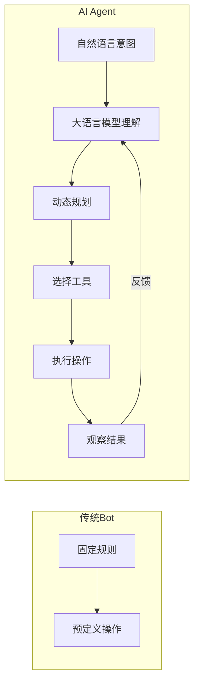

**关键区别**：
- 传统 Bot：if-else 规则，只能做预编程的操作
- AI Agent：理解自然语言意图，能动态规划和选择工具

---

## 二、Function Calling 原理

### 2.1 什么是 Function Calling？

Function Calling 是让 LLM 与外部世界交互的桥梁：

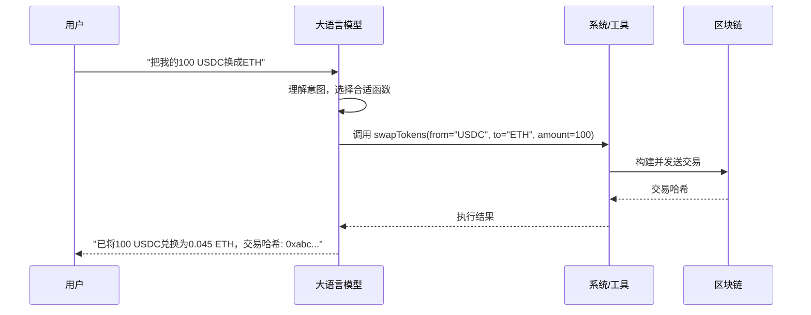

### 2.2 Function Calling 的工作原理

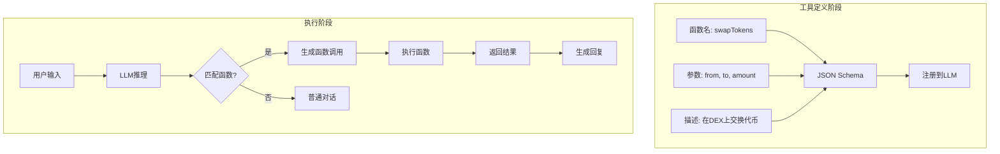

### 2.3 代码示例：定义工具函数

```typescript
// 定义 AI Agent 可用的工具
const tools = [
  {
    type: "function",
    function: {
      name: "swapTokens",
      description: "在去中心化交易所交换两种代币",
      parameters: {
        type: "object",
        properties: {
          fromToken: {
            type: "string",
            description: "源代币地址",
          },
          toToken: {
            type: "string",
            description: "目标代币地址",
          },
          amount: {
            type: "number",
            description: "交换数量",
          },
          slippage: {
            type: "number",
            description: "滑点容忍度（百分比）",
          },
        },
        required: ["fromToken", "toToken", "amount"],
      },
    },
  },
  {
    type: "function",
    function: {
      name: "getBalance",
      description: "查询钱包代币余额",
      parameters: {
        type: "object",
        properties: {
          tokenAddress: {
            type: "string",
            description: "代币合约地址",
          },
        },
        required: ["tokenAddress"],
      },
    },
  },
];
```

---

## 三、完整架构：AI Agent 执行链上交易

### 3.1 系统架构图

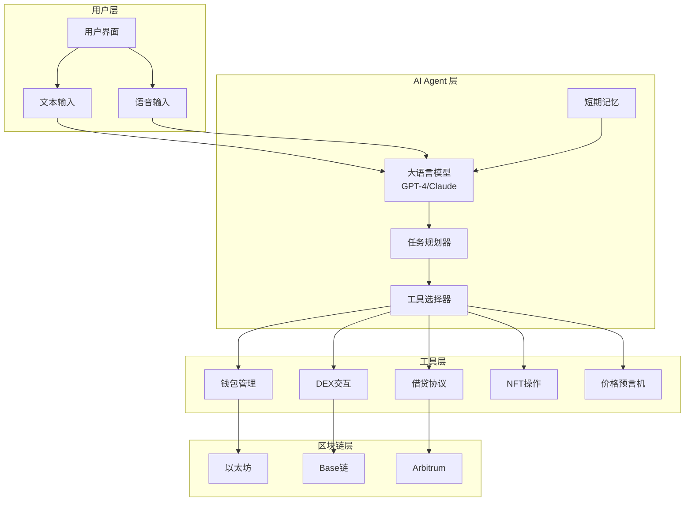

### 3.2 执行流程详解

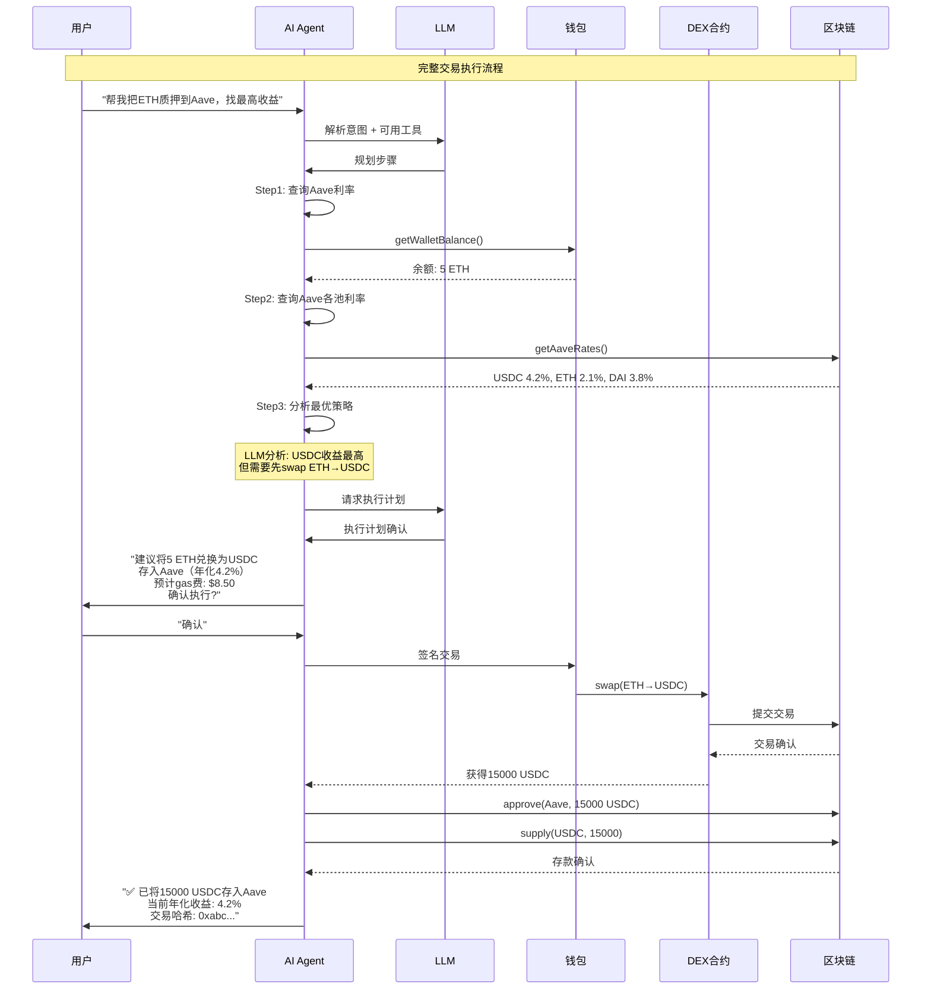

---

## 四、关键技术实现

### 4.1 钱包管理

```typescript
// 核心钱包类
class AgentWallet {
  private privateKey: string;
  private provider: ethers.JsonRpcProvider;
  
  constructor(privateKey: string, rpcUrl: string) {
    this.privateKey = privateKey;
    this.provider = new ethers.JsonRpcProvider(rpcUrl);
  }
  
  // 获取余额
  async getBalance(tokenAddress?: string): Promise<string> {
    if (!tokenAddress) {
      // 获取原生代币余额
      const balance = await this.provider.getBalance(this.getAddress());
      return ethers.formatEther(balance);
    }
    
    // 获取ERC20代币余额
    const contract = new ethers.Contract(tokenAddress, ERC20_ABI, this.provider);
    const balance = await contract.balanceOf(this.getAddress());
    const decimals = await contract.decimals();
    return ethers.formatUnits(balance, decimals);
  }
  
  // 发送交易
  async sendTransaction(to: string, value: string, data: string): Promise<string> {
    const wallet = new ethers.Wallet(this.privateKey, this.provider);
    const tx = await wallet.sendTransaction({
      to,
      value: ethers.parseEther(value),
      data,
      gasLimit: 200000,
    });
    return tx.hash;
  }
  
  // 签名消息
  async signMessage(message: string): Promise<string> {
    const wallet = new ethers.Wallet(this.privateKey);
    return await wallet.signMessage(message);
  }
}
```

### 4.2 DEX 交互工具

```typescript
// Uniswap V3 交互
const uniswapTools = [
  {
    name: "uniswap_swap",
    description: "在Uniswap V3上交换代币",
    parameters: {
      tokenIn: { type: "string", required: true },
      tokenOut: { type: "string", required: true },
      amountIn: { type: "string", required: true },
      fee: { type: "number", default: 3000 }, // 0.3%
      slippage: { type: "number", default: 0.5 }, // 0.5%
    },
    execute: async (params) => {
      const router = new ethers.Contract(UNISWAP_ROUTER, ROUTER_ABI, wallet);
      
      // 1. 获取报价
      const quote = await getQuote(params);
      
      // 2. 设置滑点保护
      const minAmountOut = quote.amountOut * (1 - params.slippage / 100);
      
      // 3. 执行交换
      const tx = await router.exactInputSingle({
        tokenIn: params.tokenIn,
        tokenOut: params.tokenOut,
        fee: params.fee,
        recipient: wallet.address,
        amountIn: ethers.parseUnits(params.amountIn, 18),
        amountOutMinimum: minAmountOut,
        sqrtPriceLimitX96: 0,
      });
      
      return {
        txHash: tx.hash,
        amountOut: quote.amountOut,
        gasUsed: tx.gasLimit.toString(),
      };
    },
  },
];
```

### 4.3 AI Agent 核心循环

```typescript
class OnChainAgent {
  private llm: OpenAI;
  private wallet: AgentWallet;
  private tools: Tool[];
  
  constructor(config: AgentConfig) {
    this.llm = new OpenAI({ apiKey: config.openaiKey });
    this.wallet = new AgentWallet(config.privateKey, config.rpcUrl);
    this.tools = this.loadTools();
  }
  
  // 主执行循环
  async run(userInput: string): Promise<AgentResponse> {
    // 1. 构建消息历史
    const messages = [
      { role: "system", content: SYSTEM_PROMPT },
      { role: "user", content: userInput },
    ];
    
    // 2. LLM推理循环
    while (true) {
      const response = await this.llm.chat.completions.create({
        model: "gpt-4",
        messages,
        tools: this.tools,
        tool_choice: "auto",
      });
      
      const choice = response.choices[0];
      
      // 3. 如果LLM决定调用工具
      if (choice.finish_reason === "tool_calls") {
        const toolCalls = choice.message.tool_calls;
        
        for (const call of toolCalls) {
          // 4. 执行工具调用
          const result = await this.executeTool(
            call.function.name,
            JSON.parse(call.function.arguments)
          );
          
          // 5. 将结果返回给LLM
          messages.push(choice.message);
          messages.push({
            role: "tool",
            tool_call_id: call.id,
            content: JSON.stringify(result),
          });
        }
        
        // 继续循环，让LLM处理结果
        continue;
      }
      
      // 6. LLM生成最终回复
      return {
        message: choice.message.content,
        status: "completed",
      };
    }
  }
  
  // 执行单个工具
  private async executeTool(name: string, args: any): Promise<any> {
    const tool = this.tools.find((t) => t.name === name);
    if (!tool) throw new Error(`Tool not found: ${name}`);
    
    console.log(`Executing tool: ${name}`, args);
    
    // 安全检查
    await this.validateTransaction(args);
    
    // 执行
    return await tool.execute(args, this.wallet);
  }
  
  // 安全验证
  private async validateTransaction(args: any): Promise<void> {
    // 检查交易金额是否超过限制
    if (args.amount && parseFloat(args.amount) > MAX_TRANSACTION_AMOUNT) {
      throw new Error("Transaction amount exceeds limit");
    }
    
    // 检查是否需要用户确认
    if (args.requiresConfirmation) {
      // 这里可以添加用户确认逻辑
    }
  }
}
```

---

## 五、安全设计（非常重要！）

### 5.1 安全风险矩阵

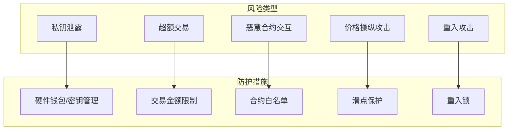

### 5.2 关键安全机制

```typescript
class SecurityManager {
  // 1. 交易金额限制
  private async checkAmountLimit(amount: number): Promise<boolean> {
    const limit = await this.getTransactionLimit();
    if (amount > limit) {
      throw new Error(`Amount ${amount} exceeds daily limit ${limit}`);
    }
    return true;
  }
  
  // 2. 合约白名单
  private async validateContract(address: string): Promise<boolean> {
    const whitelist = await this.getWhitelist();
    if (!whitelist.includes(address.toLowerCase())) {
      throw new Error(`Contract ${address} is not whitelisted`);
    }
    return true;
  }
  
  // 3. 价格保护
  private async checkPriceManipulation(
    tokenIn: string,
    tokenOut: string,
    expectedPrice: number
  ): Promise<boolean> {
    const actualPrice = await this.getPrice(tokenIn, tokenOut);
    const priceImpact = Math.abs(actualPrice - expectedPrice) / expectedPrice;
    
    if (priceImpact > MAX_PRICE_IMPACT) {
      throw new Error(`Price impact ${priceImpact} exceeds maximum`);
    }
    return true;
  }
  
  // 4. 用户确认（重要操作）
  private async requireUserConfirmation(
    action: string,
    details: any
  ): Promise<boolean> {
    // 发送确认请求给用户
    const confirmed = await this.sendConfirmationRequest({
      action,
      details,
      timeout: 30000, // 30秒超时
    });
    
    if (!confirmed) {
      throw new Error("User rejected the transaction");
    }
    return true;
  }
}
```

### 5.3 权限分级

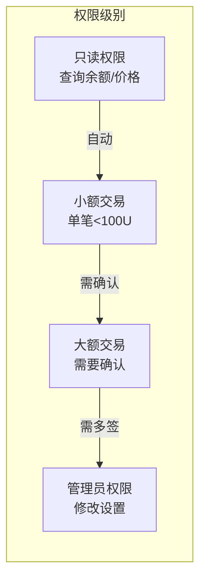

---

## 六、实际案例分析

### 案例1：Fetch.ai 的 Agent 网络

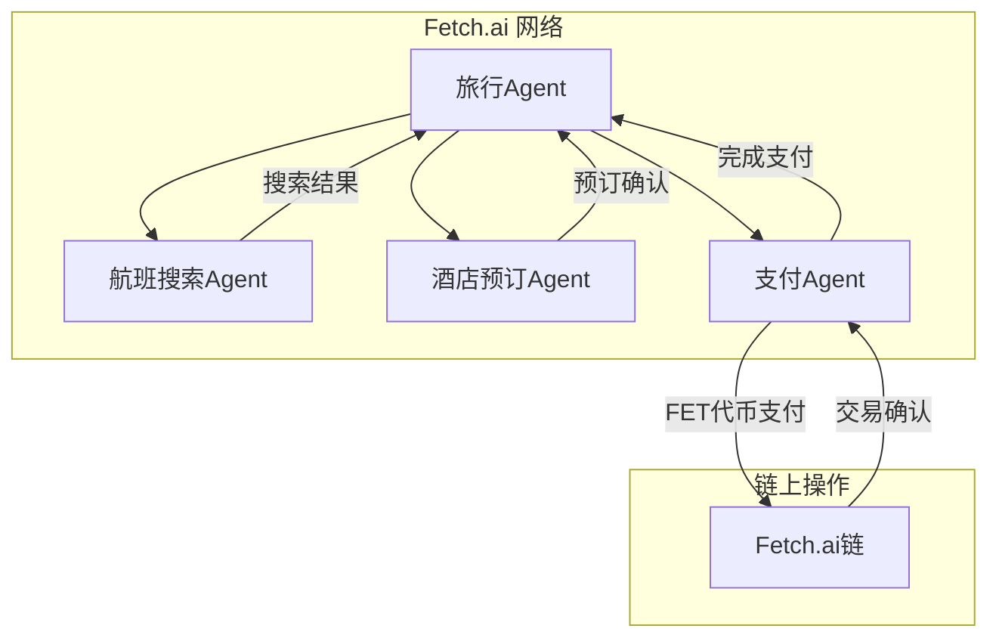

**特点**：
- Agent 可以发现和协商服务
- 自动化多方协调
- 使用原生代币 FET 进行支付

### 案例2：Autonolas 的 DeFi 策略 Agent

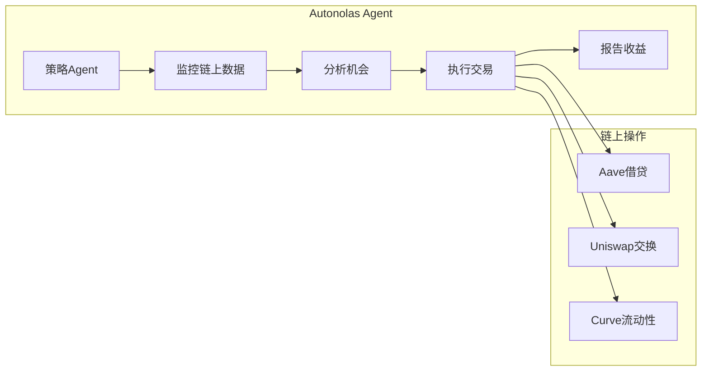

**特点**：
- 7x24 小时自动运行
- 多协议策略优化
- 收益自动复投

---

## 七、动手实践：构建你的第一个 AI Agent

### 7.1 最小可行项目

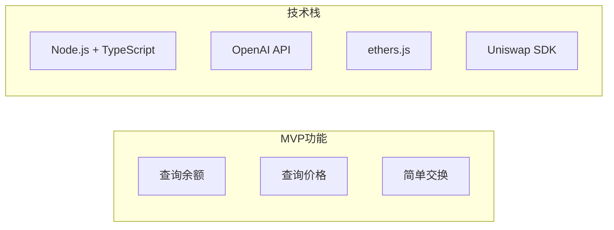

### 7.2 项目结构

```
ai-defi-agent/
├── src/
│   ├── agent/
│   │   ├── index.ts          # Agent 主类
│   │   ├── tools.ts          # 工具定义
│   │   └── safety.ts         # 安全模块
│   ├── blockchain/
│   │   ├── wallet.ts         # 钱包管理
│   │   ├── dex.ts            # DEX交互
│   │   └── contracts.ts      # 合约ABI
│   └── config/
│       └── index.ts          # 配置管理
├── package.json
└── README.md
```

### 7.3 核心代码示例

```typescript
// index.ts - AI Agent 主入口
import { OpenAI } from "openai";
import { AgentWallet } from "./blockchain/wallet";
import { getTools, executeTool } from "./agent/tools";

const openai = new OpenAI({ apiKey: process.env.OPENAI_API_KEY });
const wallet = new AgentWallet(process.env.PRIVATE_KEY!, process.env.RPC_URL!);

async function runAgent(userInput: string) {
  const tools = getTools(wallet);
  
  const messages = [
    {
      role: "system",
      content: `你是一个DeFi助手Agent。你可以帮用户查询余额、查看价格、执行交换。
        始终确认用户的意图，并在执行交易前获得确认。
        当前网络: ${process.env.CHAIN_NAME}`,
    },
    { role: "user", content: userInput },
  ];
  
  // Agent循环
  while (true) {
    const response = await openai.chat.completions.create({
      model: "gpt-4",
      messages,
      tools,
      tool_choice: "auto",
    });
    
    const choice = response.choices[0];
    
    if (choice.finish_reason === "tool_calls") {
      const toolCalls = choice.message.tool_calls!;
      
      for (const call of toolCalls) {
        const result = await executeTool(call.function.name, 
          JSON.parse(call.function.arguments), wallet);
        
        messages.push(choice.message);
        messages.push({
          role: "tool",
          tool_call_id: call.id,
          content: JSON.stringify(result),
        });
      }
      continue;
    }
    
    return choice.message.content;
  }
}

// 运行示例
async function main() {
  const result = await runAgent("查看我的USDC余额，然后告诉我ETH的当前价格");
  console.log(result);
}

main().catch(console.error);
```

---

## 八、进阶话题

### 8.1 多链支持

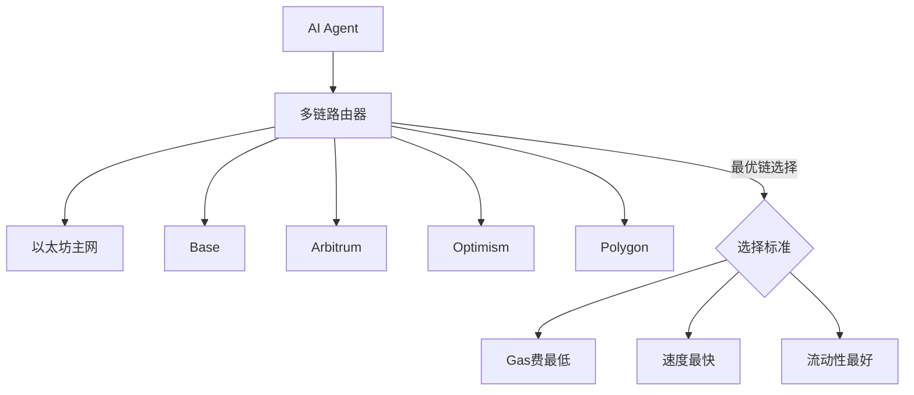

### 8.2 MEV 防护

```typescript
// 使用 Flashbots 保护交易
async function sendProtectedTransaction(tx: Transaction) {
  // 1. 构建交易包
  const bundle = [
    {
      signer: wallet,
      transaction: tx,
    },
  ];
  
  // 2. 通过 Flashbots 发送
  const result = await flashbots.sendBundle(bundle, targetBlock);
  
  // 3. 检查是否被包含
  const receipts = await result.receipts();
  
  return {
    included: receipts.length > 0,
    blockNumber: receipts[0]?.blockNumber,
  };
}
```

### 8.3 Agent 协作网络

```mermaid
flowchart TD
    subgraph 多Agent协作
        Master[主Agent] --> DeFi[DeFi策略Agent]
        Master --> Data[数据分析Agent]
        Master --> Risk[风险评估Agent]
        Master --> Exec[执行Agent]
        
        DeFi --> Master
        Data --> Master
        Risk --> Master
        Exec --> Master
    end
```

---

## 九、学习资源

### 必读文档
1. **OpenAI Function Calling**: https://platform.openai.com/docs/guides/function-calling
2. **ethers.js 文档**: https://docs.ethers.org/v6/
3. **Uniswap V3 SDK**: https://docs.uniswap.org/

### 开源项目参考
1. **ElizaOS**: https://github.com/elizaOS/eliza
2. **Fetch.ai uAgents**: https://github.com/fetchai/uAgents
3. **Autonolas**: https://github.com/valory-xyz/autonolas

### 工具推荐
- **Hardhat**: 本地开发和测试
- **The Graph**: 链上数据查询
- **Tenderly**: 交易模拟和调试

---

## 十、总结与思考

### 关键要点

1. **Function Calling 是桥梁**：让 LLM 能够理解和执行链上操作
2. **安全第一**：私钥管理、金额限制、滑点保护缺一不可
3. **Agent 循环**：LLM推理 → 工具选择 → 执行 → 反馈 → 继续推理
4. **多链思维**：现代DeFi需要跨链能力

### 思考题

1. 如果 AI Agent 执行了一个错误的交易，应该如何设计回滚机制？
2. 如何防止 LLM 被提示注入攻击，执行恶意交易？
3. AI Agent 的"自主权"边界应该在哪里？

### 项目练习

尝试构建一个最小的 AI Agent：
- 能够查询钱包余额
- 能够获取代币价格
- （可选）能够执行简单的交换

---

*学习日期: 2026-05-22*
*学习主题: AI Agent + 链上执行*
````
<!-- DAILY_CHECKIN_2026-05-22_END -->

# 2026-05-21
<!-- DAILY_CHECKIN_2026-05-21_START -->


# 一次链上操作是如何发生的？从账户、钱包、签名到交易、Gas、合约和区块浏览器

#   
很多人刚接触 Web3 时，会遇到一堆概念：

账户、钱包、签名、交易、Gas、智能合约、测试网、区块浏览器。

这些概念看起来分散，但其实它们共同组成了一条完整的链上操作链：

账户 → 钱包 → 签名 → 交易 → Gas → 合约执行 → 上链确认 → 区块浏览器查看

只要理解这条链路，你就能真正明白：

> 当你在 DApp 上点击一次按钮时，区块链背后到底发生了什么。

## **一、账户：你的链上身份**

在区块链世界里，账户就是你的链上身份。

它通常表现为一个地址，例如：

0xA1b2C3...89F

这个地址可以接收资产、发送资产、持有 Token、持有 NFT，也可以和智能合约交互。

你可以把账户理解成：

> 你在区块链上的身份证号，或者银行账户号。

但和传统互联网不同的是，区块链账户没有用户名、密码、手机号验证码。

真正控制账户的是你的私钥。

谁掌握了私钥，谁就拥有这个账户的控制权。

想进一步理解账户、钱包、地址和私钥的关系，可以阅读

[Ethereum 官方钱包介绍](https://ethereum.org/wallets/)

。Ethereum 官方文档也提到，钱包可以作为你连接应用的入口，并帮助你管理账户、余额和交易记录。(

[ethereum.org](http://ethereum.org)

)

实操例子：创建一个链上账户

你可以选择一个钱包工具，例如：

-   [MetaMask](https://metamask.io/)
    
-   [Rabby Wallet](https://rabby.io/)
    
-   [OKX Wallet](https://web3.okx.com/)
    
-   [Phantom](https://phantom.com/)
    

这些都是常见的钱包入口，其中 MetaMask、Rabby 和 OKX Wallet 都支持以太坊及 EVM 生态，Phantom 常用于 Solana，也支持多链场景。(

[MetaMask](https://metamask.io/?utm_source=chatgpt.com)

)

创建钱包后，你会得到一个地址，例如：

0x7a9F...12B8

这个地址就是你的链上账户。

别人可以往这个地址转 ETH、Token 或 NFT。

但一定要记住：

> 地址可以公开，私钥和助记词绝对不能公开。

## **二、钱包：管理账户和私钥的工具**

很多新手会误以为，钱包是“存币的地方”。

其实不是。

链上资产并不是存在钱包里，而是记录在区块链上。

钱包只是帮你管理账户和私钥的工具。

钱包主要负责：

-   创建账户
    
-   保存私钥或助记词
    
-   展示链上资产
    
-   连接 DApp
    
-   发起签名
    
-   发起交易
    

所以更准确地说：

> 钱包不是保险柜，而是钥匙管理器。

资产在链上，钱包负责帮你拿着“钥匙”。

实操例子：用同一个助记词恢复账户

假设你在

[MetaMask](https://metamask.io/)

里创建了一个钱包。

之后你把同一组助记词导入

[Rabby Wallet](https://rabby.io/)

。

你会发现，Rabby 里也能看到同一个地址。

这说明：

账户不是属于某个钱包 App 的。 账户属于这组私钥或助记词。

MetaMask、Rabby、OKX Wallet 只是不同的钱包工具。

安全提醒

不要把助记词发给任何人。

不要在陌生网站输入助记词。

不要把助记词截图保存在手机或网盘。

如果一个网站让你输入助记词，基本可以直接判断为高风险。

## **三、签名：证明这次操作是你授权的**

区块链没有传统意义上的登录系统。

你不能通过手机号验证码证明“我是我”。

你证明身份的方式是：

> 用私钥对消息或交易进行签名。

签名的作用是：

-   证明这次操作确实是你授权的
    
-   不暴露你的私钥
    
-   防止别人伪造你的操作
    
-   保证交易内容没有被篡改
    

签名就像你在链上的电子签字。

实操例子：连接 DApp 时签名登录

很多 Web3 网站都会有一个按钮：

Connect Wallet

比如你打开一个 NFT 网站、DeFi 网站或链上数据工具时，它会要求你连接钱包。

连接后，网站可能会弹出一个签名请求：

Sign this message to login

你点击签名后，并不一定会发生转账，也不一定会消耗 Gas。

这个过程通常只是证明：

这个地址确实由你控制。

你需要分清两类签名

第一类是**消息签名**。

它通常用于登录、验证身份，一般不消耗 Gas。

第二类是**交易签名**。

它会把交易提交到链上，一般会消耗 Gas。

所以每次钱包弹窗时，都要认真看清楚：

这是普通签名，还是交易确认？

## **四、交易：提交给区块链的一条操作请求**

在区块链里，交易不只是转账。

只要你想修改链上的状态，通常都需要发起一笔交易。

比如：

-   转 ETH 是交易
    
-   转 Token 是交易
    
-   Mint NFT 是交易
    
-   Swap 代币是交易
    
-   质押资产是交易
    
-   部署智能合约是交易
    
-   调用合约方法也是交易
    

所以交易的本质是：

> 你向区块链提交的一条状态修改请求。

实操例子：给另一个地址转 0.001 ETH

假设你在测试网上有一点测试 ETH。

你打开钱包，点击发送。

填写对方地址：

0xB2c3...9F88

填写金额：

0.001 ETH

然后点击确认。

这时钱包会生成一笔交易。

这笔交易的意思是：

我同意从我的地址转出 0.001 ETH 到这个目标地址。

你确认后，钱包会用你的私钥签名，并把交易广播到区块链网络。

之后你可以用

[Sepolia Etherscan](https://sepolia.etherscan.io/)

查看这笔测试网交易。Sepolia Etherscan 是 Etherscan 提供的 Sepolia 测试网浏览器，可以查询测试网上的交易、地址、Token 和区块信息。(

[Ethereum (ETH) Blockchain Explorer](https://sepolia.etherscan.io/?utm_source=chatgpt.com)

)

## **五、Gas：链上操作的手续费**

区块链不是免费运行的。

每一笔交易都需要节点进行验证、计算和存储。

因此，你需要为这次操作支付手续费。

这个手续费通常叫 Gas。

你可以把 Gas 理解成：

> 链上操作的燃料费，或者计算资源费。

Ethereum 官方文档解释，发送交易或运行智能合约都需要支付 Gas 费用，用来处理链上的计算任务。(

[ethereum.org](http://ethereum.org)

)

实操例子：对比转账和 Swap 的 Gas

你可以观察两种操作。

第一种是普通转账：

从 A 地址转 0.001 ETH 到 B 地址

第二种是 Swap：

把 ETH 换成 USDC

你会发现，Swap 的 Gas 通常比普通转账更高。

因为普通转账只是修改两个账户的余额。

而 Swap 需要调用去中心化交易所的智能合约，计算兑换比例、更新池子余额、转移 Token，执行逻辑更复杂。

如果你想实时查看以太坊主网 Gas 情况，可以打开

[Etherscan Gas Tracker](https://etherscan.io/gastracker/)

。Etherscan Gas Tracker 会展示当前 Ethereum 网络的 Gas 相关信息。(

[Ethereum (ETH) Blockchain Explorer](https://etherscan.io/gastracker?utm_source=chatgpt.com)

)

## **六、智能合约：链上的自动程序**

智能合约可以理解成部署在区块链上的程序。

它按照提前写好的代码规则自动执行。

比如一个 NFT 合约可能规定：

用户支付 0.05 ETH，可以 Mint 一个 NFT。

当你点击 Mint 按钮时，你不是在和某个传统服务器交互，而是在调用链上的 NFT 合约。

合约会自动判断：

-   你有没有支付足够的 ETH
    
-   Mint 是否还开放
    
-   你是否有白名单资格
    
-   是否超过购买数量限制
    

如果条件满足，合约就会执行 Mint，并把 NFT 记录到你的账户地址下。

Solidity 官方文档中也提到，合约可以理解为部署在以太坊链上某个地址中的代码和数据集合。(

[Solidity 文档](https://docs.soliditylang.org/en/latest/introduction-to-smart-contracts.html?utm_source=chatgpt.com)

)

实操例子：用 Remix 体验合约

如果你想真正感受智能合约是怎么运行的，可以打开

[Remix IDE](https://remix.live/)

。

[Remix](https://remix.live/)

是一个可以在浏览器里编写、测试、部署智能合约的 Web3 IDE，适合初学者学习 Solidity 和合约部署。(

[Remix IDE](https://remix.live/?utm_source=chatgpt.com)

)

你可以尝试：

1\. 打开 Remix 2. 新建一个 Solidity 合约 3. 编译合约 4. 连接测试网钱包 5. 部署到测试网 6. 在区块浏览器查看合约地址

想系统学习合约语言，可以阅读：

-   [Solidity 官方文档](https://docs.soliditylang.org/)
    
-   [Ethereum 智能合约介绍](https://ethereum.org/developers/docs/smart-contracts/)
    
-   [Ethereum 开发者文档](https://ethereum.org/developers/docs/)
    

## **七、测试网：链上操作的练习场**

在真实区块链上操作需要消耗真实资产。

为了避免学习和开发过程中造成损失，区块链通常会提供测试网。

测试网可以理解成：

> 区块链的练习场，或者沙盒环境。

常见测试网包括：

-   Sepolia
    
-   Base Sepolia
    
-   Arbitrum Sepolia
    
-   Polygon Amoy
    
-   BNB Testnet
    
-   Solana Devnet
    

测试网上的 Token 一般没有真实价值，可以通过水龙头领取。

开发者可以在测试网上部署合约、测试功能、模拟交易。

新手也可以用测试网练习钱包连接、签名、转账、Mint 和合约交互。

实操例子：在 Sepolia 测试网上转账

你可以按照这个流程练习：

1\. 安装 MetaMask 或 Rabby 2. 切换到 Sepolia 测试网 3. 领取 Sepolia 测试 ETH 4. 给另一个地址转 0.001 测试 ETH 5. 在 Sepolia Etherscan 查看交易

测试 ETH 可以尝试通过

[Google Cloud Sepolia Faucet](https://cloud.google.com/application/web3/faucet/ethereum/sepolia)

领取。该页面说明 Sepolia ETH 可以用于部署合约、调试交易和在测试网上实验。(

[Google Cloud](https://cloud.google.com/application/web3/faucet/ethereum/sepolia?utm_source=chatgpt.com)

)

如果你需要添加不同 EVM 网络，可以使用

[ChainList](https://chainlist.org/)

查询网络信息。ChainList 提供 EVM 网络的 Chain ID、RPC 等信息，常用于把网络添加到钱包中。(

[ChainList](https://chainlist.org/?utm_source=chatgpt.com)

)

## **八、区块浏览器：链上世界的搜索引擎**

区块浏览器是查看链上数据的工具。

常见区块浏览器包括：

-   [Etherscan](https://etherscan.io/)
    
-   [Sepolia Etherscan](https://sepolia.etherscan.io/)
    
-   [Solscan](https://solscan.io/)
    
-   [Solana Explorer](https://explorer.solana.com/)
    

你可以通过区块浏览器查看：

-   某个地址的资产
    
-   某笔交易是否成功
    
-   消耗了多少 Gas
    
-   调用了哪个智能合约
    
-   发生了哪些 Token 转移
    
-   合约代码是否开源
    
-   区块打包情况
    

Etherscan 是以太坊常用区块浏览器，可以查询以太坊上的交易、地址、Token 和区块等信息；Solscan 和 Solana Explorer 则常用于查看 Solana 链上的交易和账户数据。(

[Ethereum (ETH) Blockchain Explorer](https://etherscan.io/?utm_source=chatgpt.com)

)

实操例子：查询一笔交易

当你完成一次转账、Mint 或 Swap 后，钱包通常会给你一个交易哈希。

它长得类似这样：

0x9f3a8c...7bd2

你可以复制这个交易哈希，然后打开对应链的区块浏览器。

例如：

如果是 Ethereum 主网交易，就打开

[Etherscan](https://etherscan.io/)

。

如果是 Sepolia 测试网交易，就打开

[Sepolia Etherscan](https://sepolia.etherscan.io/)

。

如果是 Solana 交易，就打开

[Solscan](https://solscan.io/)

或

[Solana Explorer](https://explorer.solana.com/)

。

你可以看到：

交易状态：成功 / 失败 发送方：你的地址 接收方：目标地址或合约地址 Gas 消耗：多少 交易时间：什么时候打包 区块高度：被打包在哪个区块 Token 转移：发生了哪些资产变化

区块浏览器是学习 Web3 最重要的工具之一。

你不应该只看钱包显示结果。

真正的链上记录，要去区块浏览器里查。

## **九、把所有模块串成一次完整实操**

现在我们用一个完整场景把所有概念串起来。

假设你要在测试网上 Mint 一个 NFT。

完整链路是这样的：

1\. 你创建一个钱包账户 2. 钱包生成一个链上地址 3. 你切换到测试网 4. 你领取测试 ETH 5. 你打开 NFT Mint 页面 6. 你连接钱包 7. DApp 识别你的账户地址 8. 你点击 Mint 9. DApp 生成一笔合约调用交易 10. 钱包弹出交易确认 11. 你查看 Gas 费用 12. 你点击确认 13. 钱包用私钥签名交易 14. 交易被广播到区块链网络 15. 节点验证交易是否合法 16. 验证者把交易打包进区块 17. NFT 合约执行 Mint 逻辑 18. NFT 被记录到你的账户地址下 19. 交易完成 20. 你在区块浏览器查看交易详情

这就是一条完整的链上操作链。

## **十、推荐读者收藏的实操入口**

钱包工具：

-   [MetaMask](https://metamask.io/)
    
-   [Rabby Wallet](https://rabby.io/)
    
-   [OKX Wallet](https://web3.okx.com/)
    
-   [Phantom](https://phantom.com/)
    

测试网和水龙头：

-   [Sepolia Etherscan](https://sepolia.etherscan.io/)
    
-   [Google Cloud Sepolia Faucet](https://cloud.google.com/application/web3/faucet/ethereum/sepolia)
    
-   [ChainList](https://chainlist.org/)
    

区块浏览器：

-   [Etherscan](https://etherscan.io/)
    
-   [Etherscan Gas Tracker](https://etherscan.io/gastracker/)
    
-   [Solscan](https://solscan.io/)
    
-   [Solana Explorer](https://explorer.solana.com/)
    

合约学习：

-   [Remix IDE](https://remix.live/)
    
-   [Solidity 官方文档](https://docs.soliditylang.org/)
    
-   [Ethereum 开发者文档](https://ethereum.org/developers/docs/)
    
-   [Ethereum 智能合约介绍](https://ethereum.org/developers/docs/smart-contracts/)
    

## **结语：理解链上操作，才算真正入门 Web3**

很多人使用 Web3 应用时，只看到前端页面上的按钮。

比如：

Connect Wallet Sign Swap Mint Stake Confirm

但真正重要的是理解按钮背后的链上逻辑。

连接钱包，本质是让 DApp 读取你的账户地址。

签名，本质是证明你同意某个操作。

交易，本质是向区块链提交状态修改请求。

Gas，本质是为链上计算资源付费。

合约，本质是链上自动执行的程序。

区块浏览器，本质是查看链上结果的窗口。

所以，学习 Web3 不要只停留在“会点按钮”。

你要理解每次点击背后发生了什么。

当你能把这条链路想清楚：

钱包授权 → 签名交易 → 支付 Gas → 调用合约 → 修改链上状态 → 浏览器可查

你就真正跨过了 Web3 入门最关键的一步。
<!-- DAILY_CHECKIN_2026-05-21_END -->

# 2026-05-20
<!-- DAILY_CHECKIN_2026-05-20_START -->


\## 1. Hermes Agent 是什么？

Hermes Agent 是一个\*\*运行在服务器上的持久化 AI Agent 平台\*\*，由 Nous Research 开发。它不是普通的聊天机器人，而是具备以下特点的\*\*长期协作型 Agent\*\*：

\- **跨会话记忆**：能记住用户偏好、项目结构、常用命令、历史决策

\- **工具驱动执行**：可以真正执行命令、操作文件、调用 API、浏览网页

\- **技能系统**：支持加载专业工作流（[SKILL.md](http://SKILL.md)）

\- **子代理协作**：可以派生子代理并行完成复杂任务

\- **Git 原生集成**：特别适合维护学习仓库和 Proof-of-Work

它的目标是成为用户的\*\*第二大脑 + 执行助手\*\*，特别适合长期学习、项目开发和知识管理场景。

\## 2. 核心组成模块

| 模块 | 作用 | 实际使用例子 |

|---------------|----------------------------------------|-------------------------------------------|

| **Memory** | 持久化保存事实和偏好 | 保存“用户偏好中文回复”、“项目结构” |

| **Tools** | 可执行的具体能力 | terminal、browser\_navigate、file、git 等 |

| **Skills** | 可复用的专业工作流 | `hermes-agentgithub-code-reviewplan` |

| **Subagents** | 委托子代理并行工作 | 复杂任务拆分执行 |

| **Cron** | 定时任务和提醒 | 每天早上自动提醒学习 |

\## 3. 在 AI × Web3 School 中的应用

Hermes Agent 在本课程中主要承担以下角色：

\- **学习管家**：每天提醒学习、生成 daily note 和打卡草稿

\- **仓库管理员**：维护 `ai-web3-school-cohort-0` 仓库结构和 Git 操作

\- **信息查询员**：通过 WCB Agent API 查询任务、会议、进度

\- **内容整理者**：把课程活动整理成结构化笔记

\- **反馈沉淀者**：收集 Handbook 问题并整理到 `handbook-feedback/`

\## 4. 重要工作流（已实践）

\### 初始化流程

1\. 确认学员画像（每轮最多 2-3 个问题）

2\. 引导 GitHub CLI 登录

3\. 创建个人学习仓库（推荐 `ai-web3-school-cohort-0`）

4\. 初始化目录结构（daily、tasks、experiments、handbook-feedback 等）

5\. 创建 README、profile、learning-plan 等核心文件

6\. 提交初始版本

\### 每日学习流程

1\. 通过 WCB API 查询今日会议和任务

2\. 生成 `daily/YYYY-MM-DD.md`

3\. 整理活动信息、收获、打卡内容

4\. 提交到 GitHub

\### API 使用

\- 使用 `WCB_AGENT_SECRET_API_KEY` 调用以下接口：

\- `users.getProfile`

\- `tasks.listForLearner`

\- `events.listForLearner`

\## 5. 核心原则（必须遵守）

\- **人工确认优先**：所有涉及创建仓库、文件写入、Git 提交、API 写入的操作必须先让用户确认

\- **不泄露敏感信息**：Secret Key、Token、密码等不要写进 repo 或聊天记录

\- **轻量启动**：先让今天能行动，而不是一次性规划全部未来

\- **开源思维**：repo 是公开的 Proof-of-Work，要有实际产出

\- **隐私安全**：public repo 严禁存放 API Key、私钥、助记词等

\## 6. 常用命令模式

\`\`\`bash

\# 创建 daily note

cat > daily/[2026-05-19.md](http://2026-05-19.md) << 'EOF'

...

EOF

\# 提交变更

git add .

git commit -m "Add daily note for 2026-05-19"

git push

\`\`\`

\## 7. 部署技巧：让其他 Agent 帮助部署 Hermes Agent

在实际使用中，直接自己部署 Hermes Agent 比较麻烦。推荐采用 **「让 Agent 帮 Agent 部署」** 的方式，效率更高。

\### 推荐做法：使用 Claude Code 辅助部署

**核心思路**：让 Claude Code（或 Codex、OpenCode）作为“部署工程师”，而 Hermes Agent 作为“最终运行的 Agent”，两者分工协作。

\### 实用部署流程建议

1\. **准备阶段**

\- 准备好服务器（推荐 Ubuntu 22.04+ 或 Debian）

\- 准备好 API Key（OpenAI / Anthropic / Grok 等）

\- 准备好 GitHub Token（用于 git 操作）

2\. **让 Claude Code 帮你部署的 Prompt 示例**

\`\`\`markdown

你是一个专业的 DevOps 工程师，请帮我在一台新的 Linux 服务器上部署 Hermes Agent。

要求：

1\. 使用最新版本的 Hermes Agent

2\. 配置好环境变量（包括 API Key）

3\. 安装必要的依赖（Playwright、git、curl 等）

4\. 创建一个 systemd 服务，让 Hermes Agent 开机自启

5\. 配置好持久化目录和日志

6\. 最后给出完整的部署命令和验证步骤

服务器信息：Ubuntu 22.04，root 用户

\`\`\`

3\. **部署后的验证清单**

\- `hermes --version` 是否正常

\- 是否能正常调用工具（terminal、browser）

\- Memory 是否能持久化

\- 是否能成功连接 GitHub

\- 是否能加载技能

4\. **进阶技巧**

\- **多 Agent 协作部署**：先让 Claude Code 写部署脚本，再让 Hermes Agent 执行和验证

\- **模板化部署**：把常用部署流程写成技能（[SKILL.md](http://SKILL.md)），以后一键部署

\- **环境隔离**：建议为 Hermes Agent 单独创建一个 `hermes` 用户，而不是用 root

5\. **常见坑点**

\- Playwright/Chromium 依赖缺失（需要安装 `libatk-bridge-2.0at-spi2-atk` 等）

\- 权限问题（文件读写、git push）

\- API Key 泄露（不要写进公开脚本）

\- 端口冲突或防火墙问题

\---
<!-- DAILY_CHECKIN_2026-05-20_END -->

# 2026-05-19
<!-- DAILY_CHECKIN_2026-05-19_START -->


# LLM、Prompt、Workflow、Agent 到底是什么？一篇讲清 AI 时代的底层概念

很多人现在都在用 AI，但大多数人其实只停留在“会问 ChatGPT”的阶段。

真正拉开差距的，不是你用了哪个模型，而是你是否理解 AI 背后的工作方式。

这 6 个概念，基本决定了你能把 AI 用到什么程度：

```text
LLM → Prompt → Workflow → Tool Use → Agent → AI Coding
```

* * *

## 1\. LLM：AI 的底层大脑

LLM，全称是 **Large Language Model**，中文叫 **大语言模型**。

你可以把它理解成 AI 的“大脑”。

它通过大量文本、代码和知识数据训练出来，具备理解、生成、总结、翻译、推理、写代码等能力。

比如：

-   ChatGPT
    
-   Claude
    
-   Gemini
    
-   DeepSeek
    
-   Qwen
    
-   Llama
    

这些都属于 LLM。

LLM 的核心能力是：

> 根据你的输入，理解上下文，并生成最合理的输出。

但 LLM 本身不是万能的。

它很聪明，但如果你不给它清晰的指令，它也可能输出模糊、跑偏、不稳定的结果。

所以，理解 LLM 之后，下一步就是理解 **Prompt**。

* * *

## 2\. Prompt：你给 AI 的指令

Prompt，中文通常叫 **提示词**。

它本质上就是你输入给 AI 的内容，包括：

-   问题
    
-   指令
    
-   背景信息
    
-   目标
    
-   约束条件
    
-   输出格式
    

简单来说：

> Prompt 就是你告诉 AI：“我要你做什么，以及怎么做。”

比如：

```text
帮我写一篇关于 AI 的文章。
```

这是一个很普通的 Prompt，范围太宽，AI 只能自由发挥。

但如果你这样写：

```text
你是一名 AI 产品科普作者，请用通俗易懂的语言，面向刚入门的普通用户，写一篇介绍 LLM、Prompt、Workflow、Agent 的文章。

要求：
1. 结构清晰
2. 少用术语
3. 多举例子
4. 适合发在 X 平台
```

这个 Prompt 就清楚很多。

因为它告诉了 AI：

-   它要扮演什么角色
    
-   面向什么用户
    
-   完成什么任务
    
-   使用什么风格
    
-   输出到什么场景
    

所以 Prompt 的核心不是写得复杂，而是**表达清楚你的真实需求**。

可以这样理解：

> LLM 是大脑，Prompt 是你对大脑下达的指令。

* * *

## 3\. Workflow：让 AI 按流程做事

Workflow，中文叫 **工作流**。

它的作用是把一个复杂任务拆成多个步骤，让 AI 按顺序完成。

比如你要让 AI 写一篇文章，如果只说：

```text
帮我写一篇文章。
```

结果通常不会特别稳定。

但如果你设计一个 Workflow：

```text
1. 先分析目标读者
2. 再确定文章主题
3. 再生成文章大纲
4. 再逐段写正文
5. 再优化标题
6. 最后生成配图提示词
```

AI 的输出质量就会明显提升。

Workflow 的本质是：

> 把“让 AI 随便发挥”，变成“让 AI 按 SOP 执行”。

它特别适合：

-   内容创作
    
-   学习计划
    
-   产品设计
    
-   代码开发
    
-   数据分析
    
-   商业策划
    
-   自动化办公
    

当任务越复杂，Workflow 越重要。

* * *

## 4\. Tool Use：让 AI 拥有外部能力

Tool Use，中文叫 **工具调用**。

它指的是 AI 可以调用外部工具来完成任务，而不是只靠语言生成。

因为 LLM 本身只是语言模型，它擅长理解和生成，但它并不天然具备所有能力。

比如，单纯的 LLM 本身不能真正做到：

-   查询实时网页
    
-   读取本地文件
    
-   执行代码
    
-   操作数据库
    
-   调用 API
    
-   发送邮件
    
-   创建日历
    
-   生成图片
    
-   操作浏览器
    

但如果给它工具，它就可以做到。

比如你问：

```text
今天新加坡天气怎么样？
```

AI 可以调用天气工具，拿到实时数据，再回答你。

再比如：

```text
帮我分析这个 Excel 表格。
```

AI 可以读取文件、分析数据、生成结论。

所以 Tool Use 的本质是：

> 让 AI 从“只会说”，变成“可以做”。

可以这样理解：

> LLM 是大脑，Tool Use 是给 AI 配上眼睛和手。

* * *

## 5\. Agent：可以自主执行任务的 AI

Agent，中文通常叫 **智能体**。

它不是单纯的聊天机器人，而是一个可以围绕目标自主行动的 AI 系统。

普通 AI 对话是：

```text
你问一句，它答一句。
```

Agent 更像是：

```text
你给它一个目标，它自己拆解任务、调用工具、执行步骤、检查结果，然后继续推进。
```

比如你对 Agent 说：

```text
帮我做一个 Web3 个人博客网站。
```

Agent 可能会自动完成：

```text
1. 理解你的需求
2. 拆分页面模块
3. 选择技术栈
4. 创建项目结构
5. 编写页面代码
6. 调用工具运行项目
7. 根据报错修复问题
8. 优化样式
9. 给出部署方式
```

这就是 Agent 和普通 LLM 的区别。

LLM 更像一个会回答问题的大脑。

Agent 更像一个会自己干活的 AI 员工。

Agent 的关键能力包括：

-   自主规划
    
-   任务拆解
    
-   工具调用
    
-   结果检查
    
-   多轮执行
    
-   根据反馈继续优化
    

更现实的理解是：

> Agent 是人类目标和 AI 执行能力之间的自动化桥梁。

* * *

## 6\. AI Coding：AI 参与编程开发

AI Coding，就是用 AI 辅助或自动化完成编程工作。

它不是简单地“让 AI 写一段代码”，而是让 AI 参与整个开发流程。

AI Coding 可以包括：

-   解释代码
    
-   生成代码
    
-   修复 Bug
    
-   重构项目
    
-   生成测试
    
-   编写文档
    
-   分析报错
    
-   设计数据库
    
-   创建前端页面
    
-   调用 API
    
-   部署项目
    

比如你可以对 AI 说：

```text
用 React + Tailwind 帮我写一个 Web3 钱包连接页面。
```

这是基础 AI Coding。

更进一步，你可以说：

```text
阅读整个项目，找到登录功能的问题，修复它，并保证不影响原有功能。
```

这就更接近 Agent 化的 AI Coding。

现在很多工具都属于 AI Coding 方向：

-   Cursor
    
-   Claude Code
    
-   GitHub Copilot
    
-   Windsurf
    
-   ChatGPT
    
-   Devin 类 Agent
    

AI Coding 的核心价值，不是替代程序员，而是提高开发效率。

它可以帮你：

-   更快理解项目
    
-   更快生成代码
    
-   更快定位错误
    
-   更快完成重复性开发
    
-   更快把想法变成 Demo
    

* * *

## 最后总结

这 6 个概念可以这样理解：

```text
LLM：AI 的底层大脑
Prompt：你给 AI 的指令
Workflow：让 AI 按流程做事
Tool Use：让 AI 调用外部工具
Agent：可以自主执行任务的 AI 系统
AI Coding：AI 在编程开发中的落地应用
```

它们之间的关系是：

```text
LLM → Prompt → Workflow → Tool Use → Agent → AI Coding
```

如果你只是会和 ChatGPT 聊天，那你只掌握了 AI 的一小部分。

真正会用 AI 的人，会逐渐从：

```text
会提问
→ 会写 Prompt
→ 会设计 Workflow
→ 会使用工具
→ 会搭建 Agent
→ 会用 AI Coding 做项目
```

这才是 AI 时代真正值得掌握的能力路径。
<!-- DAILY_CHECKIN_2026-05-19_END -->

# 2026-05-18
<!-- DAILY_CHECKIN_2026-05-18_START -->


## 1\. LLM 是什么？

**LLM = Large Language Model，大语言模型。**

简单说，它是一种用海量文本、代码、网页、书籍、对话等数据训练出来的 AI 模型，核心能力是：**根据上下文预测接下来最可能出现的内容**，然后通过不断预测，生成一段完整回答。

你可以把它理解成：

> 一个被训练过很多文字经验的“语言推理引擎”，它不是死记硬背每句话，而是学习语言、知识、逻辑、代码、写作风格之间的统计规律。

比如你输入：

> “帮我写一个 React 登录页”

LLM 会根据它学到的模式，判断你需要的是：组件结构、输入框、按钮、状态管理、样式、校验逻辑，然后生成代码。

但注意：**LLM 不是数据库，也不是人脑。**  
它本质上不是“查到答案”，而是“根据训练出来的模式生成最合理的答案”。所以它可能会出现幻觉，也就是看起来很确定，但实际是错的。

* * *

## 2\. 怎么理解 LLM 的核心机制？

可以用四层理解：

### 第一层：Token

LLM 不直接理解“字”或“词”，而是把文本切成很多小片段，叫 **token**。

比如：

> 我喜欢学习 AI

可能被拆成：

> 我 / 喜欢 / 学习 / AI

英文、代码、中文都会被拆成 token。模型看到的是 token 序列。

* * *

### 第二层：预测下一个 token

LLM 的基础训练目标很简单：

> 给定前面的内容，预测下一个 token 是什么。

比如：

> 今天天气很

模型可能预测：

> 好 / 热 / 冷 / 晴朗

它会根据上下文选择概率最高、最合适的 token。

GPT-3 这类模型展示了一个重要现象：**模型规模、数据量、计算量变大后，少样本学习能力会明显增强**，也就是你只给几个例子，它就能完成新任务。GPT-3 论文中明确讨论了 scaling 与 few-shot 能力的关系，并训练了 175B 参数模型。

* * *

### 第三层：Transformer 架构

现代 LLM 大多基于 **Transformer**。  
Transformer 的关键是 **Attention 注意力机制**，它可以让模型在处理一句话时，判断哪些词和哪些词关系更重要。

比如：

> 小明把书放进书包，因为它太重了。

这里的“它”更可能指“书”，不是“书包”。Attention 就是在帮助模型建立这种上下文关联。

2017 年的论文 **《Attention Is All You Need》** 提出了 Transformer，核心是用注意力机制替代传统的循环网络和卷积结构，并且更适合并行训练。

* * *

### 第四层：对齐与指令微调

原始语言模型只会“续写”，不一定会“听话”。  
后来出现了 **Instruction Tuning** 和 **RLHF，人类反馈强化学习**，让模型更像助手。

InstructGPT 的论文指出，仅仅把模型做大，并不一定让它更符合用户意图；通过人工示范、排序反馈、强化学习，可以让模型更有帮助、更安全、更符合指令。

ChatGPT 就是在这个方向上变得大众化的产品。OpenAI 在介绍 ChatGPT 时也说明，它是一个可以用对话方式交互的模型，能够回答追问、承认错误、质疑错误前提，并拒绝不合适请求。

* * *

## 3\. LLM 的发展历史脉络

可以分成几个阶段看。

| 阶段 | 时间 | 核心变化 | 代表技术 |
| --- | --- | --- | --- |
| 规则时代 | 1950s-1990s | 人工写规则，让机器处理语言 | 词法分析、语法树、专家系统 |
| 统计 NLP 时代 | 1990s-2010s | 用概率和机器学习处理语言 | N-gram、HMM、CRF |
| 词向量时代 | 2013 前后 | 把词变成向量，捕捉语义关系 | Word2Vec、GloVe |
| 深度学习 NLP | 2014-2017 | 用 RNN/LSTM 处理上下文 | Seq2Seq、Attention |
| Transformer 时代 | 2017 起 | 注意力机制成为主流 | Transformer |
| 预训练模型时代 | 2018-2020 | 先大规模预训练，再微调任务 | BERT、GPT |
| 大模型时代 | 2020-2022 | 参数、数据、算力规模化 | GPT-3、PaLM |
| 对话助手时代 | 2022-2023 | 指令微调 + RLHF，产品化爆发 | InstructGPT、ChatGPT |
| 多模态/开源/Agent 时代 | 2023-2025 | 文本、图像、音频、代码、工具调用融合 | GPT-4、Gemini、LLaMA、DeepSeek-R1 |

* * *

## 4\. 几个关键节点

### 2013：Word2Vec，让词有了“空间位置”

Word2Vec 的重要性在于，它把词表示成向量。相似含义的词，在向量空间中距离更近。比如“国王”和“王后”，“男人”和“女人”之间会形成某种语义关系。Word2Vec 论文提出了高效计算连续词向量的方法，并在大规模数据上取得更好的语义和句法相似度表现。

这一步让 NLP 从“字符/词表处理”进入了“语义向量处理”。

* * *

### 2017：Transformer 出现，LLM 的基础架构诞生

Transformer 是 LLM 爆发的真正底座。  
以前的 RNN/LSTM 处理长文本比较慢，也不容易并行。Transformer 通过 Attention 机制，让模型可以更高效地处理长距离依赖，并且更适合 GPU 大规模训练。

可以说：

> 没有 Transformer，就没有今天的大语言模型爆发。

* * *

### 2018：BERT 和 GPT 路线分化

2018 年左右出现了两个重要方向：

**BERT**：更擅长理解。  
BERT 使用双向 Transformer，从左右上下文一起理解文本，可以通过微调适配问答、文本分类、自然语言推理等任务。BERT 论文称，它可以用一个额外输出层微调到多种 NLP 任务，并在 11 个任务上取得当时的 SOTA 结果。

**GPT**：更擅长生成。  
GPT 采用自回归方式，从左到右预测下一个 token，非常适合写文章、写代码、对话、总结、改写等生成任务。

所以你可以粗略理解为：

> BERT 像“阅读理解高手”，GPT 像“续写和生成高手”。

后来 ChatGPT 这一类产品主要沿着 GPT 生成式路线发展。

* * *

### 2020：GPT-3 证明“规模化”非常重要

GPT-3 是 LLM 历史中的关键节点。它展示了一个现象：当模型足够大、训练数据足够多时，模型会出现更强的通用能力，比如翻译、问答、摘要、代码、少样本学习等。GPT-3 论文中提到，该模型有 1750 亿参数，并展示了 few-shot 能力。

这之后，行业开始形成一个共识：

> 大模型不是单一任务模型，而是“通用基础模型”。

* * *

### 2022：InstructGPT / ChatGPT，让大模型变成“助手”

GPT-3 很强，但不一定好用。  
它可能乱续写、不听指令、输出不安全内容。

InstructGPT 引入了通过人类反馈来训练模型遵循用户意图的方法，也就是 RLHF。论文指出，1.3B 参数的 InstructGPT 在人类偏好评估中甚至可以优于 175B 的 GPT-3 输出，这说明“对齐”不只是规模问题。

2022 年 11 月，ChatGPT 发布，把 LLM 从研究圈推向普通用户。OpenAI 介绍 ChatGPT 时强调了它的对话能力，包括追问、纠错、承认错误和拒绝不当请求。

这一步非常关键：

> LLM 从“能生成文本的模型”，变成了“普通人也能使用的智能助手”。

* * *

### 2023：GPT-4、LLaMA、Gemini，多路线爆发

2023 年之后，大模型进入竞争爆发期：

OpenAI 推出更强的 GPT-4 系列，行业开始重视推理、代码、多模态和安全能力。Meta 发布 LLaMA，强调更小、更高效的基础语言模型，帮助研究社区更容易研究大模型。Meta 当时介绍 LLaMA 是一个面向研究社区的基础语言模型系列，最大 65B 参数。

Google 发布 Gemini，明确把模型设计成多模态，可以处理文本、图像、音频、视频等不同输入。Google 在 Gemini 介绍中称，Gemini 1.0 有 Ultra、Pro、Nano 三种尺寸，并且是面向多模态构建的模型。

这一阶段的关键词是：

> 更强能力、多模态、开源生态、商业应用。

* * *

### 2024-2025：推理模型、多模态、Agent、端侧小模型

2024 年以后，LLM 不只是聊天，还开始向几个方向发展：

第一，**推理能力增强**。  
DeepSeek-R1 这类模型强调通过强化学习激发模型的推理能力。DeepSeek-R1 论文介绍了 R1-Zero 和 R1，并称其通过大规模强化学习展现出推理行为，同时开源了多个蒸馏模型。

第二，**多模态融合**。  
模型不只读文字，还能看图、听音频、理解视频、分析文档。Google 也在 2026 年介绍 Gemini Embedding 2 时提到，它可以把文本、图片、视频、音频、文档映射到统一的多模态 embedding 空间。

第三，**Agent 化**。  
LLM 开始调用工具、浏览网页、写代码、操作软件、规划任务。它不再只是“回答”，而是尝试“执行”。

第四，**小模型和端侧模型**。  
不是所有场景都需要巨大模型。手机、浏览器、本地电脑、企业私有部署，也需要更小、更快、更便宜的模型。Meta 在 Llama 3 发布中也强调了 8B 和 70B 的预训练与指令微调模型，面向广泛使用场景。

* * *

## 5\. 一句话总结 LLM 的历史

LLM 的发展可以这样理解：

> 从“人工写规则让机器理解语言”，到“用数据统计语言规律”，再到“用神经网络学习语义”，再到“用 Transformer 和海量数据训练通用模型”，最后变成今天可以对话、写代码、看图、调用工具、执行任务的 AI 助手。

更简单地说：

> LLM 是 AI 从“专用工具”走向“通用智能接口”的关键一步。

对你这种 Web3 / 前端 / AI 方向的开发者来说，最值得抓住的是：**LLM 不只是聊天机器人，它正在变成新的软件交互层。**  
未来很多产品的核心，不再只是按钮、表单、菜单，而是：

> 用户用自然语言表达意图，LLM 理解意图，调用工具，完成任务。
<!-- DAILY_CHECKIN_2026-05-18_END -->
<!-- Content_END -->
