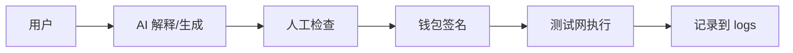

# fox896

**GitHub ID:** fox896

**Telegram:** @Foxpriest

## Self-introduction

AI x Web3 School

## Notes

<!-- Content_START -->
# 2026-05-29
<!-- DAILY_CHECKIN_2026-05-29_START -->
# Day 9 学习日记 · Week 2 深化：补全提案 + 最小实验

> 日期：2026 年 \_\_\_\_ 月 \_\_\_\_ 日  
> 今日学习时长：约 \_\_\_\_ 分钟（建议 60–120 分钟）  
> **说明：** Day 8 = 选方向 + 五角色；**Day 9 = 把提案写完整 + 做一件最小可验证的事**。  
> 前置：`[day8.md](./day8.md)`、`[week2-proposal.md](./week2-proposal.md)`  
> 课程：[AI-Web3-School](https://web3career.build/zh/programs/AI-Web3-School?tab=learning)

* * *

## 今日目标

-   确认 / 锁定 Day 8 所选赛道（仍可小改，但要写清「为什么」）
    
-   看完 **1–2 份** 本赛道入门材料（见第 2 节）
    
-   补全 `week2-proposal.md`：用户故事、类似项目、技术路径草图
    
-   完成 **1 个最小实验**（AI 或测试网，见第 4 节）
    
-   在 `logs/` 记一条 Week 2 实验记录
    

* * *

## 0\. 今日在干什么（先读 2 分钟）

Day 8 你画了「地图」（赛道 + 五角色 + 提案草稿）。  
Day 9 要做出 **能给别人看的一页纸**，并 **动手试一小步**——证明这个想法不是空想。

**合格标准（自测）：**

-   别人读完 `week2-proposal.md` 能说出：给谁用、解决啥、AI 干啥、链上干啥、怎么验证
    
-   仓库里多了一点 **证据**：笔记 / demo / 测试网 Tx / AI 协作日志
    

* * *

## 1\. 承接 Day 8（先填再往下）

| 项目 | Day 8 定的 | Day 9 是否调整 |
| --- | --- | --- |
| 所选赛道 | 【待填】 | 【待填】 |
| 暂定项目名 | 【待填】 | 【待填】 |
| 五角色是否填完 | 是 / 否 | 若否，今天先补 |

**若 Day 8 还没选赛道，今天 15 分钟内必须定一个：**  
推荐双小白友好 → **Dev Tooling**（用 Cursor 帮学合约/查链）或 **Open Track**（自定「学习助手 + 测试网记录」）。

* * *

## 2\. 按赛道看材料（选你所选赛道那一行）

每条 **看 1 个即可**，不必全看。看完后填「今日材料笔记」。

| 赛道 | 推荐材料（任选 1） | 我今天看了 |
| --- | --- | --- |
| Agentic Commerce / Payment | 以太坊账户与交易 + 思考：AI 下单时谁签名 | [ ] |
| Dev Tooling | Remix 文档 / Hardhat 入门 | [ ] |
| AI Security / Privacy | 复习 Week 1：助记词不给 AI；MetaMask 安全 | [ ] |
| AI × Governance | DAO 入门概念（浏览即可） | [ ] |
| Open Track | 自己的 Day 8 问题 + 搜 1 个类似项目名（官网/文档） | [ ] |

### 今日材料笔记

| 项目 | 内容 |
| --- | --- |
| 材料名称 / 链接 | 【待填】 |
| 看了多久 | ____ 分钟 |
| 新学到的 1 个点 | 【待填】 |
| 对我提案的启发（1 句） | 【待填】 |

* * *

## 3\. 补全提案（`week2-proposal.md`）

在 `[week2-proposal.md](./week2-proposal.md)` 里新增或填写下面几块（模板已在本节，可复制过去）。

### 3.1 用户故事（谁 + 场景 + 痛点）

**格式：** 作为【谁】，我想【做什么】，但【卡在哪】，所以需要【你的方案】。

> 【待填】  
> 例：作为 Web3 新手，我想记录每次测试网操作，但 Etherscan 看不懂，所以需要一个用大白话解释 Tx 的小助手（AI 解释 + 我自己核对 + 哈希存 GitHub）。

### 3.2 类似项目 / 参考（不必竞品分析，列 1–2 个名字 + 差异）

| 参考 | 它做什么 | 我和它的差别（1 句） |
| --- | --- | --- |
| 【待填】 |   |   |
| 【待填】（可选） |   |   |

### 3.3 技术路径草图（小白版，3–5 步）

| 步骤 | 做什么 | 用 AI？ | 用链上？ |
| --- | --- | --- | --- |
| 1 | 【待填】 | 是 / 否 | 是 / 否 |
| 2 |   |   |   |
| 3 |   |   |   |

**Mermaid 草图（可选，可让 Cursor 画）：**



### 3.4 提案自检（全填完打勾）

-   赛道 + 一句话问题
    
-   五角色表
    
-   用户故事
    
-   至少 1 个参考
    
-   技术路径 ≥3 步
    
-   风险与对策 ≥1 条
    
-   最小验证计划
    

* * *

## 4\. 最小实验（今天必须做 1 个）

**原则：** 测试网优先；AI 产出必须人工核对；不碰助记词。

### 方案 A · 偏 Dev Tooling / Open Track（推荐双小白）

用 Cursor 完成下面 **至少一项**：

| 实验 | 做什么 | 证据放哪 |
| --- | --- | --- |
| A1 | 让 AI 根据你的提案，生成 demos/week2-flow.md 流程图（你改错） | demos/ |
| A2 | 在 Sepolia 再完成 1 笔操作（转账或 Remix 读/写），Tx 记入提案「验证」 | logs/testnet-practice.md |
| A3 | 用 AI 写一段「如何查我这笔 Tx」大白话，对照 Etherscan 改对 | notes/day9.md 第 5 节 |

**我今天做了：** 【待填】A1 / A2 / A3（勾选）

### 方案 B · 偏 Payment / Security / Governance

| 实验 | 做什么 |
| --- | --- |
| B1 | 画一张「AI 绝不能碰」清单（私钥、助记词、自动签名）→ demos/ai-web3-guardrails.md |
| B2 | 写 3 条「涉及付钱/授权时人工确认」的检查项，放进 week2-proposal.md 风险表 |

**我今天做了：** 【待填】B1 / B2

### 实验记录摘要

| 项目 | 内容 |
| --- | --- |
| 实验编号 | 【待填】 |
| 做了什么 | 【待填】 |
| 结果（成功 / 部分 / 失败） | 【待填】 |
| 若链上：Tx / 合约链接 | 【待填】 |
| AI 错在哪 / 我怎么改的 | 【待填】 |

详细日志 → `[logs/week2-day9-experiment.md](../logs/week2-day9-experiment.md)`

* * *

## 5\. AI 协作记录（可选贴摘要）

| 项目 | 内容 |
| --- | --- |
| 提示词大意 | 【待填】 |
| AI 帮了什么 | 【待填】 |
| 我改了什么 | 【待填】 |
| 不可信之处 | 【待填】 |

* * *

## 6\. 今日收获

1.  提案从「有个想法」变成「能说清用户、路径、验证」的一页纸。
    
2.  用 **最小实验** 证明方向能落地一小步，而不是只停在概念表。
    

* * *

## 7\. 不懂 / 明天想问的

1.  技术路径里要不要写具体编程语言？
    
2.  Week 3 是不是就要组队 Hackathon 了？
    

**预习：** 路径写「用什么工具」即可（Cursor、Remix、Sepolia），语言可后定；Week 3 通常深化 + Hackathon 启动，以 [学习页](https://web3career.build/zh/programs/AI-Web3-School?tab=learning) 为准。

* * *

## 8\. 明日预告（Day 10 / Week 2 收尾）

-   根据导师/共学反馈 **改一版 proposal**
    
-   补第二件小实验或把 demo 做得能展示
    
-   准备 Week 2 打卡：提案链接 + 实验证据
    

**今天结束前检查：**

-   `week2-proposal.md` 无大面积【待填】
    
-   `logs/week2-day9-experiment.md` 已写
    
-   `git commit` 一次（可选但推荐）
    

* * *

## 9\. 给 Cursor 的提示（复制用）

```
Day 9 Week 2。请读 notes/day8.md、notes/day9.md、notes/week2-proposal.md。
我的赛道是【填赛道】。请帮我：
1）写用户故事 + 技术路径 3 步（大白话）
2）建议 1 个今天能完成的最小实验
3）起草 demos/week2-flow.md
标【待核实】；默认 Sepolia；不要涉及私钥。
```

* * *

_提醒：提案可改，但要有「问题 + 验证」；链上操作本人签名。_
<!-- DAILY_CHECKIN_2026-05-29_END -->

# 2026-05-28
<!-- DAILY_CHECKIN_2026-05-28_START -->

# Day 8 学习日记 · Week 2 入口：AI × Web3 交叉方向

> 日期：2026 年 \_\_\_\_ 月 \_\_\_\_ 日  
> 今日学习时长：约 \_\_\_\_ 分钟（建议 60–90 分钟）  
> **说明：** 官方 Week 1 为 7 天；**Day 8 = Week 2 第 1 天**（进入交叉主题与选题）。  
> 课程：[AI-Web3-School 学习页](https://web3career.build/zh/programs/AI-Web3-School?tab=learning)

* * *

## 今日目标

-   理解 Week 2 在整营中的位置（从「打基础」到「选方向、画问题」）
    
-   浏览 5 条交叉赛道，初步选定 1 条（可 Day 9 再定）
    
-   用「五角色」框架分析一个具体场景
    
-   写出一份 **1 页以内** 的方向草案（proposal 雏形）
    

* * *

## 0\. Week 1 → Week 2 接上了什么

| 阶段 | 你在干什么 |
| --- | --- |
| Week 1 | 学共同语言：AI（LLM/Agent）+ Web3（钱包/测试网/合约）；各做一次最小实践 |
| Week 2 | 进入 AI × Web3 真实问题空间：选一条赛道，弄清「谁发起、谁执行、谁付钱、谁验证、谁担责」，产出可进入下一阶段的 方向提案 |
| Week 3–4 | 深化练习 + Hackathon 组队、实现、Demo（见共学营后续安排） |

**今天不必写完整项目代码**，重点是：**选对问题、画清关系、写明白提案**。

* * *

## 1\. Week 2 五条赛道（先扫一眼）

共学营常见交叉方向（名称以 [学习页](https://web3career.build/zh/programs/AI-Web3-School?tab=learning) 为准）：

| 赛道 | 大白话在解决什么 | 我可能关心的点（勾选） |
| --- | --- | --- |
| Agentic Commerce / Payment | AI 帮下单、支付、结算，钱和授权怎么安全走 | [ ] |
| Dev Tooling | 用 AI 写合约、测合约、查链上数据，提升开发效率 | [ ] |
| AI Security / Privacy | AI 不能碰私钥；隐私数据上链/不上链；防钓鱼与越权 | [ ] |
| AI × Governance / Coordination | DAO 里用 AI 整理提案、摘要、协作，人仍投票拍板 | [ ] |
| Open Track | 以上都不贴，自拟 AI+Web3 交叉题 | [ ] |

**我 Day 8 暂定方向（可改）：** 【待填，例如 Dev Tooling / Open Track】

**为什么选它（2 句话）：** 【待填】

* * *

## 2\. 五角色框架（Week 2 核心工具）

分析任何一个 AI×Web3 场景，都问这 5 个问题：

| 角色 | 要问什么 | 我的场景里是谁（待填） |
| --- | --- | --- |
| 谁发起（Initiator） | 谁提出任务、谁有目标？ |   |
| 谁执行（Executor） | 谁跑 AI、谁调合约、谁发交易？ |   |
| 谁付钱（Payer） | Gas、服务费、商品款从哪出？ |   |
| 谁验证（Verifier） | 怎么证明做对了？链上记录、人工复核、第三方？ |   |
| 谁担责（Risk bearer） | 错了谁损失？私钥泄露、误转账、AI 瞎编谁负责？ |   |

**示例（学习用，非我的项目）：**  
「AI 帮我在测试网部署合约」→ 发起：我；执行：Remix+我签名；付钱：我付 Gas；验证：Etherscan+我检查；担责：我（AI 不能代签）。

**我选的场景（一句话）：** 【待填】

**五角色填完后的最大风险 1 条：** 【待填，例如：Agent 越权签名 / AI 编造地址】

**对应安全对策 1 条：** 【待填，例如：人工确认 + 仅测试网 + 限额】

* * *

## 3\. 方向提案 · 1 页草案（Week 2 交付雏形）

> 共学营 Week 2 目标：产出 **ready for next phase** 的 proposal。下面模板够用即可，不必很长。

### 3.1 基本信息

| 项目 | 内容 |
| --- | --- |
| 项目名称（暂定） | 【待填】 |
| 所选赛道 | 【待填】 |
| 目标用户（谁会用） | 【待填，例如：和我一样的新手 / 小团队开发者】 |
| 要解决的一个问题（一句话） | 【待填】 |

### 3.2 问题与方案（各 3–5 句）

**现在痛在哪：**

> 【待填】

**我的方案大概怎么做（AI 做什么 + 链上做什么）：**

> 【待填】

**为什么需要 Web3（不用普通 App 行不行）：**

> 【待填】

### 3.3 最小验证计划（Week 2 内能试什么）

| 步骤 | 内容 | 用测试网？ |
| --- | --- | --- |
| 1 | 【待填，例如：Cursor 生成合约说明，人工核对】 | 是 / 否 |
| 2 | 【待填，例如：Sepolia 部署最小合约】 | 是 |
| 3 | 【待填，例如：记录 Tx + README】 | 是 |

### 3.4 还不确定（诚实写）

1.  【待填】
    
2.  【待填】
    

* * *

## 4\. 与 Week 1 仓库的衔接

| Week 1 已有 | Week 2 怎么用 |
| --- | --- |
| notes/day1–7.md | 复盘里写「Week 2 方向」时可引用 |
| logs/testnet-practice.md | 提案里「验证」可写：以链上哈希为证 |
| demos/ | 新方向的概念图 / 五角色表可放 demos/week2-proposal.md |
| Cursor Agent | 帮起草提案，五角色与风险必须人工改 |

**建议新建：** `notes/week2/` 或 `notes/day8-proposal.md` 存正式提案（可选）。

* * *

## 5\. 今日收获

1.  Week 2 不是继续堆概念，而是 **选交叉方向 + 用五角色把问题画清楚**。
    
2.  任何 AI×Web3 想法都要提前想 **谁签名、谁担责**，Week 1 的测试网与「人工确认」习惯直接沿用。
    

* * *

## 6\. 不懂 / 明天想问的

1.  五条赛道有没有官方更细的案例或参考项目？
    
2.  Open Track 会不会比跟赛道更难打分 / 难交作业？
    

**预习：** 以 [学习页](https://web3career.build/zh/programs/AI-Web3-School?tab=learning) 当周模块与群答疑为准；Open Track 通常需 **问题定义更清楚**。

* * *

## 7\. 明日预告（Day 9 / Week 2 继续）

-   深化所选赛道：看 1–2 篇推荐材料
    
-   把 proposal 补全：用户故事、竞品/类似项目、技术路径草图
    
-   若已定方向，开始 **最小实验**（仍优先测试网）
    

**今天要带走的文件：** 本笔记第 3 节提案至少填 **50%**（赛道 + 问题 + 五角色）。

* * *

## 8\. 给 Cursor 的提示（可选）

复制到 Chat，让 Agent 帮你填第 3 节草稿（你再改）：

```
我是双小白，Day 8 Week 2。请读 notes/day8.md，
根据我选的赛道【在此填赛道】，用大白话填「方向提案」模板：
问题、方案、五角色、最小验证计划。标【待核实】；不要涉及私钥；默认 Sepolia 测试网。
```

* * *

_提醒：提案阶段仍不涉及主网大额资产；Agent 不能代签；链接与项目名需自行核实。_
<!-- DAILY_CHECKIN_2026-05-28_END -->

# 2026-05-26
<!-- DAILY_CHECKIN_2026-05-26_START -->


# Day 6 学习日记 · Web3 侧：最小智能合约

> 日期：2026 年 \_\_\_\_ 月 \_\_\_\_ 日（请改成你实际操作当天）  
> 今日学习时长：约 \_\_\_\_ 分钟（建议 60–90 分钟）  
> 对应计划：[learning-plan.md](./learning-plan.md#day-6web3-侧最小智能合约跟着做即可)

* * *

## 今日目标

-   在 Remix 用测试网部署一个最小合约
    
-   完成 1 次「读」+ 1 次「写」
    
-   在区块浏览器找到合约和交易
    
-   用大白话写：智能合约 vs 普通网站后台（见第 4 节；链上凭证见第 1–3 节【待填】）
    

* * *

## 0\. 今日在学什么（先读 2 分钟）

**智能合约** = 部署在区块链上的小程序。规则和执行过程**公开可查**，部署后往往**很难改**，所以要先在 **Sepolia 测试网**练。

**今天一条线走通：** Remix 写/选示例 → 编译 → 连接 MetaMask → 部署到 Sepolia → **读**一个状态 → **写**改一次状态 → Etherscan 查合约和交易。

**不会写代码？** 用 Remix 自带的示例合约，点按钮即可完成共学营最低要求。

* * *

## 0.5 操作步骤备忘（Remix + Sepolia）

1.  打开 [Remix IDE](https://remix.ethereum.org/)
    
2.  左侧 **File Explorer** → `contracts` → 打开 `1_Storage.sol`（Remix 自带示例；没有就新建同名文件，见下方「示例合约说明」）
    
3.  左侧 **Solidity Compiler** → 选编译器版本（与文件里 `pragma` 一致）→ **Compile**
    
4.  左侧 **Deploy & Run**：
    
    -   **Environment** 选 **Injected Provider - MetaMask**
        
    -   MetaMask 弹窗确认，网络选 **Sepolia**
        
    -   **Deploy** → 钱包 **Confirm** 签名（会花 Gas，比纯转账贵）
        
5.  部署成功后，下方 **Deployed Contracts** 出现你的合约：
    
    -   **读**：点 `retrieve` 或 `number`（蓝色按钮，不改链上状态，不花 Gas）
        
    -   **写**：在 `store` 输入数字（如 `42`）→ 点 `store`（橙色按钮）→ 钱包 **Confirm**
        
6.  复制 **合约地址** → 打开 [Sepolia Etherscan](https://sepolia.etherscan.io/) 搜索
    

**示例合约说明（**`1_Storage.sol` **在干什么）：**

-   链上存一个数字 `number`
    
-   `store(新数字)` = **写**，要签名 + Gas
    
-   `retrieve()` = **读**，只查看，不上链改状态
    

* * *

## 1\. Remix 操作记录

| 项目 | 内容 |
| --- | --- |
| 用的合约例子名称 | 1_Storage.sol（或 HelloWorld / 自定义：____） |
| 部署的网络 | Sepolia |
| 部署是否成功 | 【待填】是 / 否 |
| 遇到的问题 | 【待填，例如：Compiler 版本不对 / MetaMask 连不上 / Gas 不足】 |
| 怎么解决的 | 【待填】 |

**部署前自检：**

-   MetaMask 网络 = **Sepolia**，测试币够付 Gas（比 Day 5 转账留多一点）
    
-   Remix Environment = **Injected Provider - MetaMask**
    
-   部署弹窗看清是 **Contract Deployment**，再 Sign
    

* * *

## 2\. 读 / 写 操作

### 读（Read）

| 项目 | 内容 |
| --- | --- |
| 读了什么（函数名或界面上的按钮） | 【待填】例如：点击 retrieve |
| 读到的结果 | 【待填】例如：0（部署后默认）或 42（store 之后） |

**读操作特点：** 不改动链上数据，一般**不需要**钱包签名，**不花 Gas**（在 Remix 里直接点蓝色按钮即可）。

* * *

### 写（Write）

| 项目 | 内容 |
| --- | --- |
| 写了什么 | 【待填】例如：store(42)，把 number 设为 42 |
| 是否要在钱包里确认 | 是（写操作必须 Sign） |
| 交易哈希 | 【待填，0x…】 |
| 是否成功 | 【待填】是 / 否 |

**写后再读一次：** 再点 `retrieve`，应看到 `42`（或你写入的值），证明状态已上链。

* * *

## 3\. 链上凭证（可同步到 `../logs/testnet-practice.md`）

| 项目 | 内容 |
| --- | --- |
| 合约地址 | 【待填，0x…，Etherscan 上 Contract 页面】 |
| 部署交易哈希 | 【待填，Deploy 那笔 Tx】 |
| 写入交易哈希（如有） | 【待填，store 那笔 Tx】 |
| 区块浏览器 · 合约页链接 | 【待填】https://sepolia.etherscan.io/address/0x... |
| 区块浏览器 · 交易页链接 | 【待填】部署 Tx 或 store Tx 的 URL |

**在 Etherscan 合约页可以看：**

-   **Transactions**：部署、调用记录
    
-   **Contract** → **Read Contract / Write Contract**（有时需验证源码后才显示，Remix 部署未验证也正常）
    

* * *

## 4\. 智能合约 vs 普通网站后台

| 对比项 | 普通网站后台 | 智能合约 |
| --- | --- | --- |
| 代码跑在哪 | 公司自己的服务器 | 区块链网络（很多节点一起执行） |
| 用户能不能看到规则 | 一般看不到源码，只能看界面 | 字节码/验证后源码可公开查 |
| 改起来容不容易 | 开发者可更新服务器代码 | 部署后常不可改或需专门升级机制，要更谨慎 |

**我用大白话总结（3 句话以内）：**

> 网站后台像店家后厨，规则外人难看清、老板能改菜单。  
> 智能合约像把「店规」贴在大广场公告栏，谁都能查，一旦贴出很难撕掉。  
> 所以要先在测试网练，写错了也是测试币，并养成部署前多想一步的习惯。

* * *

## 5\. 今日收获

1.  在 Remix 里区分了 **读（不改链）** 和 **写（要签名 + Gas）**，并亲手部署了一个最小合约。
    
2.  理解智能合约不是「普通网页后台」，状态和执行更公开，部署前要想清楚，测试网是必经练习场。
    

* * *

## 6\. 不懂 / 明天想问的

1.  部署合约为什么比转账更费 Gas？
    
2.  Etherscan 上「Verify Contract」是干什么的，Week 1 必须做吗？
    

**预习答（可选）：** 部署要把代码存进链上，数据量大、计算多，所以更贵。Verify 是把源码公开对照，Week 1 **不强制**，有合约地址和 Tx 即可交差。

* * *

## 7\. 明日预告

明天（Day 7）做：**AI + 链上串起来**、对照 `[learning-plan.md](./learning-plan.md)` checklist、更新 README、准备本周打卡。  
今天要保存好的：

-   合约地址和浏览器链接已记在 `logs/testnet-practice.md` 或本文件第 3 节
    
-   至少做过 1 次读 + 1 次写，且能说出和 Day 5 转账的相同/不同（都要 Sign 吗？Gas 呢？）
    

**Day 7 对比备忘：** Day 5 转账 = 一次写；Day 6 合约 = 程序常驻链上，可读可写多次。

* * *

## 8\. 与 Day 5 / 仓库其他文件

| 对比 | Day 5 转账 | Day 6 合约 |
| --- | --- | --- |
| 工具 | MetaMask | Remix + MetaMask |
| 链上留下什么 | 一笔转账记录 | 合约地址 + 部署/调用记录 |
| 典型 Gas | 相对较低 | 部署通常更高 |
| 记录文件 | day5.md、logs/testnet-practice.md | 本文件 + 同文件「智能合约」一节 |

* * *

_提醒：全程 Sepolia 测试网；不要把助记词/私钥写进笔记。未实际操作前，请勿编造合约地址或 Tx Hash。_
<!-- DAILY_CHECKIN_2026-05-26_END -->

# 2026-05-25
<!-- DAILY_CHECKIN_2026-05-25_START -->


# Day 5 学习日记 · Web3 侧：测试网、转账、区块浏览器

> 日期：2026 年 \_\_\_\_ 月 \_\_\_\_ 日（请改成你实际操作当天）  
> 今日学习时长：约 \_\_\_\_ 分钟（建议 60–90 分钟）  
> 对应计划：[learning-plan.md](./learning-plan.md#day-5web3-%E4%BE%A7%E6%B5%8B%E8%AF%95%E7%BD%91%E8%BD%AC%E8%B4%A6%E5%8C%BA%E5%9D%97%E6%B5%8F%E8%A7%88%E5%99%A8)

* * *

## 今日目标

-   切换到 Sepolia 测试网并领到测试币
    
-   完成至少 1 笔测试网转账
    
-   在区块浏览器查到交易并记录 4 项信息
    
-   理解 Gas 是什么（见第 4 节；链上记录见第 1–3 节【待填】）
    

* * *

## 0\. 今日在学什么（先读 2 分钟）

**测试网** = 区块链的「练习场」。上面的币**没有真实价值**，用来练签名、转账、看记录，不会亏真钱。

**今天一条线走通：** 水龙头领测试币 → 钱包发起转账 → 签名确认 → 区块浏览器查结果 → 搞懂 Gas。

* * *

## 1\. 测试网准备

| 项目 | 内容 |
| --- | --- |
| 网络名称 | Sepolia（以太坊常用测试网） |
| 用的水龙头链接 | Google Cloud Sepolia Faucet（需 Google 账号；若领不到可搜「Sepolia faucet」换别的） |
| 领到的测试币数量（大约） | 【待填，例如 0.05 SepoliaETH】 |
| 遇到的问题 | 【待填，例如：水龙头要登录 / 一天只能领一次 / 到账要等几分钟】 |

**操作步骤备忘：**

1.  打开 MetaMask → 网络选 **Sepolia**（没有则「显示测试网络」或手动添加）。
    
2.  复制钱包**地址**（0x 开头）→ 粘贴到水龙头 → 领取。
    
3.  等 1–5 分钟，在钱包里看余额是否增加。
    

* * *

## 2\. 测试转账记录

| 项目 | 内容 |
| --- | --- |
| 从哪个地址（可只写后 4 位） | …【待填】 |
| 转到哪个地址 | …【待填】（可转给自己另一个地址，或共学伙伴测试地址） |
| 转账金额（测试币） | 【待填，建议先小额，如 0.001 ETH】 |
| 钱包弹窗里「签名」授权了什么（自己的话） | 【待填】例如：同意从 A 地址向 B 地址转出 0.001 SepoliaETH，并支付 Gas |

**签名和「普通网站点确定」有什么不同（一句话）：**

> 网站「确定」多是同意条款或提交表单；**链上签名**是用私钥对**这一笔具体转账**点头，链上会永久留下记录，且要付 Gas，**不能当成普通网页按钮乱点**。

**转账前自检（建议每次做）：**

-   网络是 **Sepolia**，不是 Ethereum 主网
    
-   收款地址复制完整、前后几位核对过
    
-   金额是测试小额
    

* * *

## 3\. 区块浏览器记录

浏览器：[Sepolia Etherscan](https://sepolia.etherscan.io/)

在搜索框粘贴**交易哈希**或**你的地址** → 点开对应 **Transaction**。

| 项目 | 内容 |
| --- | --- |
| 交易哈希（Tx Hash） | 【待填，0x 开头一长串】 |
| 状态（成功 / 失败） | 【待填】Success / Fail |
| Gas 用了多少（抄浏览器上的数即可） | 【待填，如 Gas Used: 21000；Gas Fee: 0.00000… ETH】 |
| 区块高度（Block） | 【待填】 |
| 交易页面链接 | 【待填，浏览器地址栏完整 URL】 |

**在浏览器里对应看哪里：**

-   **Status**：成功绿色 / 失败红色
    
-   **Block**：区块号
    
-   **Gas Used / Transaction Fee**：本次花费
    

* * *

## 4\. Gas · 我的人话

**Gas 是什么：**

> Gas 是你在链上「办一件事」要付的**手续费**，付给帮你打包、上链的节点。办的事越复杂（例如部署合约）通常越贵；简单转账相对便宜。Sepolia 上用的是**测试 ETH**，不是真钱，但习惯要从第一天养成。

**为什么失败也可能花 Gas：**

> 网络已经开始处理你的请求时，即使最后执行失败（例如合约报错），节点仍做了计算工作，所以**Gas 可能照样被扣**。就像快递已出库，拒收也可能产生运费。所以：**先测试网、先小额、看清弹窗再签**。

* * *

## 5\. 今日收获

1.  走通了「测试网领币 → 转账 → 浏览器查单」整条链上操作链，知道交易哈希是查记录的钥匙。
    
2.  分清**签名 ≠ 普通点确定**，并理解 Gas 是链上操作的成本；失败交易也可能消耗 Gas。
    

* * *

## 6\. 不懂 / 明天想问的

1.  Gas Price 和 Gas Used 两个数分别是什么意思？
    
2.  Day 6 部署合约会比转账更费 Gas 吗？要留多少测试币？
    

**预习答（可选）：** Gas Fee ≈ Gas Used × Gas Price；部署合约通常比纯转账贵，Day 6 前钱包里留一点测试币即可（例如 ≥ 0.01 SepoliaETH，视网络情况而定）。

* * *

## 7\. 明日预告

明天（Day 6）学：在 [Remix](https://remix.ethereum.org/) 部署最小智能合约，完成一次读 + 一次写。  
今天要确认的：

-   测试网里还有少量测试币（留给明天 Gas）
    
-   钱包和浏览器能正常用
    
-   第 1–3 节链上字段已从 Etherscan **抄真实数据**（勿编造哈希）
    

* * *

## 8\. 与仓库其他文件

-   链上记录同步填写：`[logs/testnet-practice.md](../logs/testnet-practice.md)` 的「领测试币」「转账」两节
    
-   Day 4 钱包地址（仅后 4 位也可）应在 day4 笔记里；**不要写助记词/私钥**
    

* * *

_提醒：测试币没有真实价值；仍要养成看清弹窗再签名的习惯。未实际操作前，请勿编造 Tx Hash。_
<!-- DAILY_CHECKIN_2026-05-25_END -->

# 2026-05-24
<!-- DAILY_CHECKIN_2026-05-24_START -->


**一小时内启动大型语言模型应用**

课程：Full Stack LLM Bootcamp · 2023 春季

讲师：Charles Frye

发布：2023-05-09

链接：[https://fullstackdeeplearning.com/llm-bootcamp/spring-2023/launch-an-llm-app-in-one-hour/](https://fullstackdeeplearning.com/llm-bootcamp/spring-2023/launch-an-llm-app-in-one-hour/)

标签：#LLM #RAG #LangChain #MVP #全栈 #FSDL

**一、这节课在讲什么**

**核心命题**：用大约 1 小时级别的节奏，走完「从想法 → 可试用产品」的最短路径，而不是讲模型原理。

**三条主线**：

1.  Playground 里快速试能力
    
2.  Notebook 里搭 RAG / 检索流程
    
3.  部署 MVP，接真实用户反馈
    

**一句话总结**：LLM 应用的操作手册正在形成——先原型、再检索增强、再最小可用产品，边上线边学。

* * *

**二、为什么是现在？（Chapter 0）**

**2.1 时代背景**

-   公众对 LLM / AI 热情很高：**一个工具**能覆盖过去需要**多个专业工具**才能做的事。
    
-   语言用户界面（LUI）：用自然语言 / 语音与计算机交互，比传统 GUI 更自然。
    
-   GPT-3 及后续模型让 LUI 更灵活、更强大。
    
-   ChatGPT、GitHub Copilot 等产品证明：可以围绕 LLM 做真实产品。
    

**2.2 冷静的一面：Demo ≠ 产品**

| 现象 | 含义 |
| Demo 很炫，产品很难 | 「演示」与「可交付产品」差距巨大 |
| 历史上过度承诺 | 曾导致 AI 寒冬 |
| 当下任务 | 做出有价值的产品和工具，才能维持资金与行业兴趣 |

**2.3 本讲定位**

-   构建 LLM 应用的\*\*操作手册（playbook）\*\*正在浮现。
    
-   本训练营（及本讲）覆盖该过程的多个环节；本讲聚焦**最快启动**那一段。
    

* * *

**三、游乐场中的原型制作与迭代（Chapter 1）**

**3.1 做法**

-   参加 / 借鉴**以 ML 工具为主题的黑客马拉松**经验。
    
-   使用**高能力托管模型**（如 OpenAI）+ **简单聊天界面**，快速试探模型边界。
    
-   用 **Notebook** 做快速调参、原型、发现局限。
    

**3.2 案例：用 LLM 学 LLM**

-   问题陈述：让大模型帮你学习大模型相关知识。
    
-   发现的局限：
    
    -   知识**过时**
        
    -   知识**有限**（训练 cutoff、无实时联网等）
        
-   有效技巧：要求模型给出**具体来源 / 论文**，答案质量明显提升。
    

**3.3 要点**

Playground 阶段目标：**验证「模型能不能答」**，而不是做完整系统。

* * *

**四、笔记本中的原型制作与迭代（Chapter 2）**

**4.1 环境与工具**

| 工具 | 作用 |
| Colab 等 Notebook | 临时环境，快速自动化步骤 |
| OpenAI API | 调用语言模型，多语言 SDK |
| LangChain | 流行开源框架，组件齐全、迭代快 |
| archive等 Python 库 | 数据来源、抓取与处理 |
| LangChain Document Loader | 从 PDF 等提取正文 |
| Embedding 搜索 | 在大文档 / 语料里做大规模检索 |

**4.2 核心流程（RAG 雏形）**

用户问题

→ 检索：Embedding 找相关片段

→ 组装：把检索结果放进 Prompt 上下文

→ 生成：LLM 基于上下文回答

**关键动作**：

-   建立「**找信息 → 放进上下文**」的流程。
    
-   持续**原型 + 调优**语言模型行为。
    
-   参考**同类开源项目**或 LangChain **默认示例**，不要从零造轮子。
    
-   最终目标：把实验变成**更多人能用的工具**。
    

**4.3 与经典 ML 流程的对比**

-   传统 ML：数据 → 训练 → 评估 → 部署，周期长、变更成本高。
    
-   现代 LLM 应用：Prompt / 检索 / 工具链调整更灵活，**迭代更快**。
    

* * *

**五、部署 MVP（Chapter 3）**

**5.1 MVP 原则**

-   只做对**广泛用户**真正有用的功能。
    
-   优先 UI：让人尽快用起来。
    
-   尽快收集用户反馈，再决定下一版做什么。
    

**5.2 技术栈示例（讲师案例）**

| 层级 | 选型 | 用途 |
| 模型 | OpenAI | 生成与 Embedding |
| 检索 | Pinecone | 快速向量搜索 |
| 存储 | MongoDB | 业务 / 元数据 |
| 计算 / 部署 | Modal 等无服务器 | 弹性扩缩、处理数据瓶颈 |
| 触达用户 | AWS 上轻量服务 | 例如 Discord Bot |
| 观测 | （后续 askFSDL 讲 Gantry） | 看真实使用数据再改进 |

**5.3 上线后的闭环**

部署 MVP → 监控使用数据 → 分析成功/失败案例 → 迭代 Prompt / 检索 / 产品

* * *

**六、本讲知识地图（一张图记牢）**

为什么是现在？

LUI + LLM 机会 ↑ Demo与产品差距 ↑ 需要可持续的价值交付

Playground

快速试模型 → 发现过时/有限 → 要来源/引用

Notebook

数据源 → PDF/文档加载 → Embedding 检索 → LangChain 拼装 → 持续原型

MVP

窄功能 + 好 UI + 云原生部署 + 真实用户反馈 + 监控驱动迭代

* * *

**七、可执行的「一小时清单」（自用）**

 在 Playground 用 3 个问题测模型：是否幻觉、是否过时、给来源后是否变好

 Notebook：Document Loader 加载 1 份 PDF

 对文档做 Embedding，实现「问一句 → 检索 Top-K → 拼 Prompt → 回答」

 用 Gradio / Discord / 简单 Web 包一层 UI

 部署到 Modal 或同类无服务器平台，邀请 1～2 个真实用户试用

 记录：哪些问题检索不到、哪些回答用户不满意

* * *

**八、与 FSDL 其他课节的衔接**

| 本讲掌握 | 下一讲建议 |
| 1 小时启动流程 | LLM 基础（补原理） |
| Prompt 试错 | 学习拼写：提示工程 |
| Embedding 检索 | 增强语言模型（RAG 深化） |
| 全栈部署思路 | 项目攻略：askFSDL（完整 repo） |
| 上线后迭代 | LLMOps |
| Agent 方向 | Harrison Chase：Agents |

* * *

**九、个人反思区（可自行补充）**

**今天最大的收获**：

**我项目的「一小时 MVP」场景**：

**当前最大风险（幻觉 / 成本 / 延迟 / 合规）**：

* * *

**十、参考链接**

-   本节正文：[https://fullstackdeeplearning.com/llm-bootcamp/spring-2023/launch-an-llm-app-in-one-hour/](https://fullstackdeeplearning.com/llm-bootcamp/spring-2023/launch-an-llm-app-in-one-hour/)
    
-   2023 春季目录：[https://fullstackdeeplearning.com/llm-bootcamp/spring-2023/](https://fullstackdeeplearning.com/llm-bootcamp/spring-2023/)
    
-   配套完整项目 askFSDL：[https://github.com/the-full-stack/ask-fsdl](https://github.com/the-full-stack/ask-fsdl)
    

* * *

**笔记整理自 Full Stack Deep Learning · LLM Bootcamp 2023 春季 · Charles Frye 讲座大纲与章节摘要。**
<!-- DAILY_CHECKIN_2026-05-24_END -->

# 2026-05-23
<!-- DAILY_CHECKIN_2026-05-23_START -->


# **Hugging Face LLM 课程 · Ch1-2**

## **变形金刚，他们能做什么？（学习笔记）**

> _课程：Hugging Face LLM Course  
> 章节：第 1 章 · 变压器模型 →_ **_What can Transformers do?_**_  
> 工具：_`🤗 Transformers` _· 核心 API：_`pipeline()`

* * *

## **一、本章要学什么**

-   Transformer **不只做 NLP**，还覆盖视觉、音频、多模态等。
    
-   用 `pipeline()` 快速体验各类任务，无需先懂模型内部。
    
-   了解 **Model Hub**：百万级预训练模型，可下载、可上传、可在线试玩。
    
-   下一章会讲 `pipeline()` **内部三步**（预处理 → 模型 → 后处理）及自定义。
    

* * *

## **二、Transformer 无处不在**

| 模态 | 示例任务 |
| --- | --- |
| 文本 NLP | 分类、生成、翻译、问答… |
| 计算机视觉 | 图像分类、目标检测… |
| 音频 | 语音识别、音频分类… |
| 多模态 | 图文理解、图生文… |

**Model Hub**（[huggingface.co](http://huggingface.co)）

-   不限于 Transformer，**任何模型/数据集**都可分享。
    
-   注册账号后可协作、上传、在线推理试用。
    

* * *

## **三、核心工具：**`pipeline()`

### **是什么**

把 **模型 + 预处理 + 后处理** 打包成一条流水线，输入文本（或其它模态）→ 直接得结果。

### **最小示例：情感分析**

from transformers import pipeline

classifier = pipeline("sentiment-analysis")

classifier("I've been waiting for a HuggingFace course my whole life.")

_\# \[{'label': 'POSITIVE', 'score': 0.96}\]_

-   默认会下载**英文情感分析**预训练模型，**首次下载后缓存**，再跑不重复下。
    
-   可传入**列表**，批量分析。
    

### **内部三步（必记）**

输入文本

→ ① 预处理（转成模型能吃的格式）

→ ② 模型前向推理

→ ③ 后处理（转成人类可读结果）

* * *

## **四、各类 Pipeline 速查表**

### **文本（本课重点）**

| 任务名 | 作用 |
| --- | --- |
| text-generation | 根据提示续写/生成文本 |
| text-classification | 文本分到预设类别（如正/负） |
| summarization | 摘要，保留关键信息 |
| translation | 翻译 |
| zero-shot-classification | 零样本分类，标签由你指定 |
| feature-extraction | 提取文本向量表示 |
| fill-mask | 填空白（完形填空） |
| ner | 命名实体识别（人名/地名/机构） |
| question-answering | 根据给定上下文回答问题 |

### **图像**

| 任务名 | 作用 |
| --- | --- |
| image-to-text | 图像描述 |
| image-classification | 图像分类 |
| object-detection | 检测并定位物体 |

### **音频**

| 任务名 | 作用 |
| --- | --- |
| automatic-speech-recognition | 语音转文字 |
| audio-classification | 音频分类 |
| text-to-speech | 文字转语音 |

### **多模态**

| 任务名 | 作用 |
| --- | --- |
| image-text-to-text | 按文本提示对图像作答 |

> _完整列表以官方文档为准，会随版本更新。_

* * *

## **五、文本任务详解**

### **1\. 零样本分类** `zero-shot-classification`

-   **无需**用你的数据微调，直接指定 `candidate_labels`。
    
-   适合：标注贵、标签不固定的真实项目。
    

classifier = pipeline("zero-shot-classification")

classifier(

"This is a course about the Transformers library",

candidate\_labels=\["education", "politics", "business"\],

)

_\# education 得分最高_

* * *

### **2\. 文本生成** `text-generation`

-   给 **prompt**，模型续写；带**随机性**，每次结果可能不同。
    
-   常用参数：`num_return_sequences`（生成几条）、`max_length`（最大长度）。
    

generator = pipeline("text-generation")

generator("In this course, we will teach you how to")

**换 Hub 上的模型：**

generator = pipeline("text-generation", model="HuggingFaceTB/SmolLM2-360M")

generator("In this course, we will teach you how to",

max\_length=30, num\_return\_sequences=2)

-   Hub 可按**语言、任务标签**筛模型；模型页有 **Widget 在线试玩**。
    

* * *

### **3\. 推理服务 Inference Providers**

-   浏览器里可直接试模型（模型页 Widget）。
    
-   付费版可接入工作流，见官网 pricing。
    

* * *

### **4\. 填词** `fill-mask`

-   在句中 `<mask>` 处预测最可能的词。
    
-   `top_k=2`：返回概率最高的 2 个候选。
    
-   ⚠️ 不同模型 **mask 词可能不同**（如 BERT 用 `[MASK]`），用前看文档/Widget。
    

unmasker = pipeline("fill-mask")

unmasker("This course will teach you all about <mask> models.", top\_k=2)

* * *

### **5\. 命名实体识别** `ner`

-   找出：人（PER）、机构（ORG）、地点（LOC）等。
    
-   `grouped_entities=True`：把多词实体拼成一条（如 "Hugging" + "Face" → "Hugging Face"）。
    
-   模型内部可能把词切成子词（如 Sylvain → S, ##yl, ##va, ##in），pipeline 会再拼回。
    

ner = pipeline("ner", grouped\_entities=True)

ner("My name is Sylvain and I work at Hugging Face in Brooklyn.")

* * *

### **6\. 问答** `question-answering`

-   **从 context 里抽取**答案片段，**不是**自由生成答案。
    
-   返回：`answer`、`start`、`end`、`score`。
    

qa = pipeline("question-answering")

qa(question="Where do I work?",

context="My name is Sylvain and I work at Hugging Face in Brooklyn")

_\# answer: 'Hugging Face'_

* * *

### **7\. 摘要** `summarization`

-   长文 → 短文，保留要点。
    
-   可调 `max_length` / `min_length`。
    

* * *

### **8\. 翻译** `translation`

-   可写任务名如 `translation_en_to_fr`，或**直接指定 Hub 模型**：
    

translator = pipeline("translation", model="Helsinki-NLP/opus-mt-fr-en")

translator("Ce cours est produit par Hugging Face.")

* * *

## **六、图像 & 音频示例（了解即可）**

### **图像分类**

image\_classifier = pipeline(

"image-classification", model="google/vit-base-patch16-224"

)

image\_classifier("图片URL或路径")

_\# 返回 label + score_

### **自动语音识别 ASR**

transcriber = pipeline(

"automatic-speech-recognition", model="openai/whisper-large-v3"

)

transcriber("音频URL或路径")

_\# {'text': '...'}_

* * *

## **七、多源数据结合（拓展思路）**

Transformer 可把多模态/多库信息整合，例如：

-   同时搜文本库 + 图像库
    
-   合并音频转写 + 文本描述
    
-   文档 + 元数据一起检索呈现
    

（本章仅概念，具体实现见后续章节。）

* * *

## **八、本章结论（考试向）**

| 要点 | 内容 |
| --- | --- |
| 定位 | pipeline() 是演示/快速上手工具，为特定任务设计，不能随意做任务变体 |
| 下一步 | 学 pipeline() 内部机制与自定义 |
| 实践环境 | Colab「Open in Colab」/ 本地需先 Setup |
| 与 Week1 AI 课联系 | 对应 Tool use、MaaS、预训练模型调用；agent 里 pipeline 类似「封装好的工具」 |

* * *

## **九、课程建议动手清单 ✏️**

-   改情感分析输入，观察 label/score
    
-   零样本：换自己的句子和 `candidate_labels`
    
-   文本生成：`num_return_sequences=2`, `max_length=15`
    
-   Hub 找**另一种语言**的 text-generation 模型并接入 pipeline
    
-   查 `bert-base-cased` 的 mask 词，跑 fill-mask
    
-   Hub 找英语 **POS** 模型，对 NER 例句做词性标注
    
-   翻译：换法语→英语以外的模型，翻译同一句
    

* * *

## **十、中英术语对照**

| 英文 | 中文 |
| --- | --- |
| Transformers | 变压器架构 / Transformer 模型 |
| pipeline | 流水线（一站式推理接口） |
| Hub | 模型与数据集中心 |
| zero-shot | 零样本（不微调直接用） |
| fine-tune | 微调 |
| NER | 命名实体识别 |
| ASR | 自动语音识别 |
| inference | 推理 |
<!-- DAILY_CHECKIN_2026-05-23_END -->

# 2026-05-22
<!-- DAILY_CHECKIN_2026-05-22_START -->


**有道云笔记｜LLM 基础**

**课程**：Full Stack LLM Bootcamp · 2023 春季**讲师**：Sergey Karayev**发布**：2023-05-19**链接**：[https://fullstackdeeplearning.com/llm-bootcamp/spring-2023/llm-foundations/**标签**：#LLM](https://fullstackdeeplearning.com/llm-bootcamp/spring-2023/llm-foundations/标签：#LLM) #Transformer #GPT #BERT #预训练 #微调 #指令调优 #FSDL

* * *

**一、这节课在讲什么**

**定位**：给多元受众（工程师、高管、投资者）建立 LLM 的**共同语言**——从 ML 基础到 Transformer 解码器，再到 GPT / BERT / T5 / Chinchilla / LLaMA 等代表模型。

**四个关键理念**（贯穿全讲）：

1.  软件 2.0：用数据训练出「程序」
    
2.  预训练 + 微调：大模型能力的来源
    
3.  Transformer：当前主流架构
    
4.  规模、数据、指令、检索：决定产品形态与成本
    

**一句话总结**：搞懂「下一个 token 怎么预测」，就搞懂了 ChatGPT 在干什么；搞懂预训练/微调/指令调优，就搞懂了你怎么用 API 或开源模型。

* * *

**二、介绍（Chapter 0）**

| 内容 | 说明 |
| 受众 | 专家、高管、投资者都能听懂的一层抽象 |
| 架构主线 | Transformer（重点讲 Decoder） |
| 模型谱系 | GPT、T5、BERT、Chinchilla、LLaMA、RETRO 等 |

* * *

**三、机器学习基础（Chapter 1）**

**3.1 软件 1.0 → 软件 2.0**

-   传统编程：人写规则（if-else、业务逻辑）。
    
-   机器学习 / 深度学习：规则由**训练数据**学出来，工程重心转向**训练系统**（数据、算力、实验）。
    

**3.2 三类学习（实际多走向监督）**

| 类型 | 要点 |
| 无监督学习 | 无标签，从数据本身学结构 |
| 监督学习 | 有输入-输出对，最常用 |
| 强化学习 | 奖励信号驱动策略 |

注：很多「无监督」预训练，下游仍靠监督微调。

**3.3 机器眼里的世界：全是数字**

-   输入、输出都是**向量 / 矩阵**。
    
-   神经网络：分层感知机，核心运算是**矩阵乘法**。
    
-   GPU：为图形/游戏设计，与矩阵乘法契合 → 深度学习算力基础。
    

**3.4 训练三件套**

训练集 → 学参数

验证集 → 调超参、早停

测试集 → 最终评估（避免过拟合）

**3.5 预训练 + 微调（LLM 时代的标配）**

1.  预训练：海量无标注/弱标注数据，学通用表示。
    
2.  微调：较小、任务专用数据集，对齐具体应用。
    

**3.6 模型中心**

-   Hugging Face 等：海量预训练模型，按任务选用，近年爆发式增长。
    
-   Transformer 已成为 NLP 及多模态等多任务的主流骨架。
    

* * *

**四、Transformer 架构（Chapter 2）**

-   来源：2017 论文 **Attention Is All You Need**。
    
-   最初：机器翻译 SOTA。
    
-   之后：扩展到各类 NLP，乃至视觉等。
    
-   结构：看似复杂，实为**两个相似半块**（Encoder / Decoder）；本讲聚焦 **Decoder**（GPT 路线）。
    

* * *

**五、Transformer Decoder 概览（Chapter 3）**

**5.1 任务：补全文本（Completion）**

输入 token 序列： "it's a blue"

目标：预测下一个词，如 "sundress"

输出：词表上的概率分布

**5.2 推理循环（ChatGPT 就是这样）**

看到用户输入 → 采样下一个 token → 拼到序列末尾 → 再跑模型 → 重复

-   自回归生成：一次只预测一个 token，循环直到结束符或长度上限。
    

* * *

**六、输入与嵌入（Chapter 4–5）**

**6.1 文本 → 数字**

| 步骤 | 说明 |
| 分词（Tokenization） | 文本切成 token（不一定是整词） |
| 词表 ID | 每个 token 对应整数 ID |
| One-hot | ID=3 → 向量第 3 维为 1，其余为 0 |

**6.2 为什么不用 One-hot 直接喂模型？**

-   One-hot **不表达相似性**（cat 与 dog 一样「正交」）。
    
-   Embedding：可学习的矩阵，把 one-hot 映射为**稠密低维向量**。
    
-   这是最简单的「神经网络层」之一，也是语义相似性的起点。
    

* * *

**七、Masked Multi-Head Attention（Chapter 6）**

**7.1 注意力在做什么**

-   目的：根据**已出现 token** 的重要性，预测下一个 token。
    
-   形式：输出 = 输入向量的**加权和**；权重 ≈ 向量间**点积（相似度）**。
    

**7.2 Q / K / V 三个角色**

每个输入向量同时扮演：

-   Query（查询）：我要找什么
    
-   Key（键）：我是什么索引
    
-   Value（值）：我携带什么信息
    

通过**可学习矩阵**投影到不同角色，提升表达能力。

**7.3 多头注意力（Multi-Head）**

-   多套 Q/K/V 投影 → **多种「关注方式」**并行。
    
-   例如：一个头盯语法，一个头盯指代（与「感应头」等研究相关）。
    

**7.4 Mask（掩码）——Decoder 的关键**

-   防止偷看未来 token（作弊）。
    
-   只能基于**已见**序列预测下一个 → 适合生成，不适合双向填空（那是 BERT）。
    

* * *

**八、位置编码（Chapter 7）**

-   纯注意力默认像**无序词袋**（bag of tokens）。
    
-   位置编码向量加到 embedding 上 → 注入顺序信息。
    
-   听起来反直觉，但实践中有效；注意力会学到哪些位置相关。
    

* * *

**九、Skip Connection 与 Layer Norm（Chapter 8）**

| 组件 | 作用 |
| Skip Connection（残差） | 梯度更容易从末端传回起点，训练更深网络 |
| Layer Norm | 每层后把均值/方差拉回稳定区间 |
| 维度 | 往往由 输入 embedding 维度 决定整模型宽度 |

归一化不「优雅」，但对训练极其有效。

* * *

**十、前馈层（Chapter 9）**

-   结构类似经典 **MLP**。
    
-   对每个 token 的表示做**非线性变换**。
    
-   语义上：从「词级」表征升级到更抽象的「概念/思想级」表征。
    
-   参数量：大模型里 FFN 往往占参数大头（如 GPT-3）。
    

* * *

**十一、Transformer 超参数与为何强大（Chapter 10）**

**11.1 GPT-3 量级（示例）**

-   12–96 层 Transformer 块
    
-   可调 **embedding 维度**、**注意力头数**
    
-   合计约 **1750 亿**参数
    
-   小模型：embedding + attention 占比更高；大模型：**FFN 占主导**
    

**11.2 为何 Transformer 成为「通用计算机」**

-   可微：端到端反向传播优化
    
-   并行友好：比 RNN 更易吃满 GPU
    
-   表达力强：仍在研究其理论上限（如 RASP 等）
    

**11.3 开放问题**

-   把权重「反编译」回人类程序：**未解决**
    
-   学写 Transformer 代码：对产品非必需，但对理解架构有帮助（YouTube / 手写 mini-GPT 等）
    

* * *

**十二、著名 LLM 谱系（Chapter 11–18）**

**12.1 BERT（双向编码器）**

| 项 | 内容 |
| 全称 | Bidirectional Encoder Representations from Transformers |
| 结构 | Encoder，无 mask 的双向注意力 |
| 规模 | 约 1 亿参数（当时算大） |
| 训练 | 随机 mask 15% 词，预测被 mask 词 |
| 用途 | NLP 下游任务的基石（分类、NER 等） |
| 与 GPT | 理解型 vs GPT 的生成型 |

**12.2 T5（Text-to-Text）**

| 项 | 内容 |
| 范式 | 一切任务都写成 文本进 → 文本出 |
| 结构 | Encoder-Decoder（当时认为较优） |
| 规模 | 约 110 亿参数 |
| 数据 | C4（从 Common Crawl 过滤：去短页、冒犯内容、大量代码页、去重等） |
| 用法 | 学术监督任务微调后泛化多种 NLP |

**12.3 GPT（生成式预训练）**

| 版本 | 要点 |
| GPT-2 | 仅 Decoder；数据 WebText（Reddit 高赞链接抓取） |
| 分词 | BPE（字节对编码）：介于词级与 UTF-8 字节之间 |
| GPT-3（2020） | 约为 GPT-2 100 倍；强 zero-shot / few-shot |
| 训练数据 | 网页、Common Crawl、书籍、维基等；约 500B token 语料，实际训练约 300B token |
| GPT-4 | 细节未完全公开；规模推测远大于 GPT-3 |

**12.4 Chinchilla 与尺度法则（Chapter 14）**

-   更多算力 → 通常更好性能（Rich Sutton「惨痛教训」：长期看堆规模常赢）。
    
-   DeepMind Chinchilla 论文：给定算力预算，应平衡 **模型参数量** 与 **训练 token 数**。
    
-   发现：很多 LLM **参数相对数据偏多**（训练不充分）。
    
-   Chinchilla（700 亿）：用 **1.4T token** 训练，胜过只训 300B token 的更大 Gopher。
    
-   开放问题：反复训同一批数据能否继续提升？
    

**12.5 LLaMA（Meta）**

| 项 | 内容 |
| 定位 | 开源方向的 Chinchilla 最优实践 之一 |
| 规模 | 7B–65B+；≥1T token 训练 |
| 许可 | 开源权重，非商业限制（以当时许可为准） |
| 数据 | 过滤 Common Crawl、C4、GitHub、维基、书籍、论文等 |
| 生态 | RedPajama 复刻数据；社区复现 LLaMA 训练 |

**12.6 训练数据里为什么要加代码？（Chapter 16）**

-   现象：加代码可提升**非代码任务**（推理等）。
    
-   Codex：在代码上微调后，推理任务优于纯 GPT-3。
    
-   实践：主流预训练混合 GitHub 代码。
    
-   数据集：如 **The Stack**（尊重许可证从 GitHub 收集）。
    

**12.7 指令调优（Instruction Tuning）（Chapter 17）**

| 概念 | 说明 |
| 思维转变 | 从「续写文本」→「遵循指令」 |
| SFT | 用（指令, 理想回答）监督微调，提升 zero-shot 任务表现 |
| OpenAI 做法 | 大量承包商标注 + RLHF 等 |
| 对齐税（Alignment Tax） | 微调后可能削弱 few-shot 能力、校准置信度 |
| Alpaca | 用 GPT-3 生成指令数据，成本低，效果低于 GPT-3 |
| 对话数据 | 如 OpenAssistant 等开源指令/chat 数据集 |

**12.8 RETRO（检索增强，DeepMind）（Chapter 18）**

| 项 | 内容 |
| 目标 | 小模型 + 外部数据库查事实；擅长推理/写代码 |
| 机制 | 万亿 token 库中用 chunk 编码 做检索 |
| 现状 | 当时尚不如最大纯 LLM，但指向 RAG + 小模型 路线 |

与训练营后文「增强语言模型」「askFSDL」直接呼应。

* * *

**十三、知识地图（一张图）**

ML 基础

软件2.0 → 向量/矩阵 → GPU → 训练/验证/测试 → 预训练+微调 → HuggingFace

Transformer Decoder（GPT 路线）

Token → Embedding → Masked Multi-Head Attention → +位置编码

→ Residual + LayerNorm → FFN → 重复 N 层 → 下一个 token 概率

模型路线分叉

BERT：双向 Encoder，填空预训练 → 理解任务

T5：Encoder-Decoder，text-to-text

GPT：Decoder only，自回归生成 → Chat 产品

规模与数据

Chinchilla：参数量 ∝ 训练 token 要匹配 → LLaMA 开源生态

能力与对齐

代码数据 → 推理变强

指令调优 + RLHF → ChatGPT 式助手

RETRO → 检索增强小模型

* * *

**十四、给做产品的启示（自用 checklist）**

 **API 调用本质**：每次生成 = 反复「预测下一个 token」

 **上下文长度**：受模型最大 token 限制，和成本线性相关

 **选型**：要生成用 GPT 类；要嵌入/分类可仍考虑 BERT 类 encoder

 **成本**：大参数 ≠ 更好，要看**训练 token 是否充分**（Chinchilla 启示）

 **开源**：LLaMA 系 + RedPajama 是 2023 前后自建模型的常见路径

 **助手体验**：靠 **指令调优 + 对话数据**，不是单靠更大预训练

 **事实性**：RETRO / RAG 说明「查库 + 小模型」是长期方向

* * *

**十五、与训练营其他课节衔接**

| 本讲概念 | 后续课程 |
| 下一个 token / Decoder | 提示工程：如何引导采样 |
| Embedding / 注意力 | 增强语言模型：RAG、工具 |
| 预训练 / 微调 | Reza Shabani：自己训 LLM |
| 指令调优 | Harrison Chase：Agents |
| RETRO | askFSDL 项目 walkthrough |
| 部署与评测 | LLMOps |

* * *

**十六、个人反思区（可自行补充）**

**之前搞不懂、现在搞懂的一点**：

**对我当前项目的影响（选型 / 成本 / 上下文）**：

**还想深挖**：□ 手写 mini-GPT □ Chinchilla 论文 □ RLHF □ RAG/RETRO

* * *

**十七、参考链接**

-   本节：[https://fullstackdeeplearning.com/llm-bootcamp/spring-2023/llm-foundations/](https://fullstackdeeplearning.com/llm-bootcamp/spring-2023/llm-foundations/)
    
-   春季目录：[https://fullstackdeeplearning.com/llm-bootcamp/spring-2023/](https://fullstackdeeplearning.com/llm-bootcamp/spring-2023/)
    
-   经典论文：**Attention Is All You Need** (2017)
    
-   Chinchilla：**Training Compute-Optimal Large Language Models** (DeepMind)
    

* * *

**笔记整理自 Full Stack Deep Learning · LLM Bootcamp 2023 春季 · Sergey Karayev《LLM 基础》章节摘要。**
<!-- DAILY_CHECKIN_2026-05-22_END -->

# 2026-05-21
<!-- DAILY_CHECKIN_2026-05-21_START -->


**Day 1｜认路 + 搭建 Learning Agent（Cursor）**

**学习时长：** 约 2 小时

**背景：** AI、Web3 双小白，Week 1 第一天。

**今日完成：**

1\. 通读 Week 1 学习安排，弄清本周两条线：AI 基础（LLM / Prompt / Agent）+ Web3 基础（测试钱包 / 测试网 / 最小合约），以及最后要把「AI 产出 → 人工核对 → 记录进仓库」串起来。

2\. 以 **Cursor** 作为 learning agent 主工具，搭建学习工作区`.cursor/rules` 项目规则`prompts/` 每日提示词`notes/` 7 天日记与学习计划`logs/` 协作与测试网记录模板。

3\. 完成 Day 1 对话练习：向 Agent 提问「Week 1 要做什么」，整理成自己的话写入 `notes/day1.md`。

4\. 创建并关联 GitHub 学习仓库：\*\*[https://github.com/fox896/WEB3\_AI\*\*（笔记与计划已提交本地](https://github.com/fox896/WEB3_AI**（笔记与计划已提交本地) Git，目录含 `notes/learning-plan.mdnotes/day1.md` 等）。

**今日收获：**

\- Week 1 不是直接上大项目，而是先建立共同语言，再各做一次 AI 与链上最小实践。

\- 明确安全底线：链上练习只在测试网；助记词 / 私钥不交给 AI、不写进仓库；涉及签名须本人在钱包确认。

**明日计划（Day 2）：** 学习 LLM、Prompt 等概念，完成 3 个小实验并记录到 `notes/day2.md`。

**仓库链接：** [https://github.com/fox896/WEB3\_AI](https://github.com/fox896/WEB3_AI)

\---

\## 短版（字数受限时用）

Day 1 完成 Week 1 认路（2h）。用 Cursor 搭 learning agent 工作区，写好 7 天计划与 day1 笔记，关联仓库 [https://github.com/fox896/WEB3\_AI](https://github.com/fox896/WEB3_AI) 。弄清本周 AI+Web3 双线学习与测试网安全原则。明日学 LLM/Prompt 并做 3 个 AI 小实验。
<!-- DAILY_CHECKIN_2026-05-21_END -->

# 2026-05-19
<!-- DAILY_CHECKIN_2026-05-19_START -->


# Week 1 学习计划 · AI × Web3 基础

> 面向：AI 和 Web3 都是小白，每天约 1–2 小时。  
> 依据：[AI-Web3-School 学习页](https://web3career.build/zh/programs/AI-Web3-School?tab=learning) Week 1 大纲整理。  
> 本周主题：把「AI 怎么干活」和「链上怎么执行」连成一条能走通的路。

* * *

## 本周一句话目标

搞懂这些词在说什么，并各动手做一次：用 AI 工具完成一次学习任务，用测试钱包完成一次链上操作，把过程记进自己的学习仓库。

* * *

## 一、7 天学习计划（每天 1–2 小时）

### Day 1｜认路：知道这周要干什么

| 时间 | 做什么 |
| --- | --- |
| 20 分钟 | 打开共学营学习页，通读 Week 1 总览；在笔记里写下：我更像 AI 小白、Web3 小白，还是两边都从零开始。 |
| 20 分钟 | 注册 GitHub（若还没有），新建学习仓库；建好 notes/、prompts/、logs/ 文件夹。 |
| 20–40 分钟 | 选一个 AI 工具作为主工具（课程推荐：Claude Code、Codex、Hermes，或 ChatGPT / GLM 等）；完成安装或登录。 |
| 收尾 | 用 AI 问一句：「我是双小白，请用大白话解释 Week 1 要做什么」，把回答摘要抄进 notes/day1.md。 |

**今天不必写代码，也不必买真币。**

* * *

### Day 2｜AI 侧：模型、提示词、它在干什么

| 时间 | 做什么 |
| --- | --- |
| 30 分钟 | 看一篇入门材料（任选）：LLM 是什么（短视频） 或 Hugging Face LLM 第 1 章。 |
| 30 分钟 | 理解 4 个词：LLM、提示词（Prompt）、上下文窗口、温度（temperature）；每个词自己写一句人话解释。 |
| 20–30 分钟 | 对 AI 做 3 次小实验：① 问同一个问题，换不同说法；② 让它解释「区块链」；③ 故意问一个它可能瞎编的问题，看它是否乱答。 |
| 收尾 | 在 notes/day2.md 写：AI 擅长什么、不擅长什么（至少各 2 条）。 |

* * *

### Day 3｜AI 侧：从对话到「会干活」的 Agent

| 时间 | 做什么 |
| --- | --- |
| 30 分钟 | 分清三者的区别（用你自己的例子）：Prompt（你问它答）、Workflow（固定步骤流程）、Agent（自己规划、可调工具）。 |
| 30 分钟 | 看一个 Agent 入门：AI Agent 入门视频 或浏览 Microsoft AI Agents for Beginners 目录即可。 |
| 20–40 分钟 | 任务 1（共学营要求）：把 Week 1 大纲交给你的 AI 工具，让它帮你生成本文件的初稿或补充 checklist；你人工改简单、好懂的版本。 |
| 收尾 | 在 logs/ 记一条：今天 AI 帮了我什么、我改了什么、哪里不可信。 |

* * *

### Day 4｜Web3 侧：钱包与「千万别泄露」

| 时间 | 做什么 |
| --- | --- |
| 30 分钟 | 阅读 MetaMask 入门 或 以太坊账户说明（看中文概述即可）。 |
| 30 分钟 | 安装 MetaMask（或同类钱包），新建测试用钱包；用纸笔抄写助记词，不要拍照、不要发给任何人、不要写进 GitHub。 |
| 20 分钟 | 分清三样东西：助记词、私钥、地址（公钥）——各自是什么、谁能看、谁能碰。 |
| 20 分钟 | 在 notes/day4.md 画一张简单关系图：助记词 → 私钥 → 地址；并写 3 条安全规则。 |

**今天只在测试环境玩，不要用主网真钱。**

* * *

### Day 5｜Web3 侧：测试网、转账、区块浏览器

| 时间 | 做什么 |
| --- | --- |
| 20 分钟 | 把钱包网络切到 Sepolia 测试网；从 Sepolia 水龙头 领测试币。 |
| 30 分钟 | 给自己或共学伙伴转一笔测试币；在钱包里确认「签名」到底授权了什么。 |
| 30 分钟 | 打开 Sepolia 区块浏览器，找到你的交易；记录：交易哈希、状态、Gas、区块高度。 |
| 收尾 | 搞懂：Gas = 链上操作要付的「手续费」；失败也可能扣 Gas。 |

* * *

### Day 6｜Web3 侧：最小智能合约（跟着做即可）

| 时间 | 做什么 |
| --- | --- |
| 30 分钟 | 打开 Remix，跟着界面部署一个最简单的合约（如 Hello World 类示例）；全程用测试网。 |
| 40 分钟 | 完成一次「读」和一次「写」；在区块浏览器里找到合约地址和交易记录。 |
| 20 分钟 | 在 notes/day6.md 用大白话写：智能合约和普通网站后台有什么不同（状态公开、执行公开、改不了等）。 |
| 收尾 | 保存：合约地址、交易哈希、浏览器链接（可写在 logs/testnet-practice.md）。 |

**不会写代码没关系，Remix 点一点也能完成本周最低要求。**

* * *

### Day 7｜串起来：AI + 链上 + 复盘与打卡材料

| 时间 | 做什么 |
| --- | --- |
| 30 分钟 | 最小交叉实验：选一个 Week 1 概念（如 Gas、签名、Agent），让 AI 帮你做 quiz / 流程图 / 概念卡片；你人工检查错误后放进 demos/。 |
| 30 分钟 | 对照下方「本周 Checklist」，勾选已完成项；补做未完成的。 |
| 20 分钟 | 更新仓库 README.md：本周学了什么、测网练了什么、AI 帮了什么、下周想补什么。 |
| 20 分钟 | 准备共学营打卡材料：仓库链接、1 张截图或 commit 记录、一段学习日志（不要包含助记词/私钥）。 |

* * *

## 二、15 个核心概念（一句话版）

| # | 概念 | 一句话解释 |
| --- | --- | --- |
| 1 | LLM（大语言模型） | 一种会根据你给的文字，接着往下「猜最合理下一句」的 AI，擅长理解和生成语言，但不等于永远正确。 |
| 2 | Prompt（提示词） | 你发给 AI 的那段说明或问题，用来告诉它这次要做什么、用什么语气、遵守什么边界。 |
| 3 | 上下文窗口 | AI 一次能「看见并记住」的文字长度上限，太长前面的内容可能被挤掉。 |
| 4 | Workflow（工作流） | 事先定好的步骤清单，AI 只是其中一步，走哪条路基本由人设计好。 |
| 5 | Agent（智能体） | 能自己拆任务、多轮思考、按需调用工具的 AI，比单次问答更自主，也更难控。 |
| 6 | Tool Calling（工具调用） | AI 不只会说话，还能按结构化格式请求「查资料、跑命令」等，由程序执行后再把结果告诉它。 |
| 7 | AI Coding | 用 Claude Code、Cursor、Codex 等工具让 AI 帮忙写代码、解释代码，但你要负责检查和测试。 |
| 8 | Web3 | 让用户更可能「拥有自己的数据和资产」的新一代互联网形态，很多规则写在区块链上而不是某公司服务器里。 |
| 9 | 钱包 | 管理你链上身份和资产的工具，本质是保管私钥、发起签名，不是普通网站的「用户名密码登录」。 |
| 10 | 地址 | 你的链上「收款账号」，可以公开给别人，用来收款或识别身份。 |
| 11 | 助记词 / 私钥 | 控制你资产的最高权限钥匙，泄露等于别人能转走你的币，绝不能给 AI、不能发群、不能上传 GitHub。 |
| 12 | 签名 | 用私钥对某一笔具体操作点头同意，不是随便点「确定」，而是授权「这一笔具体动作」。 |
| 13 | 交易（Transaction） | 在链上提交的一条操作记录，比如转账、调用合约，要等网络确认才算完成。 |
| 14 | Gas | 在链上执行操作要付的手续费，用测试币练习时也要理解，操作可能失败但 Gas 仍可能被消耗。 |
| 15 | 智能合约 | 部署在区块链上的程序，规则和执行过程公开可查，部署后往往很难改，所以要先在测试网练。 |

**本周还会反复遇到：** 测试网（练习用的假链环境）、区块浏览器（查交易和合约的网站）、人工确认（涉及签名和授权时，必须你自己点同意）。

* * *

## 三、本周可勾选 Checklist

### 环境与记录

-   \[ \] 已阅读 Week 1 共学营学习页总览
    
-   \[ \] 已创建 GitHub 学习仓库（含 `notes/`、`logs/` 等文件夹）
    
-   \[ \] 已选定并配置一个 AI 主工具（Claude Code / Codex / Hermes / ChatGPT / GLM 等）
    
-   \[ \] 已用 AI 生成或整理过个人学习计划，并做过人工修改
    

### 模块 A · AI 基础

-   \[ \] 能用自己的话说明 LLM、Prompt、Workflow、Agent 的区别
    
-   \[ \] 完成至少 3 次有记录的 AI 对话实验（含一次「测试 AI 会不会瞎编」）
    
-   \[ \] 在 `logs/` 中保存至少 1 条「AI 帮了什么 / 我改了什么 / 哪里不可信」
    
-   \[ \] （可选）用 AI 生成 quiz、流程图、概念卡片等可交互学习产物，放入 `demos/`
    

### 模块 B · Web3 基础

-   \[ \] 已安装钱包并创建**测试专用**钱包
    
-   \[ \] 能说明助记词、私钥、地址的区别（笔记里已记录，且未泄露真实助记词）
    
-   \[ \] 已切换到 Sepolia 测试网并领取测试币
    
-   \[ \] 已完成至少 1 笔测试网转账
    
-   \[ \] 已在区块浏览器查到交易，并记录哈希、状态、Gas、区块高度
    
-   \[ \] 已在 Remix 测试网部署最小合约，完成 1 次读 + 1 次写
    
-   \[ \] 已保存合约地址、交易哈希、浏览器链接
    

### 安全与交叉

-   \[ \] 知道：AI 不能碰助记词/私钥；链上授权要人工确认
    
-   \[ \] 完成 1 次「AI 输出 → 人工检查 → 链上/笔记记录」的最小流程
    
-   \[ \] 已更新仓库 `README.md` 作为本周完成证明
    
-   \[ \] 已准备好打卡材料（仓库链接 + 截图/commit + 学习日志，**无敏感信息**）
    

### 共学营打卡提醒

-   \[ \] 打卡笔记有实质内容（不是一句话糊弄，避免被判定「水笔记」）
    
-   \[ \] 理解：完成任务 ≠ 自动打卡，要在平台按规则提交
    
-   \[ \] 第一次打卡使用的钱包地址与后续保持一致（若参与残酷共学/学分同步）
    

* * *

## 四、我可能会困惑的 8 个问题

### 1\. 我完全不会编程，能跟得上 Week 1 吗？

能。Week 1 重点是**概念 + 工具体验 + 测试网操作**，合约部分可以用 Remix 图形界面完成，AI 工具也主要是对话和整理笔记。不会写代码也要完成仓库、笔记和测试网练习。

### 2\. LLM、ChatGPT、Agent 到底有什么区别？

**LLM** 是底层「会说话的模型」；**ChatGPT** 等产品是在 LLM 外面包了一层聊天界面；**Agent** 则是在模型外面再加「能规划、能调工具、能多轮执行」的一层。你可以把 LLM 想成大脑，Agent 想成带了手和日程表的大脑。

### 3\. 钱包地址可以公开吗？助记词呢？

**地址可以公开**（像收款码）。**助记词和私钥绝对不能公开**，包括不能发给 AI、不能截图发群、不能写进 GitHub。丢了或泄露，别人可能转走资产。

### 4\. 测试网的钱是真钱吗？会不会亏钱？

测试网用的是**没有真实价值的测试币**，用来练习签名、转账、部署合约。本周应只在测试网实验；不要用还没搞懂的方式在主网存大额真钱。

### 5\. 签名和「登录网站点确定」是一回事吗？

不是。链上签名是在说：「我同意执行**这一笔具体操作**」（比如转 0.01 测试币、授权某个合约）。看到钱包弹窗时，要看清网络、金额、对方地址、授权范围，不懂就先别点。

### 6\. Gas 是什么？为什么交易失败了还花钱？

Gas 是支付给网络节点的工作费，就像寄快递的运费。**有时操作失败，运费仍可能被扣**，所以测试时要小额、多次、看浏览器里的失败原因。

### 7\. 智能合约和普通 App 的后端有什么不一样？

普通 App 的后端代码跑在公司服务器上，用户往往看不到；智能合约部署在链上，**状态和执行过程更公开**，很多合约部署后很难改。所以要先在测试网练，并养成「部署前多想一步」的习惯。

### 8\. AI 生成的链上操作指南能直接照做吗？

**不能直接照做。** AI 可能编造链接、地址或步骤。正确做法是：AI 出草案 → 你对照官方文档核对 → 小额测试网试一遍 → 涉及签名必须自己确认。课程强调的「人工复核」就是这个意思。

* * *

## 五、推荐学习顺序（来自共学营）

若你时间紧，可按这个优先级：

1.  先判断自己更缺 AI 还是 Web3，**优先补更弱的一边**。
    
2.  至少完成：**一个 AI 工具任务** + **一个测试网/合约任务**。
    
3.  再做一次最小交叉：AI 帮你整理概念 → 你人工检查 → 钱包/测试网验证 → 写进 `logs/`。
    
4.  最后整理概念说明和过程记录，供 Week 2 选题讨论。
    

* * *

## 六、本周交付物（完成后打勾）

| 交付物 | 放在哪里 |
| --- | --- |
| 个人学习计划与概念笔记 | notes/learning-plan.md（本文件）及 notes/day*.md |
| AI 协助学习日志 | logs/ |
| 测试钱包地址说明（不含助记词） | notes/day4.md |
| 测试网交易记录 | logs/testnet-practice.md |
| 合约地址 + 浏览器链接 | 同上 |
| 可交互学习产物（可选） | demos/ |
| 本周 README 小结 | 仓库根目录 README.md |

* * *

## 七、延伸资源（按需点开）

**AI 方向**

-   [Anthropic: Claude API 入门](https://anthropic.skilljar.com/claude-with-the-anthropic-api)
    
-   [Z.ai API 文档](https://docs.z.ai/api-reference/introduction)（无 OpenAI/Claude 会员时可考虑）
    
-   [Hermes Agent 文档](https://hermes-agent.nousresearch.com/docs/)
    

**Web3 方向**

-   [以太坊开发者文档](https://ethereum.org/developers/docs/)
    
-   [Web3 运行原理（演示文稿）](https://docs.google.com/presentation/d/1NUeO115bLnz0V8aejx9bYqQTaDrznTjhgbCkn-pK1a0/edit?usp=sharing)
    
-   [Remix IDE](https://remix.ethereum.org/)
    
-   [Sepolia 测试币水龙头](https://cloud.google.com/application/web3/faucet/ethereum/sepolia)
    

* * *

_最后更新：根据 AI-Web3-School Week 1 大纲整理。学习中有疑问，可在共学群提问，或让 learning agent 帮你拆解后再人工核对。_
<!-- DAILY_CHECKIN_2026-05-19_END -->

# 2026-05-18
<!-- DAILY_CHECKIN_2026-05-18_START -->


## **理解NLP和LLM**

虽然这门课程最初侧重于自然语言处理（NLP），但它已经发展成为强调大型语言模型（LLM），这代表了该领域的最新进展。

**有什么区别？**

-   **自然语言处理（NLP）**是一个更广泛的领域，致力于使计算机能够理解、解释和生成人类语言。NLP涵盖多种技术和任务，例如情感分析、命名实体识别和机器翻译。
    
-   **大型语言模型（LLM）**是自然语言处理（NLP）模型的一个强大子集，其特点是规模庞大、训练数据丰富，并且只需极少的特定任务训练即可执行各种语言任务。Llama、GPT 和 Claude 系列等模型就是 LLM 的典范，它们彻底改变了 NLP 的应用范围。
    

在本课程中，您将学习传统的 NLP 概念和前沿的 LLM 技术，因为了解 NLP 的基础知识对于有效地使用 LLM 至关重要。

自然语言处理（NLP）是语言学和机器学习的一个分支，专注于理解与人类语言相关的一切。NLP 任务的目标不仅是理解单个词语，还要理解这些词语的上下文。

以下是一些常见的自然语言处理任务，并附上一些示例：

-   **对整句进行分类**：获取评论的情感倾向、检测电子邮件是否为垃圾邮件、判断句子语法是否正确或两个句子在逻辑上是否相关。
    
-   **对句子中的每个词进行分类**：识别句子的语法成分（名词、动词、形容词）或命名实体（人、地点、组织）。
    
-   **生成文本内容**：使用自动生成的文本完成提示，或用掩码词填充文本中的空白处。
    
-   **从文本中提取答案**：给定一个问题和上下文，根据上下文提供的信息提取问题的答案。
    
-   **根据输入文本生成新句子**：将文本翻译成另一种语言，或对文本进行摘要
    

自然语言处理并不局限于文本处理。它还能解决语音识别和计算机视觉领域的复杂挑战，例如生成音频样本的转录文本或图像描述。

## **大型语言模型（LLM）的兴起**

近年来，大型语言模型（LLM）彻底改变了自然语言处理领域。这些模型，包括GPT（生成式预训练Transformer）和[**Llama**](https://huggingface.co/meta-llama)等架构，改变了语言处理的可能性。

> **大型语言模型（LLM）是一种基于海量文本数据训练的人工智能模型，它能够理解和生成类似人类的文本，识别语言模式，并执行各种语言任务，而无需针对特定任务进行训练。它们代表了自然语言处理（NLP）领域的一项重大进步。**

LLM 的特点是：

-   **规模**：它们包含数百万、数十亿甚至数千亿个参数。
    
-   **通用能力**：无需接受特定任务培训即可执行多项任务
    
-   **情境学习**：他们可以从提示中提供的例子学习。
    
-   **涌现能力**：随着这些模型规模的扩大，它们展现出一些并非预先设定或预料到的能力。
    

语言学习模型（LLM）的出现改变了自然语言处理（NLP）的范式，从为特定NLP任务构建专用模型转变为使用单一的大型模型，该模型可以通过提示或微调来处理各种语言任务。这使得复杂的语言处理更容易实现，同时也带来了效率、伦理和部署等方面的新挑战。

然而，LLM也存在一些重要的局限性：

-   **幻觉**：它们可以自信地产生错误信息。
    
-   **缺乏真正理解**：他们缺乏对世界的真正理解，仅仅依据统计模式行事。
    
-   **偏差**：它们可能会重现训练数据或输入中存在的偏差。
    
-   **上下文窗口**：它们的上下文窗口数量有限（不过这种情况正在改善）。
    
-   **计算资源**：它们需要大量的计算资源。
    

## **为什么语言处理具有挑战性？**

计算机处理信息的方式与人类不同。例如，当我们读到“我饿了”这句话时，我们很容易理解它的意思。同样，如果给我们两个句子，比如“我饿了”和“我难过”，我们也能很容易地判断它们的相似程度。但对于机器学习（ML）模型来说，这类任务就困难得多。文本需要经过处理，才能让模型从中学习。由于语言的复杂性，我们需要仔细思考如何处理文本。关于如何表示文本，已经有很多研究，我们将在下一章探讨一些方法。

即使语言学习模型（LLM）取得了长足进步，仍然存在许多根本性的挑战。这些挑战包括理解歧义、文化背景、讽刺和幽默。语言学习模型通过在多样化的数据集上进行大规模训练来应对这些挑战，但在许多复杂场景中，其理解能力仍然往往达不到人类的水平。
<!-- DAILY_CHECKIN_2026-05-18_END -->
<!-- Content_END -->
