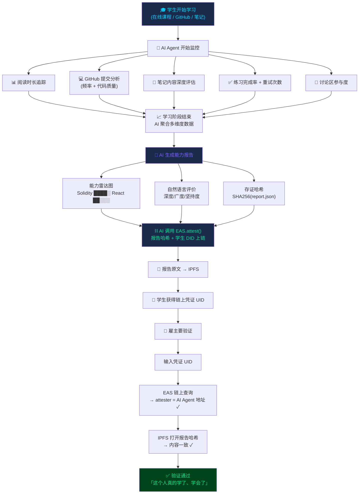

# IvyMax113

**GitHub ID:** ivychan504-cyber

**Telegram:** 

## Self-introduction

AI x Web3 School

## Notes

<!-- Content_START -->
# 2026-05-30
<!-- DAILY_CHECKIN_2026-05-30_START -->
````markdown
方向     ：Identity / Reputation / Capability
场景     ：AI 学习 Agent 分析学生行为 → 生成能力报告 → 链上存证 → 第三方可验证
项目代号 ：LearnCred

┌──────────────────────────────────────────────────────────────┐
│ 参与方                                                       │
├──────────────────────────────────────────────────────────────┤
│ 发起方：学生 / 学习者（提交学习行为数据）                        │
│ 执行方：AI Agent（分析学习深度、生成能力报告、调用 EAS 上链存证）  │
│ 付款方：MVP 阶段不需要付款（EAS 存证在 Sepolia 测试网上几乎零成本） │
│ 验收方：雇主 / 招聘方 / 课程平台 / 学生自己                       │
│ 受益方：学生（可验证的学习记录 → 增加求职竞争力）                  │
│        雇主（快速判断候选人真实能力 → 降低招聘风险）               │
│ 风险方：学生（凭证不被认可、AI 误判能力）                         │
│        学习者社区（如果信用体系破窗 → 整个链上凭证贬值）            │
│ 对抗方：试图伪造学习记录的人                                     │
├──────────────────────────────────────────────────────────────┤
│ 核心价值流转                                                  │
├──────────────────────────────────────────────────────────────┤
│                                                                 │
│   学生            AI Agent          链上(EAS)          雇主       │
│   ──学习──→  ──分析行为──→  ──存证报告──→  ──验证凭证──→        │
│   ←──────────────── 获得可验证的学习能力证明 ─────────────→      │
│                                                                 │
│   AI 的增值：把「乱七八糟的学习记录」变成「结构化的能力画像」          │
│   Web3 的增值：让这份能力画像「不可篡改、可跨平台、随时可验证」      │
├──────────────────────────────────────────────────────────────┤
│ 流程                                                        │
├──────────────────────────────────────────────────────────────┤
│ 1. 学生开始学习（在线课程 / 写代码 / 读文档）                      │
│ 2. AI Agent 持续监控学习行为：                                   │
│    · GitHub 提交频率 + 代码质量                                │
│    · 笔记完成度 + 关键词分析                                    │
│    · 练习通过率 + 重试次数                                     │
│    · 讨论区参与（提问/回答）                                     │
│ 3. 学习阶段结束 → AI 生成「学习能力报告」                        │
│ 4. AI 调用 EAS 合约，将报告 IPFS 哈希存证上链                   │
│ 5. 学生获得链上凭证 ID + 可分享的验证链接                        │
│ 6. 雇主/第三方输入凭证 ID → 链上查询 → 验证报告未被篡改 ✅           │
├──────────────────────────────────────────────────────────────┤
│ AI 做什么（能力分解）                                          │
├──────────────────────────────────────────────────────────────┤
│ 监控 (Monitor)：                                               │
│   · 追踪学习时长分布、每日活跃时段                               │
│   · 记录 GitHub commit 频率 & 代码行数分布                       │
│   · 统计练习完成率（一次过 vs 多次重试）                          │
│                                                              │
│ 理解 (Understand)：                                            │
│   · 判断学习深度：读文档时间 vs 写代码时间比例                     │
│   · 识别「假努力」：大量复制粘贴 + 零次自己提交                    │
│   · 评估知识点掌握度：正确率 + 答题速度 + 是否跳回复习             │
│                                                              │
│ 总结 (Summarize)：                                             │
│   · 将多维行为数据转为可读的能力报告                             │
│   · 生成雷达图：Solidity ████░ / React ██░░░ / DeFi █████      │
│   · 输出自然语言评价："该学生在智能合约安全方面投入超过平均 2.3 倍..."│
│                                                              │
│ 调用工具 (Tool Use)：                                          │
│   · 调用 EAS 合约 atttest() → 自动将报告哈希上链                  │
│   · 上传报告全文到 IPFS → 返回 content hash                     │
│   · 通过 MCP 协议暴露 capability → 让别人知道"我能做学习评估"      │
├──────────────────────────────────────────────────────────────┤
│ Web3 做什么（机制选择）                                        │
├──────────────────────────────────────────────────────────────┤
│ 身份 (Identity)：                                              │
│   · 学生用 DID（ENS 或 SP 的链上身份）绑定学习记录               │
│   · 报告关联到学生地址而不是平台用户名 → 跨平台通用               │
│                                                              │
│ 可验证记录 (Verifiable Records)：                              │
│   · EAS（Ethereum Attestation Service）：存证「AI证明该学生      │
│     在 2025年5-6月完成了 AI×Web3 课程，能力评级 B+」            │
│   · 存的是报告哈希 → 报告原文存 IPFS → 链上不可篡改               │
│   · 任何人都能验证：输入 attestation UID → 链上查询 → 确认有效    │
│                                                              │
│ 协作 (Collaboration)：                                         │
│   · MCP 协议让 agent 向外部声明自己能做什么（capability 声明）    │
│   · 不同平台的 AI agent 可以互相发现、互相验证凭证                │
├──────────────────────────────────────────────────────────────┤
│ 为什么 AI + Web3 缺一不可                                     │
├──────────────────────────────────────────────────────────────┤
│ 纯 AI 方案：                                                   │
│   ❌ 报告存在服务器上 → 可以被后台修改 / 删库跑路                   │
│   ❌ 凭证绑定平台账号 → 换了平台就失效                             │
│   ❌ 无法证明「这份报告就是当时 AI 生成的那份，没人改过」             │
│                                                              │
│ 纯 Web3 方案：                                                 │
│   ❌ 只能存「0x123 说 0x456 会Solidity」→ 谁来判断会不会？        │
│   ❌ 自声明 = 任何人都能伪造 → 没有信任价值                        │
│   ❌ 人工审核 = 无法规模化                                       │
│                                                              │
│ 必须一起：                                                     │
│   ✅ AI 规模化判断学习深度（只有 AI 能同时看代码+笔记+练习）          │
│   ✅ Web3 保证判断结果不可篡改（只有链上存证能防后台改）             │
│   ✅ AI → 能力判断的质量保证                                    │
│   ✅ Web3 → 判断结果的信任保证                                  │
├──────────────────────────────────────────────────────────────┤
│ 自动化边界                                                    │
├──────────────────────────────────────────────────────────────┤
│ ✅ AI 自动完成：                                                │
│    · 学习行为数据采集 & 分析                                      │
│    · 能力雷达图 & 自然语言报告生成                                 │
│    · EAS 存证 & IPFS 上传                                       │
│                                                              │
│ ⚠️ 需要人工确认：                                               │
│    · 「学得够不够深」的阈值设定（需要老师/社区校准）                │
│    · 争议处理（学生对 AI 判断不服 → 人工复核）                      │
│                                                              │
│ ❌ 暂不自动化（MVP 范围外）：                                    │
│    · 跨课程能力互认（A课程的市场分析 vs B课程的项目管理）           │
│    · 雇主端的自动匹配（凭能力报告推荐候选人）                       │
├──────────────────────────────────────────────────────────────┤
│ 验证方式                                                      │
├──────────────────────────────────────────────────────────────┤
│ 技术验证：                                                     │
│   1. 打开 EAS Scan → 输入 attestation UID → 看到存证记录        │
│   2. 检查记录内容：attester = AI Agent 地址,                      │
│      data = 报告 IPFS 哈希                                    │
│   3. 用 IPFS 网关打开哈希 → 验证报告内容与链上记录一致             │
│                                                              │
│ 业务验证：雇主收到简历 → 学生附上 LearnCred 验证链接 →             │
│          一键确认「这个人的能力评估是 AI 基于真实学习数据生成的，     │
│          且自生成后未被任何人修改」                               │
│                                                              │
│ 成本：EAS Sepolia 存证 ≈ $0.001（基本免费）                      │
├──────────────────────────────────────────────────────────────┤
│ 主要风险                                                      │
├──────────────────────────────────────────────────────────────┤
│ 1. AI 误判学习深度（假阳性：深度不够但评高分 / 假阴性：学得好但评低）  │
│ 2. 雇主/市场不认可链上凭证 → 项目白做                              │
│ 3. 学生伪造学习行为数据（用脚本自动刷 commit / 计时作弊）            │
│ 4. 平台锁定 — 学生拒绝继续用这个系统 → 之前凭证无人维护               │
│ 5. EAS Schema 设计太窄 → 未来扩展困难                            │
└──────────────────────────────────────────────────────────────┘
```

---

## 交付 ④：五句话 Proposal

```
1. 解决什么问题
   → 在线学习完没法向雇主证明你真的学了、学会了、学深了。
      简历写「精通Solidity」= 谁都可以写。
      需要一个 AI 基于真实学习行为生成的、链上不可篡改的能力证明。

2. AI 承担什么角色
   → 监控：追踪学习行为（GitHub 提交、笔记频率、练习完成度、讨论参与）
   → 理解 + 总结：判断「复制粘贴」vs「真正理解」，生成能力雷达图+自然语言报告

3. Web3 提供什么机制
   → 可验证记录：学习报告哈希通过 EAS 存证上链，生成后任何人无法篡改
   → 身份：学生 DID（ENS/链上地址）绑定所有学习记录，跨平台通用

4. 为什么必须二者同时出现
   → 纯 AI：报告存服务器 → 平台可以改/删/倒闭 → 不可信
   → 纯 Web3：只能存哈希 → 不知道存什么、不知道怎么判断质量 → 没价值
   → 必须一起：AI 判断深度（数据→洞察）+ Web3 保证不篡改（洞察→信任）
     两者合并 = 既有人工智能的判断力，又有区块链的可信度

5. 最可能死在哪 + 怎么防
   → 雇主不认链上凭证（概率：高）
     → 防：Week 3 访谈 3-5 个 Web3 公司招聘者，问「你会看链上学习证明吗」
     → 先做 AI×Web3 School 自己的学生 → 用自己验证 PMF
   → AI 判断不准（概率：中）
     → 防：先不做全自动评定，保留「人工抽查 + 学生申述」通道
     → 用 Ivy 自己的学习数据做校准 — 你就是第一个测试用户
```

---

## 交付 ⑤：参考资料清单

每条必须写「帮我判断什么」，不是只贴链接。

```
1. EAS（Ethereum Attestation Service）官方文档
   → https://attest.org/docs
   → 帮我判断：链上存证怎么发、Schema 怎么设计、请求 + 验证流程、
      每条存证的实际 Gas 成本（Sepolia vs 主网）

2. EAS SDK + 合约地址
   → https://github.com/ethereum-attestation-service/eas-contracts
   → 帮我判断：合约接口长什么样、前端怎么调 atttest()、UID 怎么生成
      和校验、支持哪些链

3. ERC-8004（Agent Trust / Reputation Standard）
   → https://eips.ethereum.org/EIPS/eip-8004
   → 帮我判断：agent 信誉标准草案里怎么定义「信誉分」、
      有哪几种计算方式、是否已有合约参考实现

4. MCP（Model Context Protocol）官方文档
   → https://modelcontextprotocol.io/docs
   → 帮我判断：agent 怎么通过 MCP 向外部声明自己的能力（capability）、
      不同 agent 怎么互相发现、是否已有类似的 agent capability 注册方案

5. Gitcoin Passport 架构
   → https://docs.passport.gitcoin.co/
   → 帮我判断：已有的链上身份/信誉方案做到什么程度了（Stamp 机制、
      Ceramic 存储、评分算法）、LearnCred 和 Gitcoin Passport 的差异化在哪

6. IPFS + Pinata / Web3.Storage
   → https://docs.pinata.cloud/  → https://web3.storage/docs/
   → 帮我判断：报告原文怎么存 IPFS、内容寻址 vs 位置寻址、
      文件持久性（pinning 策略）、和链上哈希怎么对应

7. ENS（Ethereum Name Service）
   → https://docs.ens.domains/
   → 帮我判断：学生 DID 怎么用 ENS 做可读身份（ivy.eth → 0x...）、
      文本记录怎么绑定、解析成本

8. AI×Web3 相关论文/文章
   → 「Verifiable Credentials for AI Agents」讨论
   → Vitalik 关于 on-chain identity / SBT 的文章
   → 帮我判断：行业怎么看 AI agent 身份问题、有谁在做类似的事、
      避免重复造轮子
```

---

## 交付 ⑥：主方向深挖包

### 1. 流程图



### 2. 一个典型场景

> **场景：Ivy 学完了 AI×Web3 School 三周课程**
>
> 三周里，Ivy 每天写代码、记笔记、做练习。AI Agent 一直在后台追踪：
> - GitHub 提交 23 次，涉及 Solidity 合约 4 个 + React 组件 6 个
> - 笔记写了 12 篇，涵盖 ZK、DeFi、AA 钱包
> - 练习正确率 87%，其中钱包相关题目全部一次过
>
> Week 3 结束时，AI 自动生成一份能力报告：
> ```
> 🧠 Ivy 的学习能力画像
>
> 智能合约开发   ██████░░░░  B+
> 前端 React     ████░░░░░░  C+
> 钱包/权限      █████████░  A-
> ZK 基础        ███░░░░░░░  C
>
> 综合评价：Ivy 在钱包和权限管理方面投入最深，
> 练习正确率远高于平均水平。适合 wallet/Safe 相关岗位。
> ```
>
> 报告哈希通过 EAS 存到 Sepolia 上，原文存 IPFS。Ivy 拿到一个验证链接。
>
> **两周后，Ivy 面试一家 Web3 公司。简历附上 LearnCred 链接。**
>
> 面试官打开链接 → 链上查询确认记录未被篡改 → 看到 Ivy 的能力雷达图 →
> 决定直接问她钱包/权限相关问题（而不是浪费时间问她不会的 ZK）。
>
> 面试官的评价：「我面了 50 个人，你是第一个能让我提前知道你会什么的。」

### 3. 一个反例

> ❌ **反例：只给 agent 发 NFT 名片，没有能力声明、调用接口、交付记录**
>
> 方案 A："给每个 AI agent 发一个 ERC-721 NFT，上面写着 'I am a coding agent'。"
>
> 问题：
> - NFT 元数据是人写的 → 可以写假的
> - 没有能力证明机制 → 不知道怎么验证
> - 没有交付记录 → 不知道这个 agent 之前做了什么
> - 没有验证接口 → 别的 agent 没法自动检查
>
> **这不是 identity/reputation，是贴纸。**
>
> LearnCred 的不同：AI 基于实际行为数据生成报告 → 报告内容可以被第三方审计 → 
> 报告哈希链上不可篡改 → 任何人（人或 agent）都可以通过 EAS 接口自动验证。

### 4. 一组关键风险

| 风险 | 概率 | 后果 | 预防措施 |
|------|------|------|----------|
| **雇主不认链上凭证** | 🔴 高 | 项目白做 | Week 3 访谈 3-5 个 Web3 招聘者；先用 AI×Web3 School 自己的学生验证 PMF |
| **AI 误判学习质量** | 🟡 中 | 信用崩塌 | 保留人工抽查通道；学生可申述；初期不追求全自动 |
| **学生伪造行为数据** | 🟡 中 | 凭证贬值 | 多数据源交叉验证（GitHub + 笔记 + 练习 + 时间分布）；识别异常模式（凌晨3点连续提交） |
| **平台锁定（Vendor Lock-in）** | 🟡 中 | 学生不敢用 | 凭证和报告都存链上/IPFS → 数据属于学生 → 换平台报告依然有效 |
| **EAS Schema 设计太窄** | 🟢 低 | 后续扩展困难 | 设计可扩展的 Schema（versioned + flexible fields）；参考 W3C Verifiable Credentials 数据模型 |
| **Gas 费太贵（主网）** | 🟢 低 | 不可持续 | MVP 用 Sepolia/L2（Optimism/Base）；EAS 存证成本极低 |
| **AI Agent 私钥被黑** | 🟡 中 | 假凭证上链 | 使用 Safe 多签或 EOA 权限分离；存证前加二次确认 |

### 5. 一个最小验证计划

```
Week 3 Hackathon 要验证的 3 件事：

验证 1：用户需求验证（最重要！）
  └─ 找 3 个在学 Web3 的人（AI×Web3 School 同学群）
  └─ 问：「如果给你一个链上学习证明，找工作时你会用吗？」
  └─ 问：「什么情况下你不信这个证明？」
  └─ 记录：有多少人说「会」→ 决定做不做

验证 2：技术可行性验证
  └─ 用 EAS SDK 在 Sepolia 上发一条测试凭证
  └─ 数据：attester = 你的测试地址, recipient = 学生地址,
     data = bytes32(keccak256("test report hash"))
  └─ 确认：Gas 成本 ≈ 多少 / 是不是一次交易就搞定 / EAS Scan 能不能查到
  └─ 目标：拿到一个真实可用的 attestation UID

验证 3：AI 分析逻辑验证
  └─ 输入：Ivy 自己在 Week 1-2 的学习数据（GitHub 提交 + 笔记 + 练习）
  └─ 输出：AI 生成一份能力报告
  └─ 人工判断：AI 说的「Ivy 擅长钱包」准不准？
  └─ 如果准 → 逻辑 OK；如果不准 → 调整分析权重

三个验证全部通过 → Week 3 Hackathon demo 稳了。
任何一个失败 → 知道该修哪。
```

---

> *产出时间：2026-05-30 | Week 2 Day 2 全部交付 ✅ | 下一步：Week 3 Hackathon 原型*
````
<!-- DAILY_CHECKIN_2026-05-30_END -->

# 2026-05-29
<!-- DAILY_CHECKIN_2026-05-29_START -->

[https://github.com/ivychan504-cyber/ai-web3-school-cohort-0/commit/c57acbef933963007b4720b85a3074c4739e177f](https://github.com/ivychan504-cyber/ai-web3-school-cohort-0/commit/c57acbef933963007b4720b85a3074c4739e177f)
<!-- DAILY_CHECKIN_2026-05-29_END -->

# 2026-05-28
<!-- DAILY_CHECKIN_2026-05-28_START -->


1.今天复习了一下钱包的知识

钱包通常不直连全网，连一个RPC，RPC是节点，即中心化入口风险点

节点居然越分散越安全

智能合约的本质

以太坊改规则 在论坛讨论 形成文档 然后进入升级

2.几个问题

如何提高安全性、降低管理私钥的复杂度

我搜集了很多信息，我认为针对资产较少最靠谱的还是可以考虑使用指纹或者面容解锁；要是过多，可以考虑将私钥采取多人签名或者分块管理

3.ERC-4337

账户抽象即AA，没有修改以太坊基础协议，而是引入了一种使用UserOperation对象，可以通过Paymasters进行无Gas交易

AA的基础是只能账户，与依赖单一主私钥和EOA——仅仅依赖ECSDA协议级签名检查 不同

智能账户是可编程钱包，支持更丰富的用户体验和更高的安全性

我对DE这两个模块蛮感兴趣

D模块

这个AI问题地图
<!-- DAILY_CHECKIN_2026-05-28_END -->

# 2026-05-26
<!-- DAILY_CHECKIN_2026-05-26_START -->


今天搭建了钱包模拟器
<!-- DAILY_CHECKIN_2026-05-26_END -->

# 2026-05-25
<!-- DAILY_CHECKIN_2026-05-25_START -->


1.  今天听完两场会议，去看一下马铃薯老师发的文章，感觉有很多东西我是不清楚的
    
2.  交互项目，我先做了一个我感兴趣的，虚拟人后台管控，这个项目主要是建立与真人互动，以及后代监管流量
    
3.  明天我想再做一个关于钱包的交互项目
<!-- DAILY_CHECKIN_2026-05-25_END -->

# 2026-05-24
<!-- DAILY_CHECKIN_2026-05-24_START -->


今天，主要是把我剩下的会议没看完的看完了，我蛮遗憾没能参加直播的，可以提出一些问题
<!-- DAILY_CHECKIN_2026-05-24_END -->

# 2026-05-23
<!-- DAILY_CHECKIN_2026-05-23_START -->


今天休息了，但是我看了KPI调用
<!-- DAILY_CHECKIN_2026-05-23_END -->

# 2026-05-22
<!-- DAILY_CHECKIN_2026-05-22_START -->


今天听完两个分享，感觉最好把这周学的复习一下，我的任务三还在部署中
<!-- DAILY_CHECKIN_2026-05-22_END -->

# 2026-05-21
<!-- DAILY_CHECKIN_2026-05-21_START -->


对了还有老师关于产品的一些概念，我还是满认同的，产品研发和产品运营这是两个领域，虽然鼓吹一人公司，但是现在不存在酒香不怕巷子深这个理念，产品运营也是很关键的一环，这个想法我也很早就有，好像是从那个马克扎前几年收购的数据标注公司创始人露西郭来的，还是要学会和人合作，要不然就要两者都精通，其实这是很难的

随着AI技术的发展，最好还是以始为终，产品设计还是要放在最前沿，我觉得产品经理这条路还是满宽阔的
<!-- DAILY_CHECKIN_2026-05-21_END -->

# 2026-05-20
<!-- DAILY_CHECKIN_2026-05-20_START -->


1.  遵循第一性原理
    
2.  私钥（控制权） 助记词（协助记住私钥，无数个） 地址签名
    
3.  身份授权传播排序执行确认
    
4.  私钥和公钥一对一，钱包地址是截取后二十位公钥
    
5.  打开钱包之后，资产不在钱包，钱包只是保存调用密钥
    
6.  私钥 个人主权的起点，私钥无需绑定、身份地区，但是也可以受收款
    
7.  私钥不是普通匹马，著几次一旦被泄露、授权钓鱼或者截图之后很容易被泄露
    
8.  交易和签名 握手券网络执行这件事的拘束
    
9.  收学费未执行计算、存储以及其他付费，还有什莫来着
    
10.  数字签名 使用私钥签名进行交易、签名不上链，广播交易才需要上链
     
11.  广播交易rpc，接收方可以反推是谁发送的，验证私钥拥有者进行的操作，所以四幺很重要，目前区块链重要的是这种量子技术技术问题，搞到和拥有着一样的的私钥那就完了
     
12.  GAS FEE交易费抵挡垃圾交易
     
13.  区块链网络运行钱包包广播排队排序出块证明 可查询
     
14.  出块 没有确定 需要等待一下子啊万层一笔转账需要等12分钟 可以确定完全被掌握
     
15.  共识机制 POW（BTC）课代表 POS（eth）会员制
     

去中心化如何连接呢链接RPC

18.智能合约

区块链如何升级

以太坊一些论坛 文档 实现与测试 主网升级 主网很多但是升级挺多次

去中心化 节点多web3挂念特征回顾 去中心化 无许可 抗审查 开放开源 隐私边界 可组合性

三门学科交叉 密码学经济学社会学

关于思考
<!-- DAILY_CHECKIN_2026-05-20_END -->

# 2026-05-19
<!-- DAILY_CHECKIN_2026-05-19_START -->


1.  学习LLM、以及AI相关基础概念
    
2.  LLM 即大语言模型，四个控制层面指的是：上下文窗口、系统指令、提示词（决策在人)、工具调用
    
3.  t提示词-工作流（预定义工作流）-agent
    
4.  AIAGent工具只是简化工作流程，但是审查、测试设计、架构决策无法被替代
    
5.  为什么要验证AI输出，个人觉得很大一个原因，AI只是给出一个概率最大的结果但是不是事实。其余的是编造、应用出错、上下文断裂、越权、误用其他工具
    
6.  agent 核心技术组件 状态管理、长期记忆、MCP、SKILLS、tracing \\guardrails\\handoff\\错误恢复
    
7.  使用Agent目标开放式、需要长期记忆
    

视频

1.  LLM；数学函数、预测功能、大语言模型，更多基于用户用词，相当于他们的提示词一样
    
2.  这个大模型的预测原来是，把多个文本除了最后一个字全部输入模型，然后预测最后一个字，然后对比真实性，反向调教 ，除了这个还有基于人类反馈的强化学习（RLHF） 人工标记有问题的
    
3.  3谷歌是人类福音，创造出了“变换器transformer”，一种是注意力，将每个数字编码，同时运行，还有一个是前馈神经网络这种，讲真的我有必要看一下神经网络这本书了
    
4.  对于LLM介绍课程，详细学习中
    
5.  今天主要时间还是放在了安装hermes上，准确来说，我在这上边浪费了很多时间，因为太过于小白，不晓得，这个AI项目需要匹配环境，wls\\uni这些环境，又去升级了一下windows操作环境，今晚听了安装课对我帮助真是太大了，有个助手真是满贴心
<!-- DAILY_CHECKIN_2026-05-19_END -->

# 2026-05-18
<!-- DAILY_CHECKIN_2026-05-18_START -->


1.  学习LLM、以及AI相关基础概念
    
2.  LLM 即大语言模型，四个控制层面指的是：上下文窗口、系统指令、提示词（决策在人)、工具调用
    
3.  t提示词-工作流（预定义工作流）-agent
    
4.  AIAGent工具只是简化工作流程，但是审查、测试设计、架构决策无法被替代
    
5.  为什么要验证AI输出，个人觉得很大一个原因，AI只是给出一个概率最大的结果但是不是事实。其余的是编造、应用出错、上下文断裂、越权、误用其他工具
    
6.  agent 核心技术组件 状态管理、长期记忆、MCP、SKILLS、tracing \\guardrails\\handoff\\错误恢复
    
7.  使用Agent目标开放式、需要长期记忆
    

视频

1.  LLM；数学函数、预测功能、大语言模型，更多基于用户用词，相当于他们的提示词一样
<!-- DAILY_CHECKIN_2026-05-18_END -->
<!-- Content_END -->
