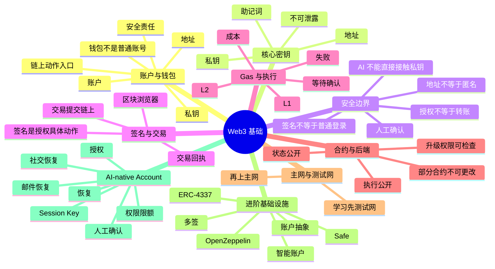
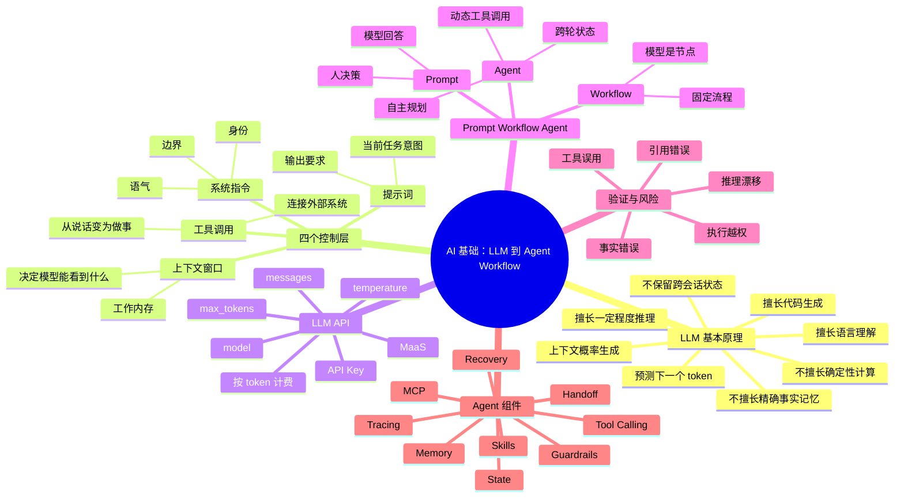
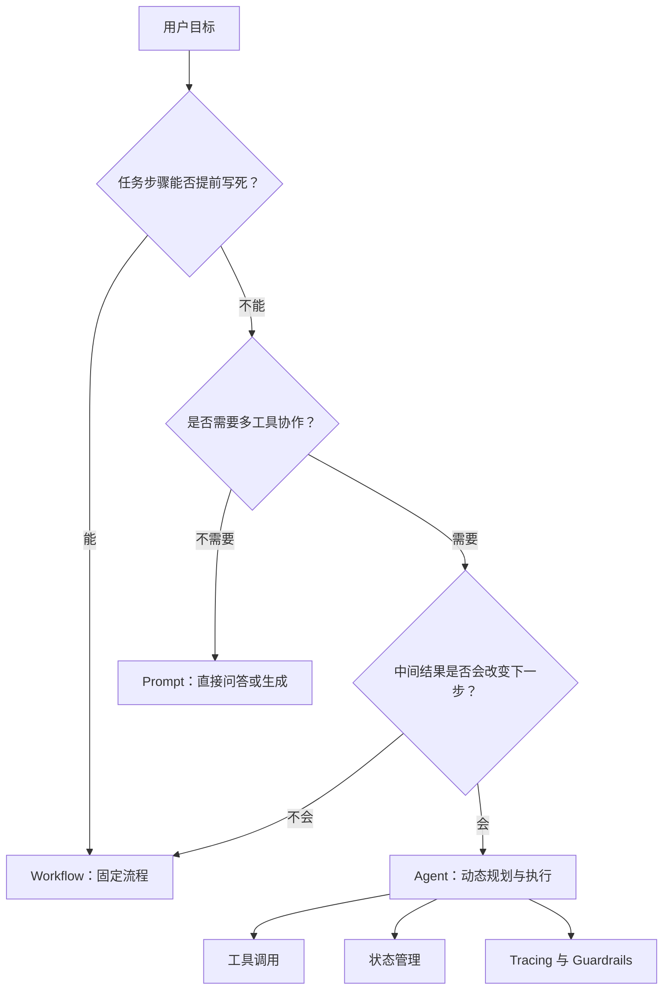
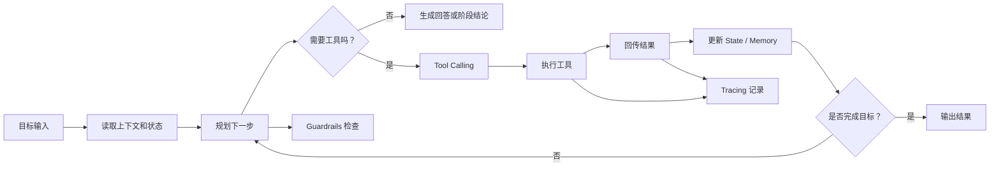

# vergissxie

**GitHub ID:** vergissxie

**Telegram:** 

## Self-introduction

AI x Web3 School

## Notes

<!-- Content_START -->
# 2026-05-19
<!-- DAILY_CHECKIN_2026-05-19_START -->
````markdown
# Week 1 模块 B：Web3 基础，账户、钱包、签名与链上执行

## 学习目标

本模块要建立一条链路：

从“钱包是什么”出发，理解账户、地址、助记词、私钥、签名、交易、Gas、合约、主网与测试网之间的关系，并明确 AI × Web3 构建者必须遵守的安全边界。

一句话概括：

> 钱包是链上动作入口，不是普通登录账号；签名是在授权具体动作；链上执行公开、可验证、但有成本和风险。

## 思维导图



## 1. 账户、地址和钱包的关系

这三个词经常被混用，但它们不是一回事。

| 概念 | 更准确的理解 | 常见误解 |
| --- | --- | --- |
| 账户 | 链上主体，可以持有资产和状态 | 以为只是一个用户名 |
| 地址 | 账户的公开标识，别人用它转账或交互 | 以为地址本身就是“身份” |
| 钱包 | 管理私钥并发起链上动作的工具 | 以为钱包只是一个登录页 |

钱包不是普通账号。它背后对应的是私钥、安全责任和链上动作入口。

你可以把它理解为：

- 账号是“谁”
- 地址是“公开可用的收款/交互标识”
- 钱包是“拿着钥匙去执行动作的工具”

## 2. 助记词、私钥、地址分别是什么

| 项目 | 作用 | 风险等级 |
| --- | --- | --- |
| 助记词 | 生成和恢复私钥的高敏感备份 | 极高 |
| 私钥 | 用来签名和控制账户的核心秘密 | 极高 |
| 地址 | 对外公开的链上标识 | 低，但可被追踪 |

### 为什么不能泄露

- 泄露助记词或私钥，就可能直接失去资产控制权
- 一旦私钥暴露，攻击者可以代你签名、授权、转账、调用合约
- 区块链交易通常不可逆，出事后很难像普通账号那样“找回密码”

结论很简单：

> 助记词和私钥都不能发给任何人，也不能交给 AI agent 代管。

## 3. 面向 AI × Web3 构建者的安全底线

### 三个最容易混淆的判断

| 判断 | 正确理解 |
| --- | --- |
| 地址并不等于匿名 | 地址可被链上行为、关联地址、交易模式追踪 |
| 签名并不等于普通登录 | 签名是在授权某个具体动作，不是简单“进系统” |
| 授权并不等于转账 | 授权通常是允许合约花费代币，不是直接转出资产 |

### AI Agent 的安全红线

- AI agent 不应直接接触私钥或助记词
- 涉及签名、授权、转账、合约写入的动作必须保留人工确认
- 自动化只能覆盖低风险、可回滚、可审计的步骤
- 关键操作前要让用户看懂“做什么、花多少钱、影响什么”

可以把 AI agent 看成“副驾驶”，不是“全权司机”。

## 4. 签名与交易的关系

签名不是“点一下确认”这么简单，它是在对某个具体动作进行授权。

常见链上动作包括：

- 转账
- 代币授权
- 合约调用
- NFT 铸造
- 多签确认

流程上通常是：

1. 钱包构造待签名消息或交易
2. 用户确认
3. 私钥生成签名
4. 交易被广播到网络
5. 节点和验证者处理
6. 出现交易回执和最终状态

## 5. Gas、失败和等待确认

Gas 是链上执行的成本单位。只要你在链上做事，就通常要为计算、存储和执行资源付费。

### 为什么会有成本

- 链上计算需要全网验证
- 存储状态需要长期保留
- 资源有限，所以需要成本机制来约束滥用

### 为什么会失败

- 余额不足
- Gas 估算不足
- 合约逻辑 revert
- 交易参数不合法
- 网络拥堵或链上状态变化

### 为什么要等待确认

交易广播后，不代表立刻最终成功。通常要等区块打包和确认，才能更稳定地把它看作已执行。

## 6. L1 / L2 与执行成本

| 层级 | 特点 | 适用理解 |
| --- | --- | --- |
| L1 | 安全性高、基础结算层、通常更贵 | 适合最终结算和高信任场景 |
| L2 | 通过扩展方案降低成本并提升吞吐 | 适合高频交互和更低成本实验 |

简单记忆：

- L1 更像“底层法庭”
- L2 更像“更便宜的执行层”

对构建者来说，选择哪一层会直接影响成本、确认速度、用户体验和开发策略。

## 7. 智能合约与普通后端逻辑的差异

智能合约不是普通后端。

| 维度 | 普通后端 | 智能合约 |
| --- | --- | --- |
| 状态 | 私有或服务端可控 | 公开可见、链上可验证 |
| 执行 | 服务端内部执行 | 链上公开执行 |
| 升级 | 比较灵活 | 取决于设计和权限 |
| 可更改性 | 通常更容易改 | 部分合约部署后不可更改 |
| 责任边界 | 运维和应用逻辑 | 代码即规则，影响资产安全 |

这意味着 Web3 代码要更重视：

- 安全
- 可审计性
- 权限设计
- 升级策略
- 失败回滚思路

## 8. 主网与测试网

主网是真实资产环境，测试网是学习和实验环境。

### 学习原则

1. 先在测试网完成交互、调试和流程验证
2. 确认签名、Gas、合约调用、钱包提示都理解了，再碰主网
3. 主网实验要非常克制，关键动作尽量人工确认

一句话：

> 不要拿主网当练习场。

## 9. 区块浏览器、钱包提示和交易回执

这些工具是理解链上行为的窗口。

| 工具 | 能帮助你看什么 |
| --- | --- |
| 区块浏览器 | 交易状态、哈希、区块、合约、事件、地址关联 |
| 钱包提示 | 你到底在签什么、授权什么、花多少 gas |
| 交易回执 | 这笔交易是否成功、消耗了多少 gas、发生了什么日志 |

构建者应养成的习惯：

- 签名前看清楚交易内容
- 发出去后查看回执
- 出问题时去浏览器查状态和事件

## 10. 高级延展：为什么这些基础设施很关键

这些关键词在 AI × Web3 里很重要，因为它们都在解决“如何安全地把自动化能力接到资产和权限上”。

| 关键词 | 作用 |
| --- | --- |
| 账户抽象 | 让账户更像可编程主体 |
| 智能账户 | 将权限和行为封装进账户逻辑 |
| 多签 | 用多个签名共同控制风险 |
| Safe | 常见的多签和资产管理方案 |
| ERC-4337 | 账户抽象的重要实现方向 |
| OpenZeppelin Contracts | 常用的合约安全与标准基础设施 |

这些组件的重要性在于，它们把“账户”从单一私钥控制，逐步升级成“可恢复、可分权、可审计、可限制”的系统。

## 11. 从钱包到 AI-native Account

AI-native Account 的核心不是“让 AI 拿到钥匙”，而是“让 AI 在严格边界内协助执行”。

### 典型能力

- 恢复
- 授权
- Session Key
- 权限限额
- 社交恢复
- 邮件恢复
- 人工确认

### 正确方向

- 让 AI 帮忙准备交易内容、检查风险、解释影响
- 让人类保留最终签名和高风险动作确认
- 用权限限额和 session key 缩小自动化暴露面

### 错误方向

- 把助记词直接交给 agent
- 让 agent 无审查地自动转账
- 让 agent 在主网做不可逆的大额动作

## 12. 常见问题

### Q1：地址公开是不是等于匿名？

不是。地址虽然不直接暴露真实姓名，但链上行为是可追踪的，地址之间也可能被关联。

### Q2：签名是不是等于登录？

不完全是。某些 Web3 场景把签名用于登录，但本质上它仍是在授权某个动作或证明控制权。

### Q3：授权和转账有什么区别？

授权通常是允许某个合约花费你的代币，转账是直接把资产转给别人。两者风险不一样。

### Q4：为什么 AI agent 不能拿私钥？

因为私钥一旦被系统完整接触，就扩大了攻击面，也放大了误操作和泄露风险。

### Q5：测试网和主网差在哪？

测试网一般用来学习和调试，不涉及真实价值；主网涉及真实资产，风险更高。

### Q6：为什么链上操作总在强调确认？

因为链上执行成本高、不可逆性强、权限影响大。确认是人为最后一道安全阀。

## 13. 本模块学习产出建议

建议把模块 B 的学习成果沉淀为：

- `notes/week1-module-b-web3-basics.md`
- `prompts/week1-module-b-note-prompt.md`
- `logs/YYYY-MM-DD-week1-module-b-agent-log.md`
- `demos/` 中的一个小型钱包或测试网 demo
- `resources.md` 中的 Web3 安全与账户抽象资料

## 参考资料

- [OpenZeppelin Docs](https://docs.openzeppelin.com/)
- [ERC-4337 overview](https://eips.ethereum.org/EIPS/eip-4337)
- [Safe Docs](https://docs.safe.global/)
- [Ethereum.org accounts](https://ethereum.org/en/developers/docs/accounts/)
- [Ethereum.org transactions](https://ethereum.org/en/developers/docs/transactions/)
````
<!-- DAILY_CHECKIN_2026-05-19_END -->

# 2026-05-18
<!-- DAILY_CHECKIN_2026-05-18_START -->

````markdown
# Week 1 模块 A：AI 基础，从 LLM 到 Agent Workflow

## 学习目标

本模块的目标是建立一条完整认知链路：

从理解“大模型是什么”，到知道“如何调用 LLM API”，再到分清 “Prompt、Workflow、Agent” 的边界，最后能判断什么时候该用 agent，什么时候不该过度 agent 化。

一句话概括：

> LLM 本身负责基于上下文生成内容；workflow 负责把任务流程固定下来；agent 则让模型在目标约束下动态规划、调用工具、管理状态。

## 思维导图



## 1. LLM 是什么

LLM，全称 Large Language Model，大语言模型。它的核心能力不是“查数据库”，也不是“真正理解世界”，而是：

> 在给定上下文中，预测最合理的下一个 token 序列。

这里的 token 可以粗略理解为文本片段。模型看见前面的内容后，会根据训练中学到的统计模式、语义关系和推理模式，生成后续内容。

### LLM 擅长什么

| 能力 | 解释 |
| --- | --- |
| 语言理解 | 能总结、改写、翻译、分类、提取关键信息 |
| 代码生成 | 能根据上下文写样板代码、解释库用法、辅助调试 |
| 模式迁移 | 能把一个例子中的结构迁移到新任务里 |
| 初步推理 | 能完成多步骤分析，但需要拆解和验证 |

### LLM 不擅长什么

| 短板 | 原因 |
| --- | --- |
| 精确事实记忆 | 模型参数不是实时数据库，知识可能过期或混淆 |
| 确定性计算 | 生成式模型会“估算式输出”，复杂计算应交给工具 |
| 引用可靠性 | 可能编造论文、链接、作者或数据来源 |
| 跨会话状态 | 模型默认不记得上次对话，除非系统提供记忆机制 |

## 2. 四个控制层面

使用 LLM 时，可以把控制方式分成四层。

| 控制层 | 负责什么 | 类比 |
| --- | --- | --- |
| 上下文窗口 | 模型当前能看到多少信息 | 工作内存 |
| 系统指令 | 设置身份、语气、边界和规则 | 角色设定与行为规范 |
| 提示词 | 表达当前任务、输入材料和输出格式 | 当前任务单 |
| 工具调用 | 让模型调用外部能力并获得结果 | 手、眼睛和仪表盘 |

关键理解：

上下文窗口不是长期记忆。它只是本轮能看到的材料。如果重要信息没有放进上下文，模型就无法稳定使用它。

系统指令比普通提示词更像“运行规则”。它通常用来定义 agent 的身份、禁止事项、工具边界、输出风格和安全规则。

提示词是任务级输入。它决定这一次要做什么、材料是什么、输出成什么格式。

工具调用把模型从“只会说话”变成“可以行动”。例如读文件、查网页、跑测试、访问数据库、调用 API。

## 3. 动手调用 LLM API

MaaS，即 Model as a Service，意思是把大模型作为云服务调用。你不需要自己买 GPU、部署模型，只需要使用 API Key，按 token 计费。

一次最小调用通常包含：

| 参数 | 作用 |
| --- | --- |
| `model` | 选择要调用的模型 |
| `messages` | 提供系统指令、用户输入和历史上下文 |
| `temperature` | 控制随机性，越低越稳定，越高越发散 |
| `max_tokens` | 控制最多生成多少 token |

建议学习路径：

1. 先从 OpenAI、Anthropic 或 GLM 的官方 Quick Start 跑通第一个请求。
2. 只改一个变量，例如先固定 `model` 和 `messages`，再比较不同 `temperature` 的输出差异。
3. 把一次 API 请求记录到 `demos/` 或 `logs/` 中，包括输入、输出、问题和改进。
4. 不要把 API Key 写进仓库。使用环境变量或本地配置文件。

## 4. Prompt、Workflow、Agent 的边界

这是本模块最重要的概念分界。

| 类型 | 决策者 | 路径是否固定 | 模型角色 | 适合场景 | 风险 |
| --- | --- | --- | --- | --- | --- |
| Prompt | 人 | 不涉及流程 | 回答者 | 一次性问答、总结、改写 | 输出可能错，但影响范围小 |
| Workflow | 人或系统设计者 | 固定 | 流程中的一个节点 | 固定步骤的批处理、审核流、报告生成 | 流程错会稳定地产生错结果 |
| Agent | 模型参与决策 | 动态 | 规划者和执行者 | 开放目标、多工具协作、迭代探索 | 行为更难预测，需要 guardrails |

### 从 Prompt 到 Agent 的流程图



## 5. AI Coding 工具的价值与限制

Claude Code、Codex CLI、Cursor 等工具的核心价值是把 LLM 放进真实开发环境里，让模型能读取代码、编辑文件、运行命令、解释错误。

### 能显著加速的事情

- 生成项目骨架和样板代码
- 解释陌生库、陌生框架和报错信息
- 快速写 demo 或 prototype
- 补充测试用例
- 整理文档、README、复盘记录
- 在已有代码风格下做小范围修改

### 不能完全替代的事情

- 架构取舍
- 安全边界设计
- 测试策略设计
- 代码审查责任
- 产品需求判断
- 对业务数据和真实用户影响的负责

更准确的心态是：

> AI coding 工具是能力放大器，不是责任转移器。

## 6. 为什么 AI 输出必须验证

AI 输出看起来流畅，不等于正确。越像“专业答案”，越要保持验证习惯。

| 风险 | 表现 | 应对方式 |
| --- | --- | --- |
| 事实错误 | 自信编造不存在的信息 | 关键事实外部核实 |
| 引用错误 | 编造论文、链接、数据来源 | 不直接信任模型给的引用 |
| 推理漂移 | 长上下文中结论偏离前提 | 分段验证、让模型列假设 |
| 执行越权 | agent 做了超出授权范围的操作 | 设置权限边界和人工确认 |
| 工具误用 | 调错工具或参数 | 使用 tracing 观察执行链 |

验证不是“怀疑 AI 没用”，而是把 AI 放进可靠工作流的一部分。

## 7. Agent 核心技术组件

Agent 不是单个 prompt。它通常是一组组件协作出来的系统。

| 组件 | 作用 | 简单理解 |
| --- | --- | --- |
| State 状态管理 | 多节点共享读写当前任务状态 | 当前任务的白板 |
| Long-term Memory 长期记忆 | 跨 session 存储与召回信息 | 笔记本或档案柜 |
| MCP | 统一连接外部工具和数据源 | 工具插座协议 |
| Skills | 可复用的高层指令和流程 | 标准作业手册 |
| Tool Calling | 模型输出结构化调用请求 | 让模型调用函数 |
| Tracing | 记录并可视化执行链 | 行动录像 |
| Guardrails | 输入输出校验与安全约束 | 护栏和红线 |
| Handoff | 子任务完成后移交控制权 | 交接单 |
| Error Recovery | 失败后的重试、回退、人工介入 | 故障恢复机制 |

### Agent 运行流程图



## 8. 什么时候需要 Agent

适合 agent 的信号：

- 目标开放，无法提前写死所有步骤
- 需要多工具协作，例如搜索、读文件、写代码、跑测试
- 中间结果会决定下一步策略
- 需要跨轮保存状态或长期积累资料
- 任务需要探索、试错、回退和迭代

不适合 agent，或应使用更简单方案的信号：

- 一次性问答：用 Prompt
- 流程固定：用脚本或 Workflow
- 强合规场景：加人工审核节点
- 数据确定性要求高：直接查数据库或调用确定性服务
- 风险高但收益低：不要为了“显得智能”而 agent 化

判断口诀：

> 步骤固定就 workflow，答案一次性就 prompt，路径会变且要用工具才考虑 agent。

## 9. 常见问题解释

### Q1：LLM 为什么会“幻觉”？

因为它的核心机制是生成最合理的文本序列，而不是从事实数据库中逐条检索。只要上下文不足、训练记忆混淆或任务要求过强，模型就可能生成看似可信但实际不存在的信息。

### Q2：上下文窗口越大，模型就越聪明吗？

不一定。大上下文能让模型看到更多材料，但不保证它会正确关注重点。长上下文还可能带来信息干扰和推理漂移，所以长材料要分段处理、结构化摘要、逐步验证。

### Q3：temperature 应该怎么设？

如果任务要求稳定、准确、格式一致，使用较低 temperature。如果任务要求创意、发散、头脑风暴，可以提高 temperature。学习和编码场景通常优先稳定。

### Q4：Tool Calling 和 Agent 是一回事吗？

不是。Tool Calling 是一种能力：模型可以请求调用工具。Agent 是一种系统形态：模型会围绕目标进行规划、选择工具、读取结果、更新状态并继续下一步。Agent 通常使用 Tool Calling，但 Tool Calling 本身不等于 Agent。

### Q5：为什么 coding agent 写完代码还要人审？

因为 agent 可能误解需求、漏掉边界条件、写出看似通过但不可维护的代码，或者没有覆盖真实业务风险。人仍然要负责架构判断、测试设计、安全边界和最终合并。

### Q6：如何降低 agent 失控风险？

关键是把权限、状态和验证机制设计清楚：限制可用工具，明确禁止事项，关键操作要求人工确认，记录 tracing，输出前跑测试或做格式校验。

## 10. 本模块学习产出建议

建议把 Week 1 模块 A 的学习成果沉淀成四类文件：

- `notes/week1-module-a-ai-basics.md`：本笔记
- `prompts/week1-module-a-note-prompt.md`：把课程材料整理成结构化笔记的 prompt
- `logs/YYYY-MM-DD-week1-module-a-agent-log.md`：一次 agent 协作日志
- `resources.md`：补充 Mermaid、LLM API、agent 工具相关资料

## 参考资料

- [GitHub Docs: Creating diagrams](https://docs.github.com/en/get-started/writing-on-github/working-with-advanced-formatting/creating-diagrams)
- [Mermaid Docs: Mindmap](https://mermaid.js.org/syntax/mindmap.html)
- [Agents365-ai/mermaid-skill](https://github.com/Agents365-ai/mermaid-skill)
````
<!-- DAILY_CHECKIN_2026-05-18_END -->
<!-- Content_END -->
